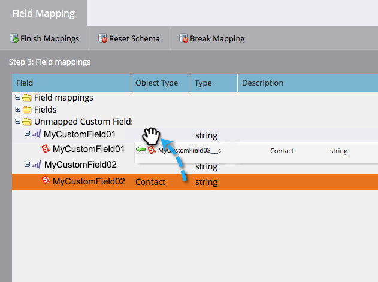
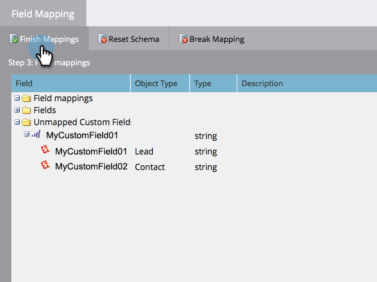

# Bearbeiten der anfänglichen Feldzuordnungen {#edit-initial-field-mappings}

>[!NOTE]
>
>Auf diese Funktion kann nur vor der ersten Synchronisierung mit Salesforce zugegriffen werden. Sobald die **[!UICONTROL Sync Now]**-Taste gedrückt wurde, kann dies nicht mehr durchgeführt werden.

Bei der ersten Synchronisation mit Salesforce kombiniert Marketo Engage automatisch ähnlich benannte benutzerdefinierte Felder in einem einzigen Feld auf der Marketo-Seite, um sicherzustellen, dass die Daten sowohl mit Lead- als auch Kontaktobjekten im CRM ausgetauscht werden können. In diesem Artikel wird erläutert, wie Sie diese Zuordnungen anpassen können.

## Nicht zugeordnete Felder zuordnen {#map-unmapped-fields}

Wenn ein Feld im Ordner [!UICONTROL Nicht zugeordnete Felder] angezeigt wird, bedeutet dies, dass es keinem ähnlichen Feld des Leads oder Kontakts in Salesforce zugeordnet ist. Das können Sie reparieren.

1. Klicken Sie **[!UICONTROL Zuordnungen bearbeiten]**.

1. Öffnen Sie den **[!UICONTROL Nicht zugeordnete benutzerdefinierte Felder]**.

   

1. Ziehen Sie ein nicht zugeordnetes benutzerdefiniertes Feld auf ein anderes, um es zusammenzuordnen.

   >[!NOTE]
   >
   >Sie können nur benutzerdefinierte Feldzuordnungen bearbeiten. Standardfeldzuordnungen können nicht geändert werden.

   

1. Klicken Sie **[!UICONTROL Zuordnungen beenden]** wenn Sie fertig sind.

   

## Vorhandene Zuordnung aufheben {#break-existing-mapping}

Wenn Sie ähnlich benannte Felder auf dem Lead und Kontaktobjekt haben, ordnet Marketo diese automatisch zusammen zu. Sie können sie als unterschiedlich betrachten und unterschiedliche Daten enthalten. Brechen Sie die Zuordnung so auf.

1. Klicken Sie **[!UICONTROL Zuordnungen bearbeiten]**.

   

1. Markieren Sie ein zugeordnetes Feld und klicken Sie auf **[!UICONTROL Zuordnung aufheben]**, um die Felder zu trennen.

   

1. Klicken Sie **[!UICONTROL Zuordnungen beenden]** wenn Sie fertig sind.

   

   Schön! Sie sind fast fertig mit der ersten Synchronisierung.

## Schema zurücksetzen {#reset-schema}

1. Wenn Sie beim Bearbeiten der Zuordnungen Änderungen am Schema in Salesforce vornehmen, können Sie die Änderungen abrufen, indem Sie auf **[!UICONTROL Schema zurücksetzen]** klicken.

   * Alle Zuordnungsänderungen werden zurückgesetzt!
   * Beim Zurücksetzen des Schemas werden nur Felder hinzugefügt, nicht entfernt (auch wenn sie vor dem Synchronisierungsbenutzer ausgeblendet werden).

   
