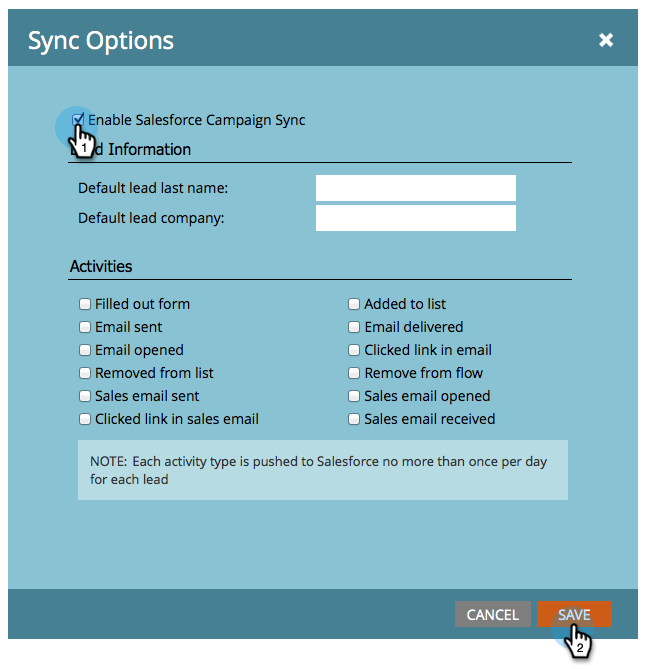

# Aktivieren/Deaktivieren der Kampagnensynchronisierung {#enable-disable-campaign-sync}

>[!NOTE]
>
>**Administratorberechtigungen erforderlich**

Mit dieser Option kann Marketo Engage seine Programmmitgliedschaft und -status mit Salesforce-Kampagnen synchronisieren und umgekehrt.

1. Gehen Sie zu **[!UICONTROL Admin]** und klicken Sie auf **[!DNL Salesforce]**.

   

1. Klicken Sie **[!UICONTROL Synchronisierungseinstellungen bearbeiten]**.

   

1. Markieren Sie **[!UICONTROL Salesforce-Kampagnensynchronisierung aktivieren]** und klicken Sie auf **[!UICONTROL Speichern]**.

   

Es kann einige Zeit dauern, bis die Synchronisierung die Daten aus Salesforce abruft.

>[!MORELIKETHIS]
>
>* [SFDC-Synchronisierung: Kampagnensynchronisierung](/help/marketo/product-docs/crm-sync/salesforce-sync/sfdc-sync-details/sfdc-sync-campaign-sync.md){target="_blank"}
>* [Standardwerte für Lead-Nachnamen und Unternehmen festlegen](/help/marketo/product-docs/crm-sync/salesforce-sync/setup/optional-steps/set-default-person-last-name-and-company-name.md){target="_blank"}
>* [Anpassen der Aktivitätssynchronisierung](/help/marketo/product-docs/crm-sync/salesforce-sync/setup/optional-steps/customize-activities-sync.md){target="_blank"}
