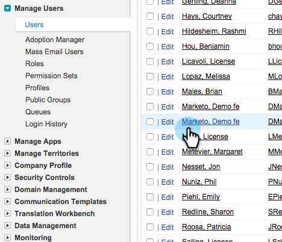

# Einrichten eines Marketo Sync-Benutzers als Marketing-Benutzer {#make-marketo-sync-user-a-marketing-user}

Der Synchronisierungsbenutzer [Marketo](/help/marketo/product-docs/crm-sync/salesforce-sync/setup/enterprise-unlimited-edition/step-2-of-3-create-a-salesforce-user-for-marketo-enterprise-unlimited.md){target="_blank"} muss Marketing-Benutzer sein, damit die Salesforce-Kampagnensynchronisierung ordnungsgemäß funktioniert. Hier erfahren Sie, wie Sie den Benutzer in Salesforce zu einem Marketing-Benutzer machen.

>[!NOTE]
>
>**Erforderliche Administratorberechtigungen**

1. Melden Sie sich bei Salesforce an. Suchen Sie in der linken Suchleiste nach Benutzern und klicken Sie unter **[!UICONTROL Verwalten von Benutzern]** auf **[!UICONTROL Benutzer]** .

   

1. Suchen Sie Ihren Synchronisierungsbenutzer und klicken Sie auf seinen Namen.

   

1. Klicken Sie auf **[!UICONTROL Bearbeiten]**.

   

1. Aktivieren Sie das Kontrollkästchen **[!UICONTROL Marketing-Benutzer]** und klicken Sie auf **[!UICONTROL Speichern]**.

   

   Sehr gut! Dieser Marketo-Synchronisierungsbenutzer ist jetzt Marketing-Benutzer.
