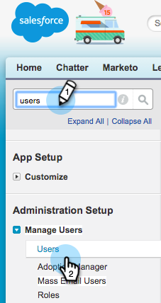
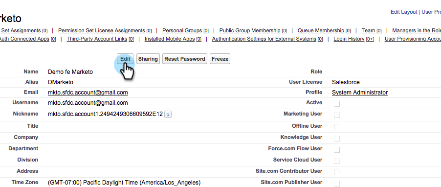

# Festlegen des Marketo-Synchronisierungsbenutzers als Marketing-Benutzer {#make-marketo-sync-user-a-marketing-user}

Der [Marketo-Synchronisierungsbenutzer](/help/marketo/product-docs/crm-sync/salesforce-sync/setup/enterprise-unlimited-edition/step-2-of-3-create-a-salesforce-user-for-marketo-enterprise-unlimited.md){target="_blank"} muss Marketing-Benutzer sein, damit die Salesforce-Kampagnensynchronisierung ordnungsgemäß funktioniert. So machen Sie einen Benutzer zu einem Marketing-Benutzer in Salesforce.

>[!NOTE]
>
>**Admin-Berechtigungen erforderlich**

1. Melden Sie sich bei Salesforce an. Suchen Sie in der linken Suchleiste nach Benutzern und klicken Sie **[!UICONTROL Benutzer]** unter **[!UICONTROL Benutzer verwalten]**.

   

1. Suchen Sie Ihren Synchronisierungsbenutzer und klicken Sie auf seinen Namen.

   

1. Klicken Sie auf **[!UICONTROL Bearbeiten]**.

   

1. Markieren Sie das **[!UICONTROL Marketing-Benutzer]** und klicken Sie auf **[!UICONTROL Speichern]**.

   

   Dieser Marketo-Synchronisierungsbenutzer ist jetzt Marketing-Benutzer.
