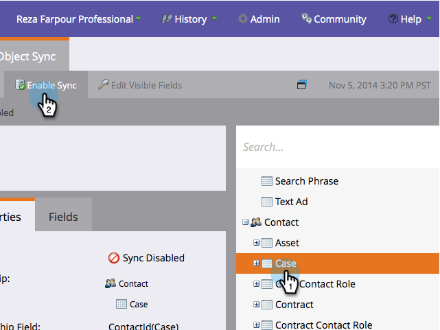

# Benutzerdefinierte Objektsynchronisierung aktivieren/deaktivieren {#enable-disable-custom-object-sync}

Benutzerdefinierte Objekte, die in Ihrer Salesforce-Instanz erstellt wurden, können auch Teil von Marketo Engage sein. So richten Sie es ein.

## Benutzerdefinierte Objektsynchronisierung aktivieren/deaktivieren {#enable-disable-custom-object-sync-1}

>[!NOTE]
>
>**Administratorberechtigungen erforderlich**

1. Klicken Sie auf **[!UICONTROL Admin]**.

   

1. Klicken Sie im Menü „Datenbankverwaltung“ auf **[!UICONTROL Salesforce-Objekte synchronisieren]**.

   

1. Wenn dies das erste benutzerdefinierte Objekt ist, klicken Sie auf **[!UICONTROL Schema synchronisieren]**. Klicken Sie andernfalls auf **[!UICONTROL Schema aktualisieren]**, um sicherzustellen, dass Sie über die neueste verfügen.

   

1. Wenn die globale Synchronisierung ausgeführt wird, müssen Sie sie deaktivieren, indem Sie auf **[!UICONTROL Globale Synchronisierung deaktivieren]** klicken.

   

   >[!NOTE]
   >
   >Eine Synchronisierung des benutzerdefinierten Salesforce-Objektschemas kann einige Minuten dauern.

1. Klicken Sie **[!UICONTROL Schema aktualisieren]**.

   

1. Wählen Sie das zu synchronisierende Objekt aus und klicken Sie auf **[!UICONTROL Synchronisierung aktivieren]**.

   >[!TIP]
   >
   >Marketo kann ein benutzerdefiniertes Objekt nur synchronisieren, wenn es eine direkte Beziehung mit dem Lead-, Kontakt- oder Kontoobjekt in Salesforce hat.

   

1. Klicken Sie erneut **[!UICONTROL Synchronisierung aktivieren]**.

   

1. Gehen Sie zurück zur Registerkarte **[!DNL Salesforce]** und klicken Sie auf **[!UICONTROL Synchronisierung aktivieren]**.

   

## Verwenden benutzerdefinierter Objekte {#using-your-custom-objects}

>[!NOTE]
>
>Benutzerdefinierte Objekte können nicht in Smart-Kampagnen mit Triggern verwendet werden.

1. Ziehen Sie in Ihrer Smart List den Filter **[!UICONTROL Hat Opportunity]** und setzen Sie ihn auf **[!UICONTROL true]**.

   

1. Verwenden Sie dann Filtereinschränkungen, um den Fokus einzugrenzen.

   

   Ausgezeichnet! Sie können jetzt die Daten dieses benutzerdefinierten Objekts in Smart-Kampagnen und Smart-Listen verwenden.

>[!MORELIKETHIS]
>
>[Benutzerdefiniertes Objektfeld als Smart-Listen-/Trigger-Einschränkungen hinzufügen/entfernen](/help/marketo/product-docs/crm-sync/salesforce-sync/setup/optional-steps/add-remove-custom-object-field-as-smart-list-trigger-constraints.md){target="_blank"}
