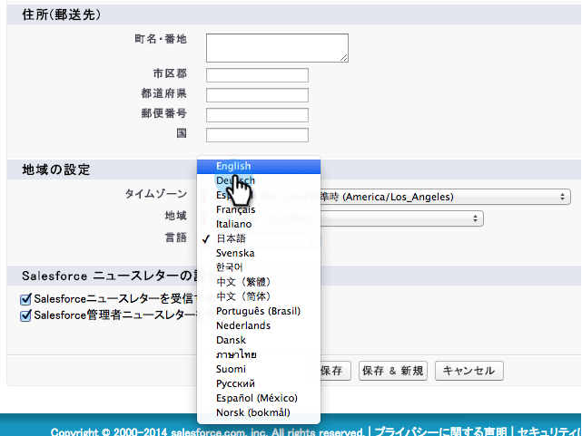

# Aktivieren der Synchronisierung benutzerdefinierter Objekte in anderen Sprachen als Englisch {#enable-non-english-custom-object-sync}

Wenn Ihr Marketo-Synchronisierungsbenutzer auf eine andere Sprache als Englisch eingestellt ist, kann beim Versuch, eine benutzerdefinierte Objektsynchronisierung zu aktivieren, ein Fehler auftreten.

## Fehlerbehebung {#how-to-fix}

1. Melden Sie sich mit dem Marketo Sync-Benutzer bei [!DNL Salesforce] an.

   

1. Klicken Sie auf die Dropdown-Liste Benutzername und wählen Sie **[!UICONTROL Setup]**.

   

1. Klicken **[!UICONTROL unter &quot;]**&quot; auf **[!UICONTROL Meine persönlichen Informationen]**.

   

1. Klicken Sie auf **[!UICONTROL Bearbeiten]**.

   

1. Ändern Sie **[!UICONTROL Sprache]** in **[!UICONTROL Englisch]**.

   

1. Klicken Sie auf **[!UICONTROL Speichern]**.

   

1. Scrollen Sie in Ihrem [Adobe](https://account.adobe.com/profile){target="_blank"}Kontoprofil nach unten zu **[!UICONTROL Bevorzugte Sprachen]** und stellen Sie sicher, dass Ihre erste Sprache auf Englisch eingestellt ist.

   

1. Navigieren Sie in Marketo Engage zu **[!UICONTROL Admin]** > **[!UICONTROL Salesforce]** > **[!UICONTROL Objekte]**. Klicken Sie **[!UICONTROL Schema aktualisieren]**.

   

1. Dadurch wird die Objektliste in englischer Sprache abgerufen. Wählen Sie das gewünschte Objekt aus und klicken Sie auf **[!UICONTROL Synchronisierung aktivieren]**.

   

1. Das benutzerdefinierte Objekt ist jetzt aktiviert und wird synchronisiert.

   

1. Kehren Sie zu [!DNL Salesforce] zurück und ändern Sie mithilfe der oben genannten Schritte den Synchronisierungsbenutzer wieder in Ihre bevorzugte Sprache.

>[!NOTE]
>
>Aktualisieren Sie das Schema ein letztes Mal, um die Objekte in Ihrer Sprache zurückzuholen.
