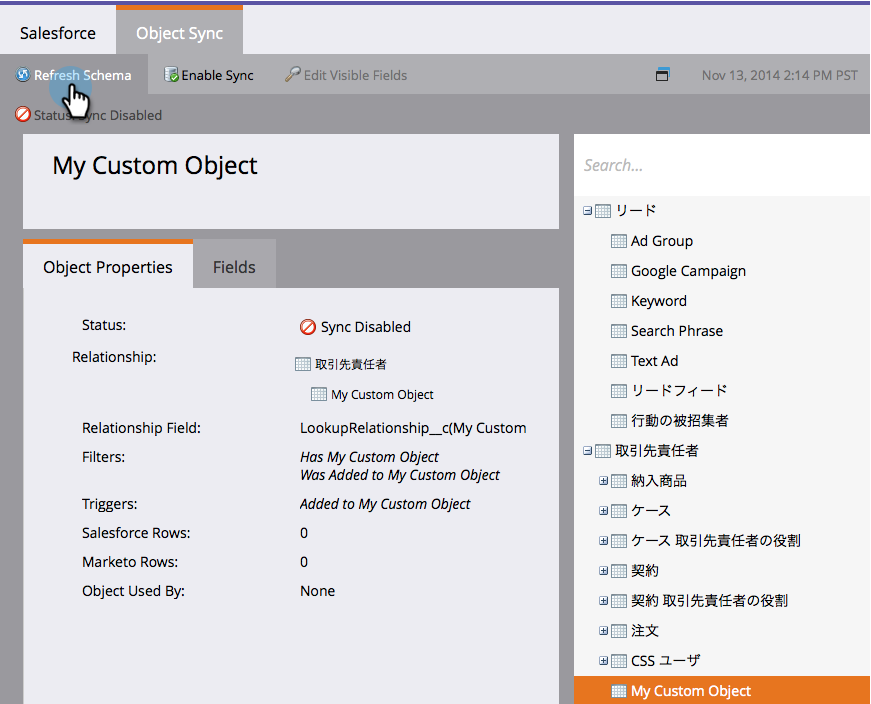

# Aktivieren der Synchronisierung benutzerdefinierter Objekte in anderen Sprachen {#enable-non-english-custom-object-sync}

Wenn Ihr Marketo-Synchronisierungsbenutzer auf eine andere Sprache als Englisch eingestellt ist, kann beim Versuch, eine benutzerdefinierte Objektsynchronisierung zu aktivieren, ein Fehler auftreten.

## Der Fehler {#the-error}

## Um ihn herumzukommen {#getting-around-it}

1. Melden Sie sich mit dem Marketo Sync-Benutzer bei [!DNL Salesforce] an.

   

1. Wechseln Sie unter dem Benutzernamen zu **[!UICONTROL Setup]**.

   

1. Klicken **[!UICONTROL unter &quot;]**&quot; auf **[!UICONTROL Meine persönlichen Informationen]**.

   

1. Klicken Sie auf **[!UICONTROL Bearbeiten]**.

   

1. Ändern Sie **[!UICONTROL Sprache]** in **[!UICONTROL Englisch]**.

   

1. Klicken Sie auf **[!UICONTROL Speichern]**.

   

1. Zurück in Marketo, klicken **[!UICONTROL unter]** > **[!UICONTROL Salesforce]** > **[!UICONTROL Objekte]** auf **[!UICONTROL Schema aktualisieren]**.

   

1. Dadurch wird die Objektliste in englischer Sprache angezeigt. Wählen Sie nun das gewünschte Objekt aus und klicken Sie auf **[!UICONTROL Synchronisierung aktivieren]**.

   

1. Beachten Sie, dass Ihr benutzerdefiniertes Objekt jetzt aktiviert ist und synchronisiert wird.

   

1. Gehen Sie nun zurück zu Salesforce und ändern Sie mithilfe der oben genannten Schritte den Synchronisierungsbenutzer wieder in Ihre bevorzugte Sprache.

>[!NOTE]
>
>Vergessen Sie nicht, das Schema ein letztes Mal zu aktualisieren, um die Objekte in Ihrer Sprache zurückzuholen.
