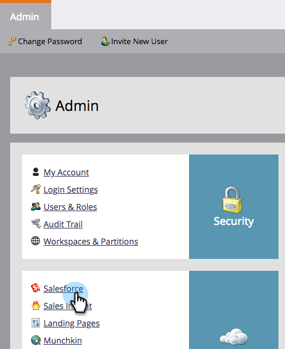

# Deaktivieren der E-Mail-Benachrichtigungen an Lead-Inhaberinnen und -Inhaber {#turn-off-email-notifications-to-lead-owner}

Sie können die automatischen E-Mail-Benachrichtigungen deaktivieren, die bei der Lead-Zuweisung an Lead-Inhaber in [!DNL Salesforce] gesendet werden. Und so geht das.

1. Wechseln Sie zu **[!UICONTROL Admin]**.

   

1. Klicken Sie auf **[!DNL Salesforce]**.

   

1. Klicken **[!UICONTROL unter &quot;]** synchronisieren“ auf **[!UICONTROL Bearbeiten]**.

   

1. Deaktivieren Sie das **[!UICONTROL E-Mail-Benachrichtigung an Verantwortlichen in Salesforce bei Lead-Zuweisung]**. Klicken Sie auf **[!UICONTROL Speichern]**.

   
