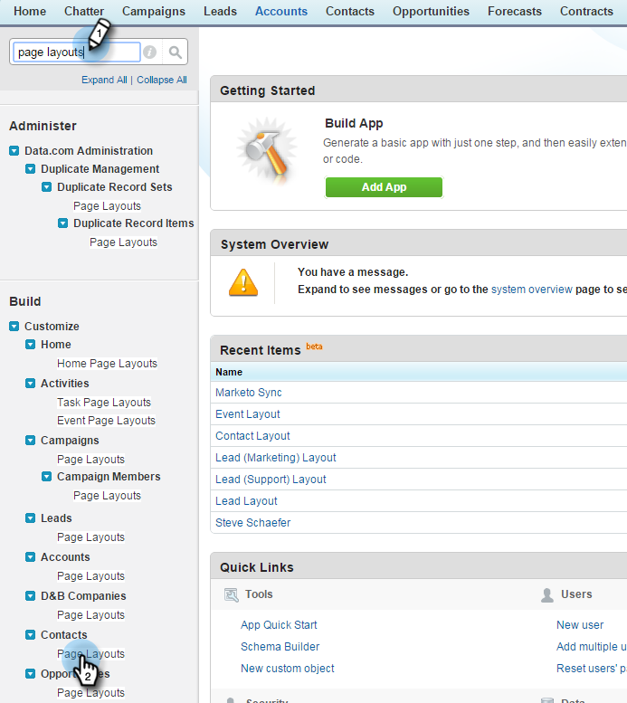

# Schritt 2 von 3: Salesforce-Benutzer für Marketo (Professional) {#step-of-create-a-salesforce-user-for-marketo-professional} erstellen

>[!NOTE]
>
>Diese Schritte müssen von einem Salesforce-Administrator ausgeführt werden

>[!PREREQUISITES]
>
>[Schritt 1 von 3: hinzufügen Marketo Fields to Salesforce (Professional)](/help/marketo/product-docs/crm-sync/salesforce-sync/setup/professional-edition/step-1-of-3-add-marketo-fields-to-salesforce-professional.md)

In diesem Artikel passen Sie die Feldberechtigungen mit einem Salesforce-Seitenlayout an und erstellen einen Marketo-Salesforce-Synchronisierungsbenutzer.

## Seitenlayouts festlegen {#set-page-layouts}

Salesforce Professional stellt die Barrierefreiheit auf Feldebene mit Seitenlayouts ein, im Gegensatz zu Salesforce Enterprise/Unlimited Profilen. Wenn Sie diese Schritte ausführen, kann der Marketo-Synchronisierungsbenutzer die benutzerdefinierten Felder aktualisieren.

1. Geben Sie **Seitenlayouts** in die Navigationsleiste ein, ohne die Taste **Eingabetaste** zu drücken, und klicken Sie unter **Seiten-Layout** auf **Leads**.

   

1. Klicken Sie neben dem Lead-Layout auf **Bearbeiten**.

   

1. Klicken Sie auf und ziehen Sie einen neuen Abschnitt **Abschnitt** in das Seitenlayout.

   

1. Geben Sie &quot;Marketo&quot;für **Abschnittsname** ein und klicken Sie auf **OK**.

   

1. Klicken Sie auf das Feld **Akquisedatum** und ziehen Sie es in den Abschnitt **Marketo**.

   

1. Wiederholen Sie den obigen Schritt für die folgenden Felder:

   * Akquisitionsprogramm
   * Akquisitionsprogramm-ID
   * E-Mail-Abmeldung
   * Abgeleiteter Ort
   * Abgeleitetes Unternehmen
   * Abgeleitetes Land
   * Abgeleiteter Stadtbereich
   * Abgeleitete Vorwahl
   * Abgeleitete Postleitzahl
   * Abgeleitetes Bundesland/abgeleitete Region
   * Lead-Bewertung
   * Ursprünglicher Verweis
   * Ursprüngliche Such-Engine
   * Ursprünglicher Suchausdruck
   * Ursprüngliche Quelleninfo
   * Ursprünglicher Quellentyp

   >[!NOTE]
   >
   >Diese Felder müssen im Seitenlayout vorhanden sein, damit Marketo sie lesen/schreiben kann.

   >[!TIP]
   >
   >Erstellen Sie zwei Spalten für die Felder, indem Sie nach rechts auf der Seite ziehen. Sie können Felder von einer Seite zur anderen verschieben, um die Spaltenlängen auszugleichen.

1. Klicken Sie auf **Speichern**, wenn Sie die Felder fertig hinzugefügt haben.

   

1. Wiederholen Sie alle oben genannten Schritte für Salesforce **Kontaktseitenlayout**.

   

1. Denken Sie daran, auf **Speichern** zu klicken, wenn Sie mit dem **Kontaktseitenlayout** fertig sind.

   

   >[!NOTE]
   >
   >Vergewissern Sie sich, dass das Feld **Ganztägiges Ereignis** zum **Ereignis Seitenlayout** hinzugefügt wurde.

## Synchronisierungsbenutzer {#create-sync-user} erstellen

Marketo benötigt Anmeldeinformationen für den Zugriff auf Salesforce. Dies ist am besten mit einem dedizierten Benutzer, der mit den unten stehenden Schritten erstellt wurde.

>[!NOTE]
>
>Wenn Ihr Unternehmen keine weiteren Salesforce-Lizenzen hat, können Sie einen vorhandenen **Marketing-Benutzer** mit dem Profil **Systemadministrator** verwenden.

1. Geben Sie &quot;users&quot;in die Navigationssuchleiste ein und klicken Sie unter **Benutzer verwalten** auf **Benutzer**.

   

1. Klicken Sie auf **Neuer Benutzer**.

   

1. Füllen Sie die erforderlichen Felder aus und wählen Sie **Benutzerlizenz: Salesforce**, setzen Sie das **Profil: Systemadministrator**, markieren Sie **Marketingbenutzer** und klicken Sie auf **Speichern**.

   

   >[!TIP]
   >
   >Vergewissern Sie sich, dass die eingegebene E-Mail-Adresse gültig ist. Sie müssen sich als Synchronisierungsbenutzer anmelden, um das Kennwort zurückzusetzen.

Ausgezeichnet! Jetzt haben Sie ein Konto, mit dem Marketo eine Verbindung zu Salesforce herstellen kann. Machen wir es!

>[!MORELIKETHIS]
>
>[Schritt 3 von 3: Marketo und Salesforce verbinden (Professional)](/help/marketo/product-docs/crm-sync/salesforce-sync/setup/professional-edition/step-3-of-3-connect-marketo-and-salesforce-professional.md)
