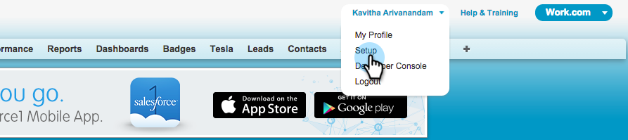
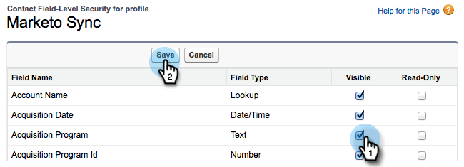

# Hinzufügen eines vorhandenen [!DNL Salesforce] zur Marketo-Synchronisierung {#add-an-existing-salesforce-field-to-the-marketo-sync}

>[!NOTE]
>
>**Admin-Berechtigungen erforderlich**

Normalerweise werden neue benutzerdefinierte Felder in Salesforce automatisch mit Marketo Engage synchronisiert. Andernfalls sind die Felder für den Marketo Sync-Benutzer möglicherweise nicht sichtbar. So können Sie das beheben.

1. Klicken Sie auf Ihren Namen und wählen Sie **[!UICONTROL Setup]** aus.

   

1. Geben Sie in der linken Suchleiste „Profil“ ein und klicken Sie unter **[!UICONTROL Benutzer verwalten]** auf **[!UICONTROL Profile]**.

   

1. Klicken Sie auf das Profil des Benutzers synchronisieren.

   

1. Klicken Sie **[!UICONTROL Abschnitt „Sicherheit auf]**&quot; auf **[!UICONTROL Anzeigen]** neben dem Objekt, das das Feld enthält.

   

1. Klicken Sie auf **[!UICONTROL Bearbeiten]**.

   

1. Markieren Sie das **[!UICONTROL Sichtbar]** für das Feld, das Sie der Synchronisierung hinzufügen möchten, und klicken Sie auf **[!UICONTROL Speichern]**.

   

   Beim nächsten Synchronisationszyklus sieht Marketo das Feld und startet die Magie.

   >[!NOTE]
   >
   > Wenn das Feld bereits Werte in [!DNL Salesforce] enthält, werden diese Werte erst bei der nächsten Datensatzaktualisierung mit Marketo synchronisiert.
