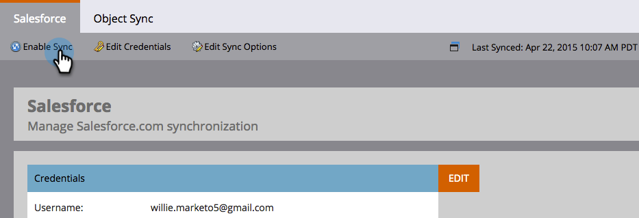

# SFDC-Synchronisierung: Eigene Objektsynchronisierung {#sfdc-sync-custom-object-sync}

Benutzerdefinierte Objekte, die in Ihrer Salesforce-Instanz erstellt wurden, können auch Teil von Marketo sein.  So richten Sie es ein:

>[!NOTE]
>
>**Administratorberechtigungen erforderlich**

>[!PREREQUISITES]
>
>Um ein benutzerdefiniertes Objekt zu verwenden, muss es mit einem [Interessenten](sfdc-sync-lead-sync.md)-, Schützen- Konto in Salesforce verknüpft sein.

## Benutzerdefiniertes Objekt aktivieren  {#enable-custom-object}

1. Klicken Sie auf **Admin** und den **Link** zur Synchronisierung von Salesforce-Objekten.****

   .

1. Wenn dies Ihr erstes benutzerdefiniertes Objekt ist, klicken Sie auf Schema **synchronisieren.**

   

1. Klicken Sie auf Globale Synchronisierung **deaktivieren.**

   

   >[!NOTE]
   >
   >Eine anfängliche Synchronisierung des benutzerdefinierten Salesforce-Schemas kann einige Minuten dauern.

   

1. Ziehen Sie das benutzerdefinierte Objekt, das Sie synchronisieren möchten, in die Arbeitsfläche.

   

   >[!NOTE]
   >
   >Benutzerdefinierte Objekte müssen eindeutige Namen haben. Marketo unterstützt nicht zwei verschiedene benutzerdefinierte Objekte mit demselben Namen.

1. Klicken Sie auf Synchronisierung **aktivieren.**

   

1. Klicken Sie erneut auf Synchronisierung **aktivieren** .

   

   >[!NOTE]
   >
   >**Erinnerung**
   >
   >
   >Vergessen Sie nicht, Ihre globale Synchronisierung erneut zu aktivieren!

1. Gehen Sie zurück zur Registerkarte **Salesforce **s.

   

1. Klicken Sie auf Synchronisierung **aktivieren.**

   

1. Um alle Ihre Salesforce-Objekte Ansicht, klicken Sie auf den Link **Admin** und auf den Link** Salesforce-Objekte synchronisieren **(siehe oben Schritt 1).

   

   >[!NOTE]
   >
   >Marketo unterstützt nur benutzerdefinierte Entitäten, die mit standardmäßigen Entitäten in einer oder zwei Ebenen verknüpft sind.

### Nächste Schritte: {#whats-next}

[Benutzerdefiniertes Objektfeld als Einschränkungen für intelligente Liste/Auslöser Hinzufügen/entfernen](../../../../product-docs/crm-sync/salesforce-sync/setup/optional-steps/add-remove-custom-object-field-as-smart-list-trigger-constraints.md)

Ausgezeichnet! Sie können jetzt Daten aus diesem benutzerdefinierten Objekt in intelligenten Kampagnen und intelligenten Listen verwenden.

