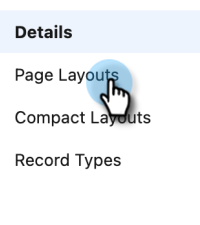
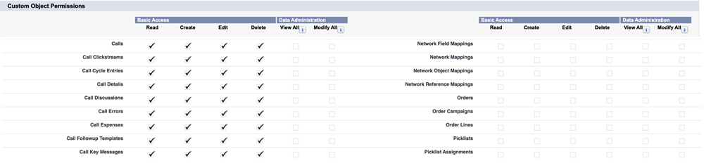

# Schritt 2 von 3: Erstellen eines [!DNL Veeva] CRM-Benutzers für Marketo Engage {#step-2-of-3-create-a-veeva-crm-user-for-marketo-engage}

>[!NOTE]
>
>Die Schritte in diesem Artikel müssen von einem [!DNL Veeva] CRM-Administrator durchgeführt werden.

>[!PREREQUISITES]
>
>[Schritt 1 von 3: Marketo-Felder zu hinzufügen [!DNL Salesforce] (Professional)](/help/marketo/product-docs/crm-sync/veeva-crm-sync/setup/step-1-of-3-add-marketo-fields-to-veeva-crm.md){target="_blank"}

In diesem Artikel passen Sie Feldberechtigungen mit einem [!DNL Veeva] CRM-Seitenlayout an und erstellen einen [!DNL Marketo-Veeva] CRM-Synchronisierungsbenutzer.

## Festlegen von Seiten-Layouts {#set-page-layouts}

Mit diesen Schritten kann der Marketo-Synchronisierungsbenutzer die benutzerdefinierten Felder aktualisieren.

1. Klicken Sie auf die **[!UICONTROL Konto]**-Seitenlayouts (Personenkonto) in der Navigationssuchleiste, ohne die Eingabetaste zu drücken, und klicken Sie auf **[!UICONTROL Seitenlayout]** unter [!UICONTROL Kontakte].

   

1. Klicken Sie auf **[!UICONTROL Seiten-Layouts]**.

   

1. Klicken Sie **[!UICONTROL HCP - Professional]**.

   

1. Klicken Sie auf und ziehen Sie einen neuen **[!UICONTROL Abschnitt]** in das Seitenlayout.

1. Geben Sie &quot;Marketo&quot; für **[!UICONTROL Abschnittsname]** ein und klicken Sie auf **[!UICONTROL OK]**.

   

1. Klicken Sie auf das Feld **[!UICONTROL Score]** und ziehen Sie es in den Abschnitt Marketo .

   

1. Wiederholen Sie den obigen Schritt für die folgenden Felder:

   * Abgeleiteter Ort
   * Abgeleitetes Unternehmen
   * Abgeleitetes Land
   * Abgeleiteter Stadtbereich
   * Abgeleitete Vorwahl
   * Abgeleitete Postleitzahl
   * Abgeleitetes Bundesland/abgeleitete Region

   >[!NOTE]
   >
   >Diese Felder müssen sich im Seiten-Layout befinden, damit Marketo sie lesen/schreiben kann.

   >[!TIP]
   >
   >Erstellen Sie zwei Spalten für die Felder, indem Sie sie nach unten auf die rechte Seite ziehen. Sie können Felder von einer Seite auf die andere verschieben, um die Spaltenlängen auszugleichen.

1. Wenn Sie mit dem Layout [!UICONTROL HCP-Professional] fertig sind, klicken Sie auf **[!UICONTROL Speichern]**.

   

>[!NOTE]
>
>Wiederholen Sie dies für andere [!UICONTROL Konto]-Seiten-Layouts.

## Profil erstellen {#create-a-profile}

1. Klicken Sie **[!UICONTROL Setup]**.

   

1. Geben Sie in die Navigationssuchleiste „Profile“ ein und klicken Sie auf den **[!UICONTROL Profile]**.

   

1. Klicken Sie auf **[!UICONTROL Neu]**.

   

1. Wählen Sie **[!UICONTROL Standardbenutzer]**, benennen Sie das Profil &quot;[!UICONTROL Marketo-Salesforce Sync] und klicken Sie auf **[!UICONTROL Speichern]**.

   

## Festlegen von Profilberechtigungen {#set-profile-permissions}

1. Klicken Sie **[!UICONTROL Bearbeiten]**, um die Sicherheitsberechtigungen festzulegen.

   

1. Stellen Sie im Abschnitt [!UICONTROL Administratorberechtigungen] sicher, dass [!UICONTROL API aktiviert] ausgewählt ist.

   

   >[!TIP]
   >
   >Stellen Sie sicher, dass Sie das Kontrollkästchen [!UICONTROL Kennwort läuft nie ab] aktivieren.

1. Stellen Sie [!UICONTROL  Abschnitt „Allgemeine ]&quot; sicher[!UICONTROL  dass „Ereignisse bearbeiten] und [!UICONTROL Aufgaben bearbeiten] ausgewählt sind.

   

1. Stellen Sie im Abschnitt [!UICONTROL Standardobjektberechtigungen] sicher, dass [!UICONTROL Lesen], [!UICONTROL Erstellen], [!UICONTROL Bearbeiten] und [!UICONTROL Löschen] für [!UICONTROL Konten] und [!UICONTROL Kontakte] aktiviert sind.

   

1. Stellen Sie [!UICONTROL  Abschnitt „Benutzerdefinierte Objektberechtigungen] sicher, dass [!UICONTROL Lese]-Berechtigungen für [!UICONTROL Aufruf], [!UICONTROL Aufrufschlüsselmeldung] und alle anderen gewünschten benutzerdefinierten Objekte überprüft werden.

   

1. Wenn Sie fertig sind **[!UICONTROL klicken Sie unten]** der Seite auf „Speichern“.

   

## Festlegen von Feldberechtigungen {#set-field-permissions}

1. Besprechen Sie mit Ihren Marketern, um herauszufinden, welche benutzerdefinierten Felder zum Synchronisieren erforderlich sind.

   >[!NOTE]
   >
   >Dieser Schritt verhindert, dass Felder, die Sie nicht benötigen, in Marketo angezeigt werden. Dadurch wird die Anzeige übersichtlicher und die Synchronisierung beschleunigt.

1. Wechseln Sie auf [!UICONTROL  Seite ]Profildetails“ zum Abschnitt **[!UICONTROL Sicherheit auf]**). Klicken Sie **[!UICONTROL Anzeigen]**, um die Barrierefreiheit für die Objekte [!UICONTROL Kontakt] und [!UICONTROL Konto] zu bearbeiten.

   

   >[!TIP]
   >
   >Sie können andere Objekte entsprechend den Anforderungen Ihres Unternehmens konfigurieren.

1. Klicken Sie für jedes Objekt auf **[!UICONTROL Bearbeiten]**.

   

Suchen Sie die unnötigen Felder und stellen Sie sicher, dass [!UICONTROL Lesezugriff] und [!UICONTROL Bearbeitungszugriff] **deaktiviert**. Klicken Sie auf **[!UICONTROL Speichern]**, wenn Sie fertig sind.

>[!NOTE]
>
>Bearbeiten Sie nur die Barrierefreiheit für die benutzerdefinierten Felder.

1. Nachdem Sie alle unnötigen Felder deaktiviert haben, überprüfen Sie [!UICONTROL Lesezugriff] und [!UICONTROL Bearbeitungszugriff] für die folgenden Objektfelder. Klicken Sie auf **[!UICONTROL Speichern]**, wenn Sie fertig sind.

<table>
 <tbody>
  <tr>
   <th>Objekt
   <th>Felder
  </tr>
  <tr>
   <td>Konto</td>
   <td>Feld eingeben</td>
  </tr>
  <tr>
   <td>Ereignis</td>
   <td>Alle Felder</td>
  </tr>
  <tr>
   <td>Aufgabe</td>
   <td>Alle Felder</td>
  </tr>
 </tbody>
</table>

## Synchronisierungsbenutzer erstellen {#create-sync-user}

Marketo benötigt Anmeldeinformationen für den Zugriff auf [!DNL Veeva] CRM. Dies geschieht am besten mit einem dedizierten Benutzer, der mit den folgenden Schritten erstellt wurde.

>[!NOTE]
>
>Wenn Ihr Unternehmen über keine zusätzlichen [!DNL Veeva] CRM-Lizenzen verfügt, können Sie einen vorhandenen Marketing-Benutzer mit dem Systemadministratorprofil verwenden.

1. Geben Sie in der Navigationssuchleiste „Benutzer“ ein und klicken Sie unter **[!UICONTROL Benutzer verwalten]** auf [!UICONTROL Benutzer ].

   

1. Klicken Sie auf **[!UICONTROL Neuer Benutzer]**.

   

1. Füllen Sie die erforderlichen Felder aus, wählen Sie die **[!UICONTROL Benutzerlizenz]**: **[!UICONTROL Salesforce]**, legen Sie den **[!UICONTROL Profile]**: **[!UICONTROL Marketo Sync]**-Benutzer fest und klicken Sie auf **[!UICONTROL Speichern]**.

   

>[!TIP]
>
>Stellen Sie sicher, dass die eingegebene E-Mail-Adresse gültig ist. Sie müssen sich als Synchronisierungsbenutzer anmelden, um das Kennwort zurückzusetzen.

Ausgezeichnet! Jetzt verfügen Sie über ein Konto, mit dem Marketo Engage eine Verbindung zu [!DNL Veeva] CRM herstellen kann. Machen wir es.

>[!MORELIKETHIS]
>
>[Schritt 3 von 3: Marketo und  [!DNL Veeva] -CRM verbinden](/help/marketo/product-docs/crm-sync/veeva-crm-sync/setup/step-3-of-3-connect-marketo-engage-and-veeva-crm.md){target="_blank"}
