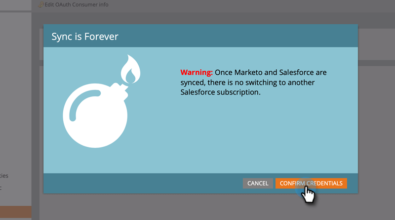

# 3. Schritt: Marketo Engage und Veeva CRM verbinden {#step-3-of-3-connect-marketo-engage-and-veeva-crm}

In diesem Artikel konfigurieren Sie Marketo Engage zur Synchronisierung mit Ihrer konfigurierten VEE CRM-Instanz. **Sie sehen Salesforce in einigen der Popups**, da Veeva CRM auf der Salesforce-Plattform basiert.

>[!PREREQUISITES]
>
>* [Schritt 1 von 3: Marketo-Felder zu Veeva hinzufügen](/help/marketo/product-docs/crm-sync/veeva-crm-sync/setup/step-1-of-3-add-marketo-fields-to-veeva-crm.md){target="_blank"}
>* [Schritt 2 von 3: Erstellen eines VEC-Benutzers für Marketo](/help/marketo/product-docs/crm-sync/veeva-crm-sync/setup/step-2-of-3-create-a-veeva-crm-user-for-marketo-engage.md){target="_blank"}

>[!IMPORTANT]
>
>Es kann jeweils nur eine Marketo-Instanz mit einer Veeva CRM-Instanz verbunden werden.

## Verbindung mit VEeva CRM über OAuth herstellen {#connect-to-veeva-crm-using-oauth}

1. Klicken Sie in Marketo auf **[!UICONTROL Admin]**. Wählen Sie **[!UICONTROL CRM]** aus und klicken Sie auf **[!UICONTROL Mit Vevar synchronisieren]**.

   

   >[!NOTE]
   >
   >Stellen Sie sicher, dass Sie [alle Felder, die Sie nicht benötigen, in Marketo vor dem Synchronisierungsbenutzer ausblenden, bevor Sie auf &quot;Synchronisierungsfelder&quot;klicken. ](/help/marketo/product-docs/crm-sync/salesforce-sync/sfdc-sync-details/hide-a-salesforce-field-from-the-marketo-sync.md){target="_blank"} Wenn Sie auf Felder synchronisieren klicken, werden alle Felder, die dem Benutzer angezeigt werden, dauerhaft in Marketo erstellt und können nicht gelöscht werden.

1. Klicken Sie auf &quot;**[!UICONTROL Anmelden bei VEeva]**&quot;.

   

   >[!NOTE]
   >
   >Aktivieren Sie Sandbox , wenn Sie eine Marketo-Sandbox mit einer VEA CRM-Sandbox synchronisieren.

1. Klicken Sie auf **[!UICONTROL Anmeldedaten bestätigen]**.

   

1. Ein Popup mit der Salesforce-Anmeldeseite wird angezeigt. Geben Sie Ihre Anmeldedaten für &quot;Marketo Sync User&quot;ein und klicken Sie auf **[!UICONTROL Anmelden]**.

   

1. Geben Sie den Verifizierungscode ein, den Sie per E-Mail erhalten haben (gesendet von Salesforce), und klicken Sie auf **[!UICONTROL Verify]**.

   

1. Nach erfolgreicher Überprüfung wird auf der Zugriffsseite angezeigt, auf der der Zugriff angefordert wird. Klicken Sie auf **[!UICONTROL Allow]**.

   

1. In einigen Minuten wird ein Popup in Marketo Enge angezeigt. Klicken Sie auf **[!UICONTROL Anmeldedaten bestätigen]**.

   

## Starten Sie Veeva Sync {#start-veeva-sync}

1. Klicken Sie auf **[!UICONTROL Starten Sie die VEA-Synchronisation]** , um die beständige Marketo-VEE CRM-Synchronisation zu starten.

   

   >[!CAUTION]
   >
   >Marketo deaktiviert das Duplizieren nicht automatisch für eine VEE CRM-Synchronisation oder wenn Sie Leads manuell eingeben.

1. Klicken Sie auf **[!UICONTROL Synchronisation starten]**.

   

>[!NOTE]
>
>Die Dauer der Erstsynchronisierung hängt von der Größe und Komplexität Ihrer Datenbank ab.

## Synchronisierung überprüfen {#verify-sync}

Marketo stellt Statusmeldungen für die VEA CRM-Synchronisation im Admin-Bereich bereit. Sie können überprüfen, ob die Synchronisierung ordnungsgemäß funktioniert, indem Sie die folgenden Schritte ausführen.

1. Klicken Sie in Marketo auf **[!UICONTROL Admin]** und dann auf **[!UICONTROL Veeva]**.

   

1. Der Synchronisierungsstatus wird oben rechts angezeigt. Es wird eine von drei Meldungen angezeigt: &quot;Zuletzt synchronisiert&quot;, &quot;Synchronisierung läuft&quot;oder &quot;Fehlgeschlagen&quot;.

>[!MORELIKETHIS]
>
>[Benutzerdefinierte Objekte konfigurieren](/help/marketo/product-docs/crm-sync/veeva-crm-sync/sync-details/custom-object-sync.md){target="_blank"}
