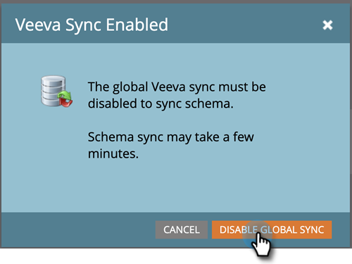
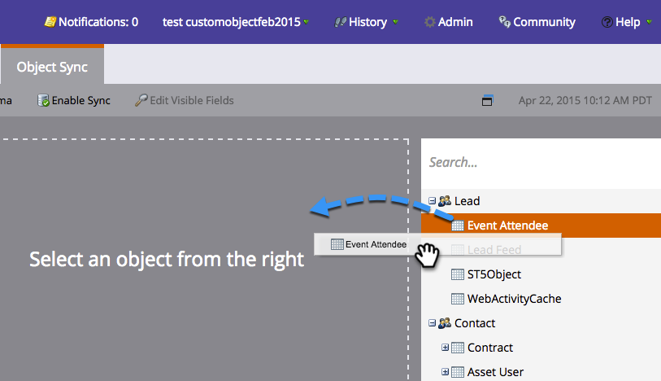
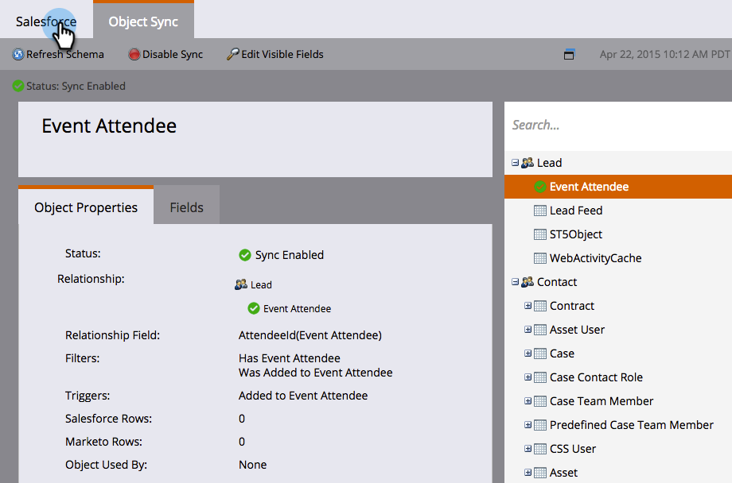

# Synchronisierung benutzerdefinierte Objekte {#custom-object-sync}

Benutzerdefinierte Objekte, die in Ihrer [!DNL Veeva] CRM-Instanz erstellt wurden, können auch Teil von Marketo Engage sein. So richten Sie es ein.

>[!NOTE]
>
>**Administratorberechtigungen erforderlich**

>[!PREREQUISITES]
>
>Um ein benutzerdefiniertes Objekt zu verwenden, muss es mit einem Kontakt- oder Kontoobjekt in [!DNL Veeva] CRM verknüpft sein.

## Benutzerdefiniertes Objekt aktivieren {#enable-custom-object}

1. Klicken Sie in Marketo auf **[!UICONTROL Admin]** und dann auf **[!UICONTROL Veeva Objects Sync]**.

   

1. Wenn dies das erste benutzerdefinierte Objekt ist, klicken Sie auf **[!UICONTROL Schema synchronisieren]**.

   

1. Klicken Sie **[!UICONTROL Globale Synchronisierung deaktivieren]**.

   

   >[!NOTE]
   >
   >Die Erstsynchronisierung des [!DNL Veeva] benutzerdefinierten Objektschemas kann einige Minuten dauern.

1. Ziehen Sie das benutzerdefinierte Objekt, das Sie synchronisieren möchten, auf die Arbeitsfläche.

   

   >[!NOTE]
   >
   >Benutzerdefinierte Objekte müssen eindeutige Namen haben. Marketo unterstützt nicht zwei verschiedene benutzerdefinierte Objekte mit demselben Namen.

1. Klicken Sie auf **[!UICONTROL Synchronisierung aktivieren]**.

   

1. Klicken Sie erneut **[!UICONTROL Synchronisierung aktivieren]**.

   

1. Kehren Sie zur Registerkarte &quot;**[!UICONTROL &quot;]**.

   

1. Klicken Sie auf **[!UICONTROL Synchronisierung aktivieren]**.

   

1. Um alle Ihre [!DNL Veeva] benutzerdefinierten Objekte anzuzeigen, klicken Sie auf **[!UICONTROL Admin]** und **[!UICONTROL Veeva-]**.

   

   >[!NOTE]
   >
   >Marketo unterstützt nur benutzerdefinierte Entitäten, die mit Standardelementen verknüpft sind, die eine bis zwei Ebenen tief sind.

Ausgezeichnet! Sie können jetzt Daten aus diesem benutzerdefinierten Objekt in Smart-Kampagnen und Smart-Listen verwenden.

>[!MORELIKETHIS]
>
>* [Meldungen zu Aufrufen und Aufrufen synchronisieren](/help/marketo/product-docs/crm-sync/veeva-crm-sync/sync-details/syncing-call-and-call-key-messages.md){target="_blank"}
>* [Benutzerdefiniertes Objektfeld als Smart-Listen-/Trigger-Einschränkungen hinzufügen/entfernen](/help/marketo/product-docs/crm-sync/veeva-crm-sync/sync-details/add-remove-custom-object-field-as-smart-list-trigger-constraints.md){target="_blank"}
