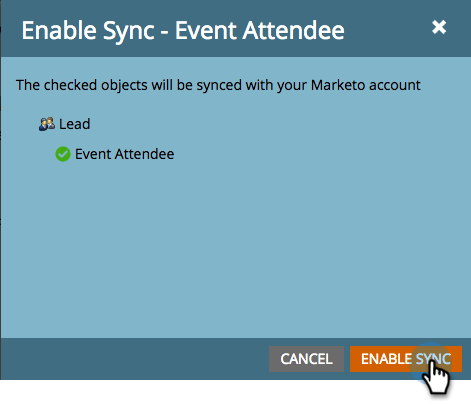
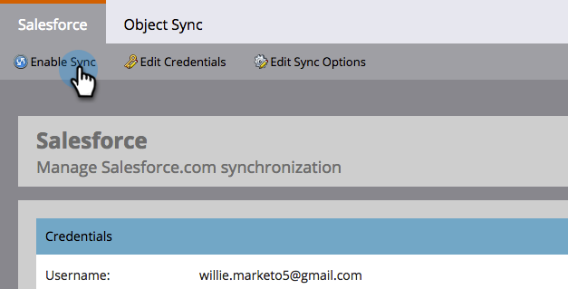

# Benutzerdefinierte Objektsynchronisierung {#custom-object-sync}

Benutzerdefinierte Objekte, die in Ihrer VEE CRM-Instanz erstellt wurden, können ebenfalls Teil von Marketo Engage sein. So richten Sie es ein.

>[!NOTE]
>
>**Administratorberechtigungen erforderlich**

>[!PREREQUISITES]
>
>Um ein benutzerdefiniertes Objekt zu verwenden, muss es mit einem Kontakt- oder Kontoobjekt in Veeva CRM verknüpft sein.

## Benutzerdefiniertes Objekt aktivieren {#enable-custom-object}

1. Klicken Sie in Marketo auf **[!UICONTROL Admin]**, dann **[!UICONTROL VEC-Objektsynchronisierung]**.

   

1. Wenn dies Ihr erstes benutzerdefiniertes Objekt ist, klicken Sie auf **[!UICONTROL Schema synchronisieren]**.

   

1. Klicks **[!UICONTROL Globale Synchronisierung deaktivieren]**.

   

   >[!NOTE]
   >
   >Die anfängliche Synchronisierung des benutzerdefinierten Objektschemas von Veeva kann einige Minuten dauern.

1. Ziehen Sie das benutzerdefinierte Objekt, das Sie synchronisieren möchten, in die Arbeitsfläche.

   

   >[!NOTE]
   >
   >Benutzerdefinierte Objekte müssen eindeutige Namen haben. Marketo unterstützt zwei verschiedene benutzerdefinierte Objekte mit demselben Namen nicht.

1. Klicks **[!UICONTROL Synchronisierung aktivieren]**.

   

1. Klicks **[!UICONTROL Synchronisierung aktivieren]** erneut.

   

1. Gehen Sie zurück zu **[!UICONTROL Veeva]** Registerkarte.

   

1. Klicks **[!UICONTROL Synchronisierung aktivieren]**.

   

1. Klicken Sie auf , um alle benutzerdefinierten Objekte von Veeva anzuzeigen. **[!UICONTROL Admin]** und **[!UICONTROL VEC-Objektsynchronisierung]**.

   

   >[!NOTE]
   >
   >Marketo unterstützt nur benutzerdefinierte Entitäten, die mit Standardentitäten verknüpft sind, eine bis zwei Ebenen tief.

Ausgezeichnet! Sie können jetzt Daten aus diesem benutzerdefinierten Objekt in Smart-Kampagnen und Smart-Listen verwenden.

>[!MORELIKETHIS]
>
>* [Synchronisieren von Aufrufen und Aufrufen von Schlüsselmeldungen](/help/marketo/product-docs/crm-sync/veeva-crm-sync/sync-details/syncing-call-and-call-key-messages.md){target="_blank"}
>* [Benutzerdefiniertes Objektfeld als Smart-List-/Trigger-Einschränkungen hinzufügen/entfernen](/help/marketo/product-docs/crm-sync/veeva-crm-sync/sync-details/add-remove-custom-object-field-as-smart-list-trigger-constraints.md){target="_blank"}
