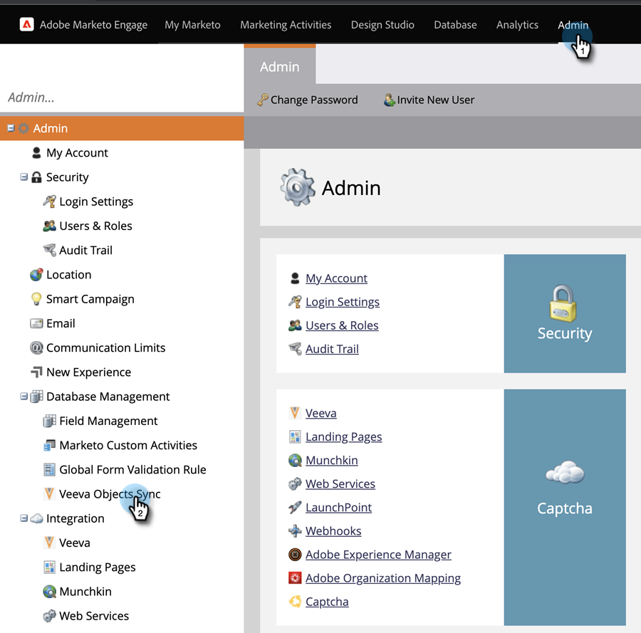
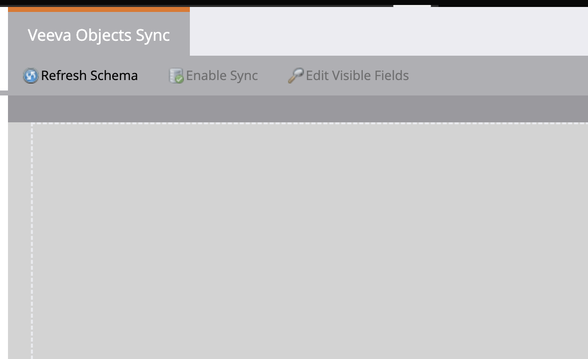
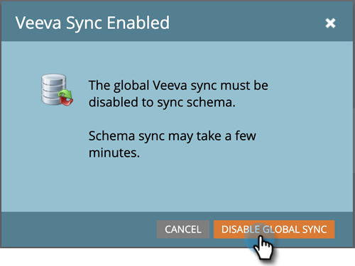
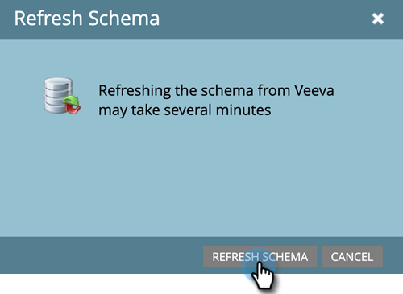
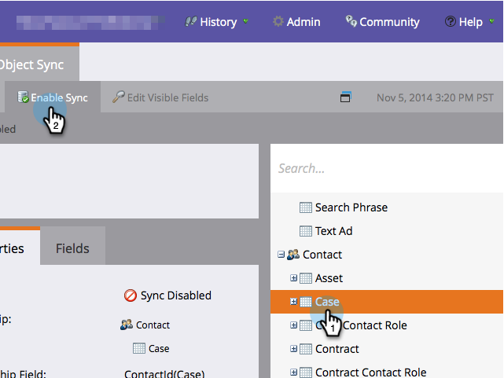
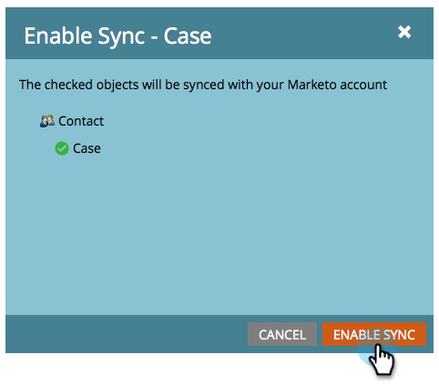
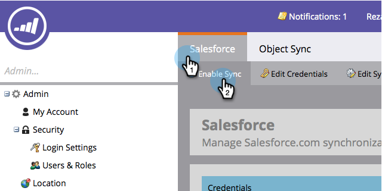
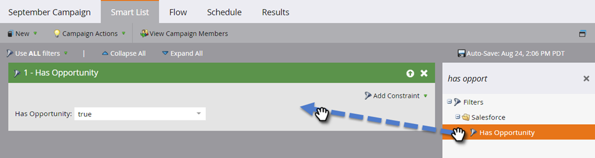
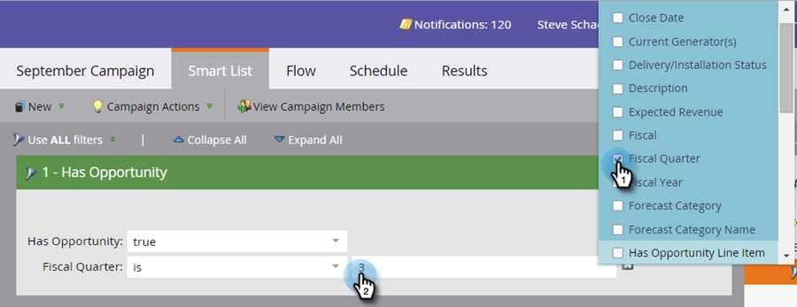

# Aktivieren/Deaktivieren der benutzerdefinierten Objektsynchronisierung {#enable-disable-custom-object-sync}

Benutzerdefinierte Objekte, die in Ihrer [!DNL Veeva] CRM-Instanz erstellt wurden, können auch Teil von Marketo Engage sein. So richten Sie es ein.

## Aktivieren oder Deaktivieren der Synchronisierung benutzerdefinierter Objekte {#enable-or-disable-the-custom-object-sync}

>[!NOTE]
>
>**Administratorberechtigungen erforderlich**

1. Klicken Sie in Marketo auf **[!UICONTROL Admin]** und dann auf **[!UICONTROL Veeva Objects Sync]**.

   

1. Wenn dies das erste benutzerdefinierte Objekt ist, klicken Sie auf **[!UICONTROL Schema synchronisieren]**. Klicken Sie andernfalls auf **[!UICONTROL Schema aktualisieren]**, um sicherzustellen, dass Sie über die neueste Version verfügen.

   

1. Wenn die globale Synchronisierung ausgeführt wird, deaktivieren Sie sie, indem Sie auf **[!UICONTROL Globale Synchronisierung deaktivieren]** klicken.

   

   >[!NOTE]
   >
   >Eine Synchronisierung des [!DNL Veeva] benutzerdefinierten Objektschemas kann einige Minuten dauern.

1. Klicken Sie **[!UICONTROL Schema aktualisieren]**.

   

1. Wählen Sie das zu synchronisierende Objekt aus und klicken Sie auf **[!UICONTROL Synchronisierung aktivieren]**.

   

   >[!TIP]
   >
   >Marketo kann ein benutzerdefiniertes Objekt nur synchronisieren, wenn es eine direkte Beziehung mit dem Kontakt- oder Kontoobjekt in [!DNL Veeva] CRM hat.

1. Klicken Sie erneut **[!UICONTROL Synchronisierung aktivieren]**.

   

1. Wechseln Sie zurück zur Registerkarte [!UICONTROL Veeva] und klicken Sie auf **[!UICONTROL Synchronisierung aktivieren]**.

   

## Verwenden benutzerdefinierter Objekte {#using-your-custom-objects}

>[!NOTE]
>
>Benutzerdefinierte Objekte können nicht in Smart-Kampagnen mit Triggern verwendet werden.

1. Ziehen Sie in [!UICONTROL Smart List] den Filter &quot;**[!UICONTROL Hat Opportunity]** auf und setzen Sie ihn auf **[!UICONTROL True]**.

   

1. Verwenden Sie optional Filtereinschränkungen, um den Fokus einzugrenzen.

   

Sie können jetzt die Daten dieses benutzerdefinierten Objekts in [!UICONTROL Smart-Kampagnen] und [!UICONTROL Smart-Listen] verwenden.

>[!MORELIKETHIS]
>
>[Benutzerdefiniertes Objektfeld als Smart-Listen-/Trigger-Einschränkungen hinzufügen/entfernen](/help/marketo/product-docs/crm-sync/veeva-crm-sync/sync-details/add-remove-custom-object-field-as-smart-list-trigger-constraints.md){target="_blank"}
