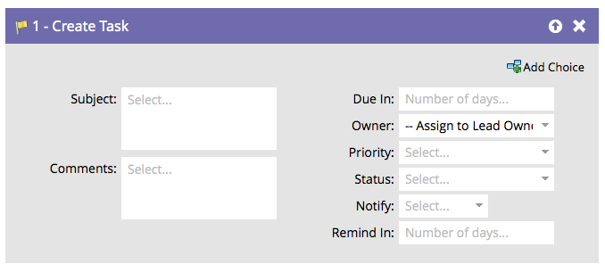

# Aufgabe erstellen in Veeva {#create-task-in-veeva}

Als Marketing-Experte verfügen Sie über Informationen, die dem Vertrieb beim Abschluss von Geschäften helfen können. Sie können Aufgaben erstellen, um ihnen mitzuteilen, was sie tun und wann sie es tun sollten.

>[!NOTE]
>
>Wenn der Marketo Sync User Aufgaben erstellt, **aufgrund von** ist ein erforderliches Feld für die Aufgabe, die in Veeva erstellt werden soll. Marketo gibt standardmäßig fünf Tage ein, wenn kein Wert vorhanden ist.

Standardmäßig sieht der Flussschritt wie folgt aus:

Passen Sie alle Felder an, um die Aufgabe wie gewünscht zu erstellen.

>[!TIP]
>
>Sie können `{{lead.tokens}}`, `{{company.tokens}}`, `{{campaign.tokens}}` und `{{system.tokens}}` im Betreff und in der Beschreibung. Siehe [Token für Flussschritte](/help/marketo/product-docs/core-marketo-concepts/smart-campaigns/flow-actions/use-tokens-in-flow-steps.md){target="_blank"} für weitere Details.
