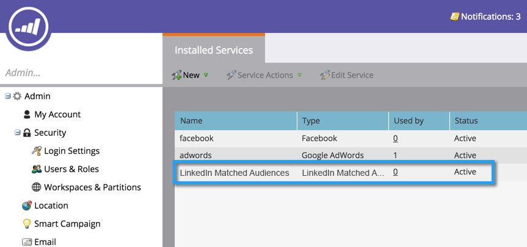

# Hinzufügen von LinkedIn Matched Audiences als LaunchPoint-Dienst {#add-linkedin-matched-audiences-as-a-launchpoint-service}

>[!IMPORTANT]
>
>LinkedIn aktualisiert ihre Marketing-APIs, die von Marketo Engage LinkedIn-Integrationen verwendet werden. Diese Änderungen erfordern eine erneute Authentifizierung aller LinkedIn LaunchPoint-Dienste in Ihren **Admin** > **LaunchPoint** zwischen dem 7. Juni und dem 15. Dezember 2024, um Dienstunterbrechungen zu vermeiden. Weitere Informationen finden Sie im [Häufig gestellte Fragen zur Migration](https://nation.marketo.com/t5/employee-blogs/linkedin-re-authentication-required/ba-p/347794){target="_blank"}.

>[!NOTE]
>
>**Erforderliche Administratorberechtigungen**

Verbinden Sie Ihr Marketo Engage-Konto mit LinkedIn Matched Audiences , um eine statische Marketo-Liste oder Smart List als LinkedIn-Zielgruppensegment zu verwenden.

1. Navigieren Sie zu **[!UICONTROL Admin]** Abschnitt.

   

1. Auswählen **[!UICONTROL LaunchPoint]**.

   

1. Auswählen **[!UICONTROL Neu]** und **[!UICONTROL Neuer Dienst]**.

   

1. Geben Sie einen **[!UICONTROL Anzeigename]** und wählen **[!UICONTROL LinkedIn Matched Audiences]**. Klicken Sie auf **[!UICONTROL Erstellen]**.

   

1. Um ein LinkedIn-Konto zu verbinden, klicken Sie auf **[!UICONTROL Autorisieren]**.

   

   >[!CAUTION]
   >
   >Damit Marketo Zielgruppen über mehrere LinkedIn-Anzeigenkonten hinweg senden kann, muss der LinkedIn-Benutzer, den Sie in den folgenden Schritten autorisieren, Zugriff auf *all* dieser Anzeigenkonten in ihrem Campaign Manager.

1. LinkedIn wird in einer neuen Registerkarte geöffnet. Melden Sie sich von hier aus bei Ihrem LinkedIn-Konto an.

   

1. Überprüfen Sie die angeforderten Berechtigungen und klicken Sie dann auf **[!UICONTROL Zulassen]**.

   

1. Ihr LinkedIn-Konto ist jetzt mit Marketo verbunden. Klicken Sie auf **[!UICONTROL Erstellen]**.

   

   Fantastisch! LinkedIn Matched Audiences werden jetzt auf der Registerkarte Installierte Dienste als LaunchPoint-Dienst aufgelistet.

   

>[!MORELIKETHIS]
>
>[Verwenden einer Marketo-Liste oder Smart-Liste als LinkedIn-Zielgruppensegment](/help/marketo/product-docs/demand-generation/social/social-functions/use-a-marketo-list-or-smart-list-as-a-linkedin-audience-segment.md){target="_blank"}
