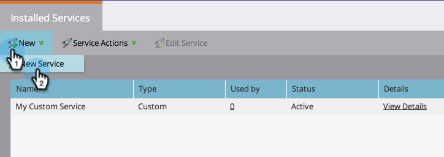
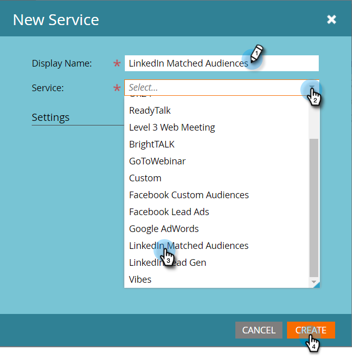
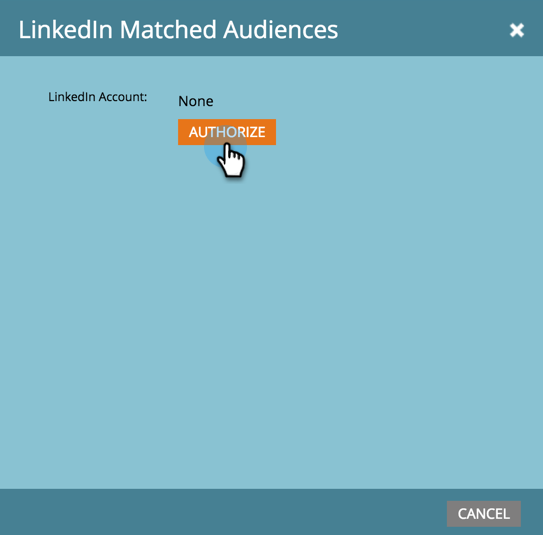
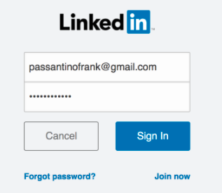

# Hinzufügen [!DNL LinkedIn] übereinstimmenden Zielgruppen als [!DNL LaunchPoint] Service {#add-linkedin-matched-audiences-as-a-launchpoint-service}

>[!IMPORTANT]
>
>LinkedIn aktualisiert seine Marketing-APIs, die von Marketo Engage LinkedIn-Integrationen verwendet werden. Diese Änderungen erfordern zwischen dem 7. Juni und dem 15. Dezember 2024 eine erneute Authentifizierung aller LinkedIn LaunchPoint-Services in Ihrem **Admin** > **LaunchPoint**-Menü, um eine Unterbrechung des Services zu vermeiden. Weitere Informationen finden Sie unter [Häufig gestellte Fragen zur Migration](https://nation.marketo.com/t5/employee-blogs/linkedin-re-authentication-required/ba-p/347794){target="_blank"}.

>[!NOTE]
>
>**Admin-Berechtigungen erforderlich**

Verbinden Sie Ihr Marketo-Konto mit [!DNL LinkedIn] übereinstimmenden Zielgruppen, um eine statische Marketo-Liste oder eine Smart-Liste als [!DNL LinkedIn] Zielgruppensegment zu verwenden.

1. Navigieren Sie zum Abschnitt **[!UICONTROL Admin]**.

   

1. Wählen Sie **[!UICONTROL LaunchPoint]** aus.

   

1. Wählen Sie **[!UICONTROL Neu]** und **[!UICONTROL Neuer Service]** aus.

   

1. Geben Sie einen **[!UICONTROL Anzeigenamen]** ein und wählen Sie **[!UICONTROL LinkedIn Matched Audiences]**. Klicken Sie auf **[!UICONTROL Erstellen]**.

   

1. Um ein [!DNL LinkedIn] Konto zu verbinden, klicken Sie auf **[!UICONTROL Autorisieren]**.

   

   >[!CAUTION]
   >
   >Damit Marketo Zielgruppen über mehrere [!DNL LinkedIn] Ad-Konten senden kann, muss der [!DNL LinkedIn], den Sie in den folgenden Schritten autorisieren, Zugriff auf *alle* dieser Ad-Konten in seinem Campaign Manager haben.

1. [!DNL LinkedIn] wird in einer neuen Registerkarte geöffnet. Melden Sie sich von hier aus bei Ihrem [!DNL LinkedIn] Konto an.

   

1. Überprüfen Sie die angeforderten Berechtigungen und klicken Sie dann auf **[!UICONTROL Zulassen]**.

   

1. Ihr [!DNL LinkedIn]-Konto ist jetzt mit Marketo verbunden. Klicken Sie auf **[!UICONTROL Erstellen]**.

   

   [!DNL LinkedIn] übereinstimmende Zielgruppen werden jetzt auf der Registerkarte Installierte Services als [!DNL LaunchPoint]-Service aufgeführt.

   

>[!MORELIKETHIS]
>
>[Verwenden einer Marketo-Liste oder Smart-Liste als  [!DNL LinkedIn] -Zielgruppensegment](/help/marketo/product-docs/demand-generation/social/social-functions/use-a-marketo-list-or-smart-list-as-a-linkedin-audience-segment.md)
