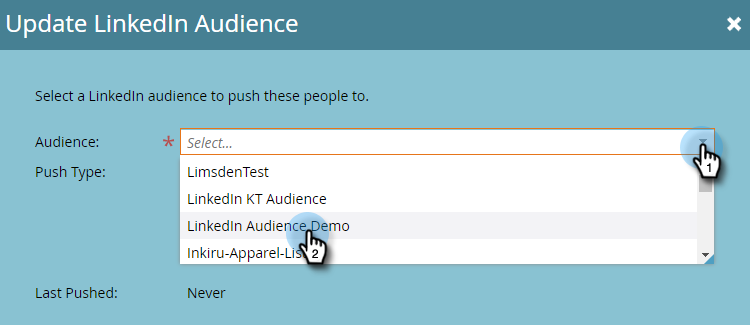

# Senden einer Liste an ein Werbenetzwerk {#send-a-list-to-an-ad-network}

Erfahren Sie, wie Sie eine statische Liste an LinkedIn, Facebook oder Google senden.

## So senden Sie eine Liste {#how-to-send-a-list}

1. Wählen Sie in Marketo Ihre Liste aus, klicken Sie auf die Dropdownliste **Liste Aktionen** und wählen Sie **An Werbenetzwerk senden**.

   

1. Wählen Sie zwischen LinkedIn, Facebook oder Google (die anderen Optionen sind derzeit nicht verfügbar). In diesem Beispiel wählen wir **LinkedIn**. Klicken Sie auf **Weiter**.

   

1. Klicken Sie auf die Dropdownliste Audience und wählen Sie die gewünschte Audience aus.

   

   >[!TIP]
   >
   >Wenn Sie jemals eine Überprüfung vornehmen müssen, können Sie über die Registerkarte &quot;Status&quot;die Ziel-Audience sehen, mit der eine Liste synchronisiert wird.

1. Wählen Sie den gewünschten Push-Typ und klicken Sie auf **Update**.

   

   >[!NOTE]
   >
   >Wenn Sie &quot;Kontinuierliche Synchronisierung der Audience aktivieren&quot;auswählen, hält Marketo die Liste im ausgewählten Werbenetzwerk auf dem neuesten Stand, während sich die Liste-Mitgliedschaft in Ihrer Marketing-Instanz ändert.

1. Und das ist es! Klicken Sie auf **OK**, um den Vorgang zu beenden.

   

## FAQ {#faq}

**Kann eine einzelne statische Liste mit mehreren Anzeigen-Audiencen synchronisiert werden?**

Nein, eine Liste kann nur mit einer einzigen Ziel-Audience synchronisiert werden.

**Wenn ich die kontinuierliche Synchronisierung mit einer vorhandenen Audience der Anzeige aktivieren möchte, wird die bestehende Audience ersetzt?**

Nein, die bestehende Audience wird hinzugefügt, nicht ersetzt.
