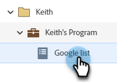
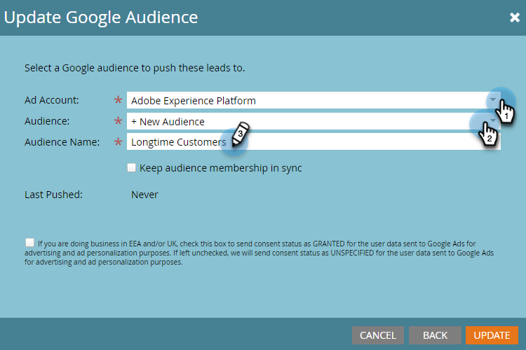
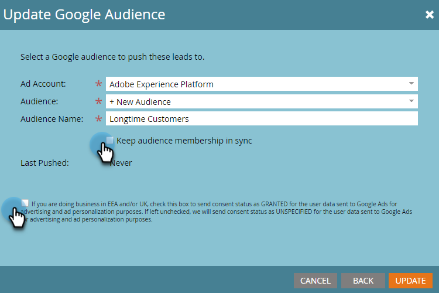

# Senden einer Liste an Google {#send-a-list-to-google}

Für diejenigen, die Google-Kundenabgleich verwenden, führen Sie die folgenden Schritte aus, um eine statische Marketo Engage-Liste an Ihr Google-Konto zu senden.

1. Suchen und wählen Sie unter Marketo Engage die gewünschte Liste aus.

   

1. Klicken Sie auf **Aktionen auflisten** und wählen Sie **An Werbenetzwerk senden**.

   

1. Wählen Sie Google und klicken Sie auf **Nächste**.

   

1. Wählen Sie Ihr gewünschtes Werbekonto aus. Sie können eine existierende Zielgruppe auswählen oder eine neue erstellen. In diesem Beispiel erstellen wir ein neues. Benennen Sie die neue Audience.

   

1. Nehmen Sie Ihre optionale Auswahl vor.

   

   >[!NOTE]
   >
   >* Auswählen **Zielgruppenmitgliedschaft synchronisieren** hält die Liste bei Änderungen in Ihrer Instanz auf dem neuesten Stand. Wir fügen Personen zur Zielgruppe hinzu/entfernen sie aus der statischen Liste.
   >
   >* Wenn Sie das Kontrollkästchen unten aktivieren, wird der Zustimmungsstatus für Benutzerdaten, die zu Werbe- und Anzeigenpersonalisierungszwecken an Google Ads gesendet werden, als GRANTED gesendet. Wenn die Option deaktiviert bleibt, wird der Status der Zustimmung als UNSPEZIFIED gesendet. Für diejenigen, die Daten für Nutzer im Europäischen Wirtschaftsraum (EWR) hochladen möchten, hat Google eine Liste von [FAQs](https://support.google.com/google-ads/answer/14310715){target="_blank"}, as well as additional details outlining the [EU user consent policy](https://www.google.com/about/company/user-consent-policy/){target="_blank"}.

1. Klicks **Aktualisieren**.

   

1. Klicks **OK** zu beenden.

   
