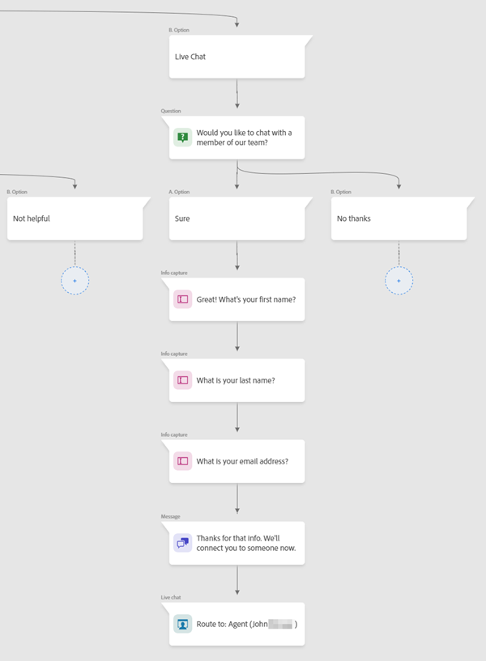
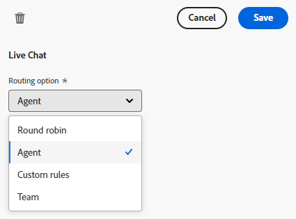

# Live-Chat-Übersicht {#live-chat-overview}

Verwenden Sie die Live-Chat-Karte im [Stream-Designer](/help/marketo/product-docs/demand-generation/dynamic-chat-two/automated-chat/stream-designer.md){target="_blank"} wenn Sie möchten, dass Besucher mit einem Live-Agenten chatten.

## Verwenden der Live-Chat-Karte {#using-the-live-chat-card}

>[!IMPORTANT]
>
>Die Live-Chat-Karte muss immer die letzte Karte im Zweig sein. Wenn die Karte an einem zufälligen Punkt im Zweig platziert wird, kann dies den Besucher überraschen, indem er sie plötzlich mit einem Agenten verbindet.

### Bewährte Methoden {#best-practices}

* Verwenden Sie eine Fragenkarte vor der Live-Chat-Karte und fragen Sie den Besucher, ob er eine Verbindung herstellen möchte.
* Nachdem der Besucher einer Verbindung zugestimmt hat, verwenden Sie die Datenerfassungskarte, um einige seiner Informationen zu sammeln, z. B. Vor-/Nachname, E-Mail-Adresse, Berufsbezeichnung usw. (Es wird empfohlen, mindestens Vorname und E-Mail-Adresse anzufordern).

## Optionen für Live-Chat-Karten {#live-chat-card-options}

Durch Klicken auf die Live-Chat-Karte im Stream können Sie festlegen, wie der Besucher weitergeleitet wird. Wählen Sie aus dem runden Rund-Rund-Rad, einem Agenten, benutzerdefinierten Regeln oder einem Team.

<table> 
 <tbody> 
  <tr> 
   <td><b>Round-Robin</b></td>
   <td>Chats werden Agenten in sequenzieller Reihenfolge zugewiesen.</td>
  </tr> 
  <tr> 
   <td><b>Agentin oder Agent</b></td>
   <td>Wählen Sie einen bestimmten Agenten, um den Chat zu erhalten.</td>
  </tr>
    <tr> 
   <td><b>Benutzerspezifische Regeln</b></td>
   <td>Alle benutzerspezifischen Regeln werden durchlaufen, wenn überlegt wird, wohin der Besucher weitergeleitet werden soll. Wenn der Besucher sich nicht für eine benutzerspezifische Regel qualifiziert, erhält er die Variable <a href="/help/marketo/product-docs/demand-generation/dynamic-chat-two/setup-and-configuration/agent-management.md#live-chat-fallback" target="_blank">Fallback-Meldung zum Live-Chat</a>.</td>
  </tr> 
  <tr> 
   <td><b>Team</b></td>
   <td>Wählen Sie ein bestimmtes Team aus, um den Chat zu erhalten. Wenn diese Option ausgewählt ist, wird ihr innerhalb des Teams ein rundes Rotationssymbol zugewiesen.</td>
  </tr>
 </tbody> 
</table>

>[!MORELIKETHIS]
>
>[Agenten-Posteingang](/help/marketo/product-docs/demand-generation/dynamic-chat-two/live-chat/agent-inbox.md){target="_blank"}
