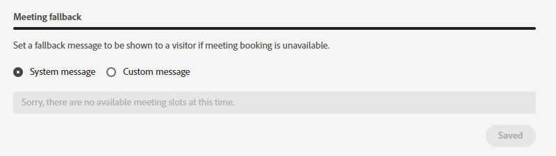

# Agentenverwaltung {#agent-management}

Zeigen Sie in der Agentenverwaltung eine Liste der Agenten in Ihrer Dynamic Chat-Instanz an, verwalten Sie Teams und legen Sie Ihre Ausweichregeln fest.

## Agentinnen bzw. Agenten {#agents}

Auf diesem Tab werden alle Agenten in Ihrer Dynamic Chat-Instanz aufgelistet und Informationen wie ihr Name, ihre E-Mail-Adresse, ihren Live-Chat-Status und mehr aufgeführt.

PICC2 - BENÖTIGUNG EINES SCREENSHOTS VON GUYS

## Teams {#teams}

Administratoren können Teams von Agenten erstellen, um das Routing zu bestimmten Gruppen von Vertriebsmitarbeitern zu erleichtern.

### Team erstellen {#create-a-team}

1. Klicks **+ Team erstellen**.

   

1. Geben Sie Ihrem Team einen Namen.

   

1. Klicken Sie auf **Agenten hinzufügen** und wählen Sie die gewünschten Agenten aus.

   

1. Klicken Sie auf **Erstellen**.

   

## Fallback-Regeln {#fallback-rules}

### Sitzungsausfall {#meeting-fallback}

Wählen Sie eine Standardnachricht (System) aus oder schreiben Sie eine benutzerdefinierte Nachricht, damit Besucher sehen können, ob die Meetingbuchung nicht verfügbar ist.

### Fallback beim Live-Chat {#live-chat-fallback}

Wählen Sie eine Standardnachricht (System) aus oder schreiben Sie eine benutzerdefinierte Nachricht, damit Besucher sehen können, wann der Live-Chat nicht verfügbar ist.

>[!TIP]
>
>Beim Erstellen einer benutzerdefinierten Nachricht können Sie die Schriftart formatieren, Links verwenden und sogar Emojis einfügen! `:)`
