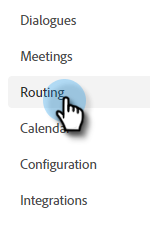

# Routing {#routing}

In Dynamic Chat gebuchte Meetings können auf zwei Arten durchgeführt werden. Runden Sie die Aktivität ab oder verwenden Sie eine benutzerdefinierte Regel.

Round robin: Sitzungen werden den Agenten nacheinander zugewiesen. Wenn Sie also fünf Agenten und Agenten haben, die drei das letzte Meeting hatten, wird Agent vier das nächste bekommen, gefolgt von Agent fünf, dann zurück zum Agenten eins.

Benutzerdefinierte Regel: Sie können bestimmte Agenten auswählen, um Sitzungen basierend auf von Ihnen ausgewählten Attributen zu erhalten.

## Erstellen einer benutzerspezifischen Regel {#create-a-custom-rule}

In diesem Beispiel senden wir alle Sitzungen aus den angeblichen Bundesstaaten CA, OR und WA an John.

1. Wählen Sie unter Dynamic Chat die Option **Routing**.

   

1. Klicken Sie auf **Benutzerspezifische Regeln** Registerkarte.

   

1. Klicks **Regel erstellen**.

   

1. Benennen Sie die Regel und klicken Sie auf **Nächste**.

   

1. Wählen Sie die gewünschten Agenten aus.

   

1. Ziehen Sie über die gewünschten Attribute.

   

1. Suchen und wählen Sie die gewünschten Werte aus.

   

1. Klicken Sie bei Auswahl aller gewünschten Werte auf **Speichern**.

   
