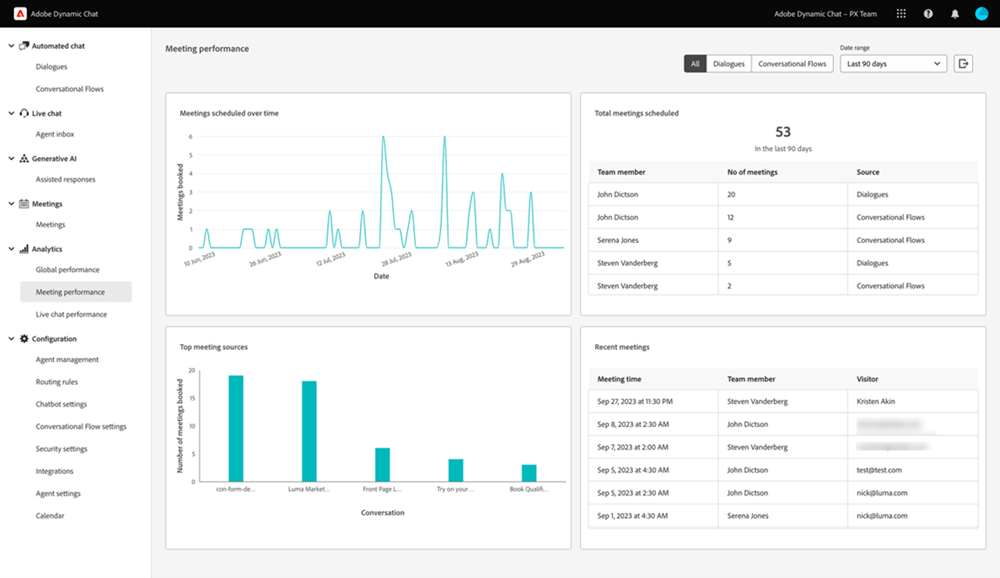

# Analytics {#analytics}

Während die Berichterstellung auf Dialogfeldebene verfügbar ist, überprüfen Sie die Gesamtinteraktion mit den drei unten stehenden Dashboards.

Greifen Sie auf jedes Dashboard unter **Analytics** im linken Navigationsbereich zu.

## Dashboard zur globalen Leistung {#global-performance-dashboard}

Erfahren Sie, wie gut Ihre Dialoge funktionieren, einschließlich Interaktions- und Leistungsmetriken (insgesamt und im Laufe der Zeit), Seiten mit der besten Leistung und Dialoge mit der besten Leistung.

Dialogfelder, Konversationsflüsse oder alles. Sortieren Sie nach bekannten Besuchern, unbekannten Besuchern oder beiden. Wählen Sie einen vordefinierten oder benutzerdefinierten Datumsbereich aus. Exportieren Sie Ihre Ergebnisse per Klick auf eine Schaltfläche.

## Dashboard zur Konferenzleistung {#meeting-performance-dashboard}

Sehen Sie, wie viele Meetings gebucht werden und mit wem sie gebucht werden.

Dialogfelder, Konversationsflüsse oder alles. Wählen Sie einen vordefinierten oder benutzerdefinierten Datumsbereich aus. Exportieren Sie Ihre Ergebnisse per Klick auf eine Schaltfläche.

## Dashboard zur Live-Chat-Leistung {#live-chat-performance-dashboard}

Sehen Sie sich an, wie viele Konversationen Ihre Live-Verkaufsmitarbeiter hatten und welche Teams die beste Leistung erzielen.

Dialogfelder, Konversationsflüsse oder alles. Wählen Sie einen vordefinierten oder benutzerdefinierten Datumsbereich aus. Exportieren Sie Ihre Ergebnisse mit einem Klick auf eine Schaltfläche.

## Definitionen {#definitions}

<table>
<thead>
<tbody>
  <tr>
    <td style="width:25%"><b>Abgeschlossen</b></td>
    <td>Ein abgeschlossenes Ereignis tritt auf, wenn ein Besucher die letzte Eingabeaufforderung in einer Konversation <i>oder </i> erreicht, wenn der gesamte Inhalt einer Konversation durch einen Besucher erschöpft ist.
     Ein abgeschlossenes Ereignis pro Besucher und Sitzung.</td>
  </tr>
  <tr>
    <td style="width:25%"><b>Gewonnene Personen</b></td>
    <td>Tritt auf, wenn ein Besucher seine E-Mail-Adresse sendet.
     Eine Akquise pro Besucher pro Sitzung.</td>
  </tr>
</tbody>
</table>
