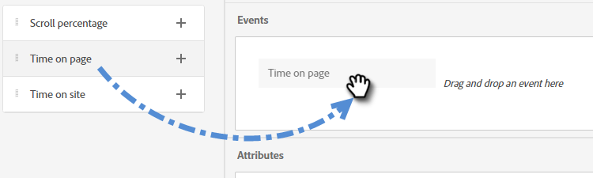

# Zielgruppenkriterien {#audience-criteria}

Ähnlich wie beim Marketo Engage von Smart Lists können Sie mit Attributen für Zielgruppenkriterien Ihre Zielgruppe definieren. Sie können bekannte oder unbekannte Personen mithilfe von abgeleiteten, Personen- oder Firmenattributen (oder einer Kombination daraus) als Ziel auswählen.

## Priorität {#priority}

Die Priorität bestimmt, welches Dialogfeld ein Lead erhält, falls er für mehr als einen qualifiziert ist. Er wird beim ersten Erstellen [ Dialogfelds ](/help/marketo/product-docs/demand-generation/dynamic-chat/automated-chat/create-a-dialogue.md){target="_blank"}. Sie können die Priorität für ein vorhandenes Dialogfeld ändern, indem Sie es öffnen und auf **[!UICONTROL Registerkarte Zielgruppenkriterien]** Dialogfelddetails) wechseln.

## Events {#events}

Mithilfe von Ereignissen können Sie Besuchende gezielt ansprechen, je nachdem, wie viel sie scrollen oder wie lange sie sich auf Ihrer Seite/Site befinden. Im folgenden Beispiel richten wir uns an Besucher, die sich seit mehr als 20 Sekunden auf einer bestimmten Seite befinden.

1. Nehmen Sie das **[!UICONTROL Zeit auf Seite]**-Ereignis und ziehen Sie es nach rechts.

   

1. Stellen Sie die Zeit für „größer als“ auf 20 Sekunden ein.

   

1. Fügen Sie die URL der gewünschten Seite im Abschnitt [Target“ ](#target).

   

## Attribute {#attributes}

**Bekannte Personen**

Es stehen _viele_ Attributkombinationen zur Auswahl. Im folgenden Beispiel richten wir uns an alle bekannten Personen in Kalifornien, die in einem Unternehmen mit mehr als 50 Mitarbeitern arbeiten.

1. Nehmen Sie das **[!UICONTROL Personenstatus]**-Attribut und ziehen Sie es nach rechts.

   

1. _Is_ ist standardmäßig festgelegt. Geben Sie im Feld Werte auswählen CA ein (Sie können auch auf die Dropdown-Liste klicken und aus der Liste auswählen).

   

1. Nehmen Sie das Attribut **[!UICONTROL Unternehmensgröße]** und ziehen Sie es an die Position _Ziehen Sie ein Attribut hierher_.

   

   >[!NOTE]
   >
   >Sie können auch ein Attribut auswählen, indem Sie auf das **+** klicken.

1. Klicken Sie auf die Dropdown-Liste Operator und wählen Sie **[!UICONTROL Größer als]**.

   

1. Geben Sie 50 ein und klicken Sie zum Speichern auf eine andere Stelle auf dem Bildschirm.

   

Und das war&#39;s!

**Anonyme Personen**

Es gibt eine einfache Möglichkeit, Personen gezielt anzusprechen, die sich noch nicht in Ihrer Datenbank befinden. In diesem Beispiel gehen wir auf alle anonymen Personen im Gebiet von New York ein.

1. Nehmen Sie das **[!UICONTROL Personen-E-Mail]**-Attribut und ziehen Sie es nach rechts.

   

1. Klicken Sie auf die Dropdown-Liste Operator und wählen Sie **[!UICONTROL Ist leer]** aus.

   

1. Nehmen Sie das Attribut **[!UICONTROL Abgeleiteter Status]** und ziehen Sie es an die Position _Ziehen Sie ein Attribut hierher_.

   

   >[!NOTE]
   >
   >Wenn jemand Ihre Website besucht, ](/help/marketo/product-docs/administration/additional-integrations/add-munchkin-tracking-code-to-your-website.md){target="_blank"} [MunchkinCookies und legt sie im System ab. Wir suchen ihre IP in einer speziellen Datenbank und leiten alle Arten von guten Informationen ab.

1. _Is_ ist standardmäßig festgelegt. Geben Sie im Feld Werte auswählen NY ein (Sie können auch auf die Dropdown-Liste klicken und aus der Liste auswählen).

   

## Mitgliedschaft {#membership}

Verwenden Sie Marketo Engage-Smart-Listen für die Zielgruppe Ihres Dialogfelds.

>[!AVAILABILITY]
>
>Für die Kriterien Mitglied der Smart-Liste oder Mitglied der Liste ist das Dynamic Chat von Prime erforderlich. Weitere Informationen erhalten Sie beim Adobe Account Team (Ihrem Account Manager).

1. Nehmen Sie unter Mitgliedschaft **[!UICONTROL Mitglied der Smart-Liste]** und legen Sie es auf der Arbeitsfläche ab.

   

1. Wählen Sie die gewünschte Smart-Liste aus.

   

## Gruppen hinzufügen {#add-groups}

Sie haben auch die Möglichkeit, Attribute zu gruppieren, falls Sie alle bestimmten Attribute zusammen mit „alle oder alle“ anderen haben möchten. Sie können mehrere Gruppen hinzufügen.

## Target {#target}

Hier geben Sie die URL(s) ein, für die ein bestimmtes Dialogfeld angezeigt werden soll. Sie haben auch die Möglichkeit, Ausschlüsse hinzuzufügen.

Zulässige Formate:

* `http://website.com`
* `https://*.website.com`
* `http://website.com/folder/*`
* `https://*.website.com/folder/*`

>[!NOTE]
>
>Die Verwendung eines Sternchens dient als Platzhalter für alle Fälle. `https://*.website.com` würde den Dialog also auf jeder Seite der Website, einschließlich Subdomains (z. B.: `support.website.com`). Und `https://website.com/folder/*` würde den Dialog auf jeder HTML-Seite in den nachfolgenden Ordner setzen (z. B.: in diesem Fall sagen wir, dass der Ordner „sports“ ist, also: website.com/sports/baseball.html, website.com/sports/football.html, etc.).

**Ausschlüsse**

Verwenden Sie Ausschlüsse, um sicherzustellen, _Ihr Dialogfeld_ auf einer bestimmten Seite/in einem bestimmten Bereich Ihrer Site angezeigt wird. Ausschlüsse haben dasselbe Format wie Einschlüsse.

>[!MORELIKETHIS]
>
>* [Erstellen eines Dialogfelds](/help/marketo/product-docs/demand-generation/dynamic-chat/automated-chat/create-a-dialogue.md){target="_blank"}
>* [Designer streamen](/help/marketo/product-docs/demand-generation/dynamic-chat/automated-chat/stream-designer.md){target="_blank"}
