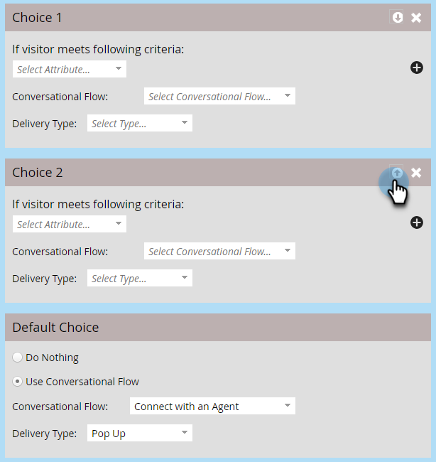

# Gesprächsflusseinstellungen für Marketo Engage Forms{#conversational-flow-settings-for-marketo-engage-forms}

Gestalten Sie die Konversation mit Marketo Engage Forms durch Integration mit Dynamic Chat Conversational Flows. Qualifizieren Sie Leads sofort mithilfe von Formulardaten oder der Smart-List-Mitgliedschaft für Besprechungsbuchungen, Whitepaper-Links oder benutzerdefinierte Ziele.

>[!AVAILABILITY]
>
>Für die Kriterien „Mitglied der Smart-Liste“ oder „Mitglied der Liste“ ist Dynamic Chat Prime erforderlich. Weitere Informationen erhalten Sie beim Adobe Account Team (Ihrem Account Manager).

1. Suchen und wählen Sie Ihr Formular aus (oder erstellen Sie ein neues).

   

1. Klicken Sie **[!UICONTROL Entwurf bearbeiten]**.

   

1. Klicken Sie auf der Seite „Formular bearbeiten **[!UICONTROL auf]** Formulareinstellungen **[!UICONTROL und dann auf „Einstellungen]**.

   

1. Klicken Sie auf **[!UICONTROL Schieberegler]** Konversationsflusseinstellungen“, um ihn zu aktivieren.

   

1. Es wird ein modales Fenster „Standardauswahl“ angezeigt. Wählen Sie Ihre Voreinstellung aus. In diesem Beispiel wählen wir &quot;**[!UICONTROL verwenden]**.

   

1. Wählen Sie den gewünschten **[!UICONTROL Konversationsfluss]** und **[!UICONTROL Versandtyp]** aus.

   

   >[!NOTE]
   >
   >[Erfahren Sie mehr über Konversationsflüsse](/help/marketo/product-docs/demand-generation/dynamic-chat/automated-chat/conversational-flow-overview.md){target="_blank"}

   **OPTIONALER SCHRITT**: Sie können auf **[!UICONTROL Auswahl hinzufügen]** klicken, um Chat-Besucher anzusprechen, die bestimmte Kriterien erfüllen. Sie können bis zu neun Auswahlmöglichkeiten zu insgesamt zehn hinzufügen.

   

   >[!NOTE]
   >
   >Der Browser des Besuchers muss vor der Formularübermittlung als bekannte Person Cookies erhalten, um sich für ein Mitglied der statischen/intelligenten Liste zu qualifizieren.

   **OPTIONALER SCHRITT**: Klicken Sie in jedem Schritt auf das **+**, um weitere Attribute hinzuzufügen, sodass Sie Ihre Audience eingrenzen können (die verfügbaren Attribute sind die Felder, die Sie für das Formular ausgewählt haben). In diesem Beispiel zielen wir auf technische Adobe-Autoren in Kalifornien ab.

   

   >[!NOTE]
   >
   >Auf „alle“ gesetzte Kriterienlogik bedeutet, dass jedes Attribut erfüllt sein muss, um qualifiziert zu werden. Mit „any“ festgelegte Kriterienlogik bedeutet, dass eines der Attribute ausreicht.

   **OPTIONALER SCHRITT**: Wenn Sie zwei oder mehr Auswahlmöglichkeiten hinzufügen, können Sie diese durch Klicken auf die Pfeile nach oben/unten neu anordnen.

   

1. Klicken Sie abschließend **[!UICONTROL Beenden]**.

   
