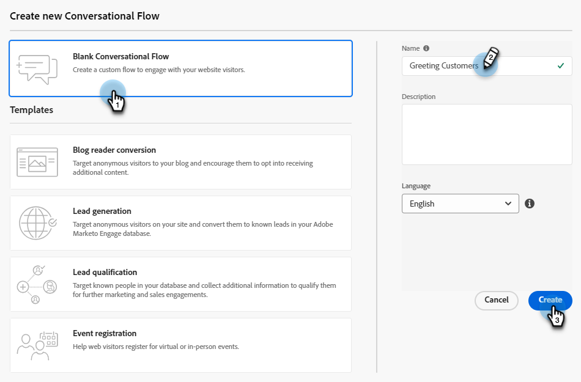

# Konversationsfluss erstellen {#create-a-conversational-flow}

So erstellen Sie einen neuen Konversationsfluss.

1. Klicken Sie unter Automatisierter Chat auf **Konversationsflüsse**.

   

1. Klicks **Konversationsfluss erstellen**.

   

1. Wählen Sie einen leeren Konversationsfluss oder eine der vorausgefüllten Vorlagen aus. Geben Sie einen Namen ein (Beschreibung ist optional), ändern Sie die Sprache (optional) und klicken Sie auf **Erstellen**.

   

>[!NOTE]
>
>Dadurch wird nur die Sprache des Systemtextes geändert. Sie sind für die Übersetzung von Inhalten verantwortlich.

1. Genau wie in Dialogen ist es an der Zeit, [Stream erstellen](/help/marketo/product-docs/demand-generation/dynamic-chat/automated-chat/stream-designer.md#create-a-stream){target="_blank"}.

>[!MORELIKETHIS]
>
>[Übersicht über den Konversationsfluss](/help/marketo/product-docs/demand-generation/dynamic-chat/automated-chat/conversational-flow-overview.md){target="_blank"}
