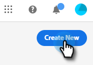

# Erstellen eines Dialogfelds {#create-a-dialogue}

So erstellen Sie ein neues Dialogfeld.

1. Klicks **[!UICONTROL Dialogfelder]**.

   

1. Klicken Sie auf **[!UICONTROL Neu erstellen]** Schaltfläche.

   

1. Wählen Sie ein leeres Dialogfeld oder eine der vorausgefüllten Vorlagen aus. Geben Sie einen Namen ein (Beschreibung ist optional), ändern Sie die Prioritätsstufe (optional) und klicken Sie auf **[!UICONTROL Erstellen]**.

   

>[!NOTE]
>
>Die Priorität bestimmt, welches Dialogfeld einem Besucher angezeigt wird, wenn er sich für mehrere Dialogfelder gleichzeitig qualifiziert.

Als Nächstes erfahren Sie, wie Sie [Stream erstellen](/help/marketo/product-docs/demand-generation/dynamic-chat/automated-chat/stream-designer.md#create-a-stream){target="_blank"}.

>[!MORELIKETHIS]
>
>* [Zielgruppenkriterien](/help/marketo/product-docs/demand-generation/dynamic-chat/automated-chat/audience-criteria.md){target="_blank"}
>* [Stream-Designer](/help/marketo/product-docs/demand-generation/dynamic-chat/automated-chat/stream-designer.md){target="_blank"}
