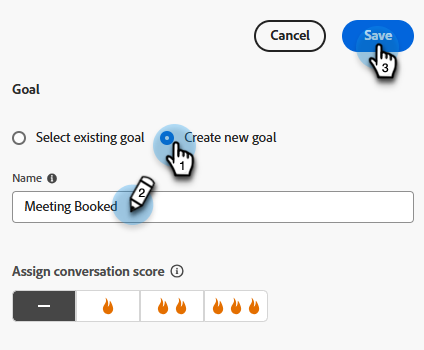

# Entwerferin bzw. Entwerfer des Streams {#stream-designer}

Es sind _viele_ Stream-Kombinationen möglich. Dieser Artikel enthält ein Beispiel, in dem der Marketing-Experte den Site-Besucher fragt, ob er Produktfragen hat. Falls ja, kann der Besucher einen Termin planen. Ist dies nicht der Fall, erhält der Besucher die Möglichkeit, sich einer Mailingliste für die künftige Korrespondenz anzuschließen. Ihnen wird auch eine kostenlose PDF angeboten. Das ultimative Ziel besteht darin, entweder einen Termin zu planen oder die E-Mail-Adresse des Besuchers zu erfassen.

>[!PREREQUISITES]
>
>Bevor Sie die Dokumentkarte verwenden können, müssen Sie sie zunächst [in Ihrem Adobe-Konto einrichten](/help/marketo/product-docs/demand-generation/dynamic-chat/integrations/adobe-pdf-embed-api.md){target="_blank"}.

## Designer-Karten streamen {#stream-designer-cards}

Der Stream Designer enthält mehrere Karten, die Sie hinzufügen können, um die Chat-Konversation zu gestalten.

<table>
 <tr>
  <td style="width:25%"><strong>Nachricht</strong></td>
  <td>Verwenden Sie, wenn Sie eine Aussage ohne Antwort erforderlich machen möchten (z. B.: "Hi! Mit dem Code SAVE25" sind alle Artikel heute um 25 % billiger.
</td>
 </tr>
 <tr>
  <td style="width:25%"><strong>Frage</strong></td>
  <td>Verwenden Sie diese Option, wenn Sie eine Multiple-Choice-Frage stellen möchten, von der Sie die verfügbaren Antworten erhalten (z. B.: Wofür sind Sie interessiert? Antworten = SUV, Compact, Truck usw.).</td>
 </tr>
 <tr>
  <td style="width:25%"><strong>Dokument</strong></td>
  <td>Ermöglicht das Einbetten von PDF-Dokumenten in Dialogfelder und das Verfolgen der Aktivität von Besuchern zur Dokumenteninteraktion (Anzahl der angezeigten-Seiten, Download des Dokuments und/oder verwendete Suchbegriffe).</td>
 </tr>
 <tr>
  <td style="width:25%"><strong>Informationserfassung</strong></td>
  <td>Verwenden Sie diese Option, wenn Sie Informationen erfassen möchten (z. B. Name, E-Mail-Adresse, Berufsbezeichnung usw.). Nachdem Sie ausgewählt haben, welchem Feld die Antwort zugeordnet werden soll, können Sie den Besuchertyp in der Antwort angeben oder Optionen aus einer von Ihnen festgelegten Auswahlliste auswählen (Tipp: Letzteres kann bei der Bereinigung der Datenbank helfen). Sie können auch festlegen, welche Daten Sie derzeit für die Antwort aufgelistet haben, oder die Frage vollständig überspringen, wenn Sie bereits über einen Wert für sie verfügen.</td>
 </tr>
 <tr>
  <td style="width:25%"><strong>Konferenzbuchung</strong></td>
  <td>Bietet dem Besucher einen Kalender der verfügbaren Daten, um ein Meeting zu planen. Wählen Sie die Kalenderverfügbarkeit über Round Robin, einen bestimmten Agenten oder mithilfe benutzerdefinierter Regeln. Klicken Sie auf <b>Attribut hinzufügen</b> , wenn Sie den Namen oder die E-Mail-Adresse des Agenten erfassen und ihn dem personenbezogenen Datensatz des Chat-Besuchers für die zukünftige Abfrage zuweisen möchten (Tipp: Erstellen Sie ein <a href="/help/marketo/product-docs/administration/field-management/create-a-custom-field-in-marketo.md" target="_blank">benutzerdefiniertes Feld</a>, um die Informationen des Agenten so zuzuordnen, dass kein standardmäßiges Marketo Engage-Feld überschrieben wird).</td>
 </tr>
 <tr>
  <td style="width:25%"><strong>Ziel</strong></td>
  <td>Dies ist die einzige Karte, die die Besucher nicht sehen werden. Es liegt an Ihnen zu bestimmen, an welchem Punkt ein Ziel innerhalb des bestimmten Chat erreicht wird (z. B.: Wenn das Sammeln der E-Mail des Besuchers Ihr Ziel ist, platzieren Sie die Zielkarte unmittelbar nach der Informationserfassung im Stream).</td>
 </tr>
 <tr>
  <td style="width:25%"><strong>Aktion*</strong></td>
  <td>Ähnlich wie ausgeblendete Felder in einem Formular können Sie mit der Aktionskarte jedes Lead- oder Firmenattribut (das einen <a href="/help/marketo/product-docs/administration/field-management/custom-field-type-glossary.md#string">String-Datentyp</a> aufweist) mit impliziten Werten füllen, die Sie mit einem Lead-Datensatz erfassen möchten. Sie können die Aktionskarte jederzeit in der Konversation hinzufügen und die entsprechenden Attribute mit einem Wert oder nativen Token aktualisieren, die den entsprechenden Wert automatisch ausfüllen.
  
<i>* Die Aktionskarte erfordert Dynamic Chat Prime. Weitere Informationen erhalten Sie vom Adobe Account Team (Ihrem Kundenbetreuer).</i></td>
 </tr>
 <tr>
  <td style="width:25%"><strong>Live-Chat</strong></td>
  <td>Verwenden Sie die Live-Chat-Karte, wenn Sie möchten, dass Besucher mit einem Live-Agenten chatten.
  <li>Die Live-Chat-Karte muss die letzte Karte im Zweig sein.</li>
  <li>Die Besucher werden an einen Agenten weitergeleitet, sobald sie diese Karte im Stream erreichen. Daher wird empfohlen, dieser Karte eine Fragenkarte mit der Frage vorzustellen, ob sie mit einem Live-Agenten chatten möchten.</li></td>
 </tr>
</table>

## Designer-Symbole streamen {#stream-designer-icons}

In der rechten oberen Ecke des Stream-Designer sehen Sie eine Handvoll Symbole. Hier ist, was sie tun.

<table>
 <tr>
  <td style="width:10%"></td>
  <td>Vergrößert die Ansicht und erstellt größere Karten</td>
 </tr>
 <tr>
  <td style="width:10%"></td>
  <td>Verkleinert die Ansicht und erstellt kleinere Karten</td>
 </tr>
 <tr>
  <td style="width:10%"></td>
  <td>Öffnet ein Fenster, in dem Sie Ihren Chat testen können (drücken Sie zum Schließen denselben Knopf)</td>
 </tr>
 <tr>
  <td style="width:10%"></td>
  <td>Ermöglicht die Suche nach Karten- oder Inhaltsarten in Ihrem Stream</td>
 </tr>
 <tr>
  <td style="width:10%"></td>
  <td>Ordnet alle Karten in Ihrem Stream an</td>
 </tr>
</table>

## Erstellen eines Streams {#create-a-stream}

Sie können Streams für Dialoge oder [Konversations-Forms](/help/marketo/product-docs/demand-generation/dynamic-chat/automated-chat/conversational-flow-overview.md){target="_blank"} erstellen. In diesem Beispiel erstellen wir einen für einen Dialog.

1. Nachdem Sie [Ihr Dialogfeld](/help/marketo/product-docs/demand-generation/dynamic-chat/automated-chat/create-a-dialogue.md){target="_blank"} erstellt haben, klicken Sie auf die Registerkarte **[!UICONTROL Stream-Designer]** .

   

1. Ziehen Sie die Karte [!UICONTROL Frage] in den Arbeitsbereich.

   

1. Schreiben Sie unter [!UICONTROL Chatbot-Antwort] Ihre Frage, wie Sie möchten.

   

   >[!TIP]
   >
   >Sie können das Erlebnis für bekannte Chat-Besucher mit Token personalisieren (z. B.: Hallo `{{lead.leadFirstName:""}}`). Klicken Sie einfach auf das Symbol mit geschweiften Klammern rechts und wählen Sie Ihre Auswahl aus. Fügen Sie einen Standardwert zwischen den Anführungszeichen hinzu, wenn anonyme Besucher etwas Allgemeines sehen sollen (z. B.: Hallo `{{lead.leadFirstName:"there"}}`).

   >[!NOTE]
   >
   >Poke ist standardmäßig auf ein gesetzt, wodurch die öffnende Frage neben dem Chat-Symbol angezeigt wird, ohne dass der Besucher darauf klicken muss, um sie zu sehen. Poke ist nur auf der ersten Karte in der Konversation verfügbar.

1. Geben Sie Ihre Benutzerantworten ein und klicken Sie auf **[!UICONTROL Speichern]**.

   

   >[!NOTE]
   >
   >**[!UICONTROL Gespeicherte Werte bearbeiten]** ist ein optionaler Schritt für diejenigen, die einen anderen Wert in der Datenbank speichern möchten als der, der Besuchern im Chat-Bot für zugeordnete Attribute in der Fragenkarte angezeigt wird (z. B.: Besucher sehen &quot;Suchmaschinenoptimierung&quot;, Sie speichern diesen Wert als &quot;SEO&quot;).

1. Für &quot;Ja&quot; möchten wir einen Termin planen. Ziehen Sie daher unterhalb dieser Option über die Karte Terminplaner .

   

1. Klicken Sie in der Spalte rechts auf **[!UICONTROL Speichern]**.

   

1. Da dies ein Ziel ist, ziehen Sie die Karte [!UICONTROL Ziel] unter die Terminplaner.

   

1. Benennen Sie Ihr Ziel (oder wählen Sie ein vorhandenes Ziel aus) und klicken Sie auf **[!UICONTROL Speichern]**.

   

1. Für &quot;Nein&quot; möchten wir sehen, ob sie der Mailingliste beitreten, also ziehen Sie unterhalb dieser Option eine weitere [!UICONTROL Frage] -Karte.

   

1. Geben Sie Ihre Antwort ein und fügen Sie Antwortoptionen für den Besucher hinzu. Klicken Sie auf **[!UICONTROL Speichern]**, wenn Sie fertig sind.

   

   >[!NOTE]
   >
   >Sie können weitere Antworten hinzufügen, indem Sie auf **[!UICONTROL Antwort hinzufügen]** klicken.

1. Ziehen Sie unter der Antwort &quot;Ja&quot;über die Karte &quot;Informationserfassung&quot;, damit Sie die E-Mail des Besuchers erfassen können.

   

1. Klicken Sie auf das Dropdown-Menü **[!UICONTROL Typ]** und wählen Sie **[!UICONTROL E-Mail]** aus.

   

1. Geben Sie eine Chat-Bot-Nachricht und einen Platzhalter ein. Stellen Sie sicher, dass das Attribut dem entsprechenden Feld in Marketo Engage zugeordnet ist, und klicken Sie auf **[!UICONTROL Speichern]**.

   

   <table>
    <tr>
     <td style="width:30%"><strong>Typ</strong></td>
     <td>Der Informationstyp, den Sie erfassen möchten: Telefon, Text, E-Mail.</td>
    </tr>
    <tr>
     <td style="width:30%"><strong>Chatbot-Nachricht</strong></td>
     <td>Die Meldung, die der Besucher sieht und ihn auffordert, die Informationen anzugeben.</td>
    </tr>
    <tr>
     <td style="width:30%"><strong>Platzhalter</strong></td>
     <td>Beispieltext, der dem Besucher dabei hilft, zu sehen, was er eingeben soll.</td>
    </tr>
    <tr>
     <td style="width:30%"><strong>Antwort einem Attribut zuordnen</strong></td>
     <td>Hiermit können Sie die Antwort des Besuchers mit dem entsprechenden Feld in seinem Personendatensatz in Ihrem Marketo Engage-Abonnement synchronisieren.</td>
    </tr>
   </table>

1. Da das Sammeln ihrer E-Mail ein Ziel ist, ziehen Sie die Karte [!UICONTROL Ziel] unter &quot;Informationserfassung&quot;.

   

1. Benennen Sie Ihr Ziel (oder wählen Sie ein vorhandenes Ziel aus) und klicken Sie auf **[!UICONTROL Speichern]**.

   

1. Denken Sie daran, eine Antwort hinzuzufügen, wenn Sie &quot;Nein&quot;sagen. Eine Option besteht darin, eine Nachrichten-Karte unten zu ziehen und &quot;Danke trotzdem&quot; zu sagen. Aber in diesem Beispiel stellen wir ihnen stattdessen ein kostenloses PDF-Dokument zur Verfügung.

   

1. In diesem Beispiel erstellen wir ein neues Dokument. Geben Sie einen Namen ein, geben Sie die URL für die PDF ein, die Sie bereits gehostet haben, und klicken Sie auf **[!UICONTROL Speichern]**.

   

1. Wählen Sie den Umschalter **[!UICONTROL Vorschau]** aus, um das Dialogfeld in der Vorschau anzuzeigen.

   

1. Wenn Sie bereit sind, Ihr Dialogfeld zu aktivieren, klicken Sie auf **[!UICONTROL Publish]**.

   

>[!NOTE]
>
>Bevor Sie auf [!UICONTROL Publish] klicken, stellen Sie sicher, dass Sie [Ihre Ziel-URL(s)](/help/marketo/product-docs/demand-generation/dynamic-chat/automated-chat/audience-criteria.md#target){target="_blank"} eingegeben haben.

>[!MORELIKETHIS]
>
>* [Erstellen eines Dialogfelds](/help/marketo/product-docs/demand-generation/dynamic-chat/automated-chat/create-a-dialogue.md){target="_blank"}
>* [Zielgruppenkriterien](/help/marketo/product-docs/demand-generation/dynamic-chat/automated-chat/audience-criteria.md){target="_blank"}
>* [Adobe PDF Embed API](/help/marketo/product-docs/demand-generation/dynamic-chat/integrations/adobe-pdf-embed-api.md){target="_blank"}
