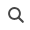
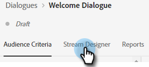

# Entwerferin bzw. Entwerfer des Streams {#stream-designer}

Es _(viele_ Stream-Kombinationen möglich. Dieser Artikel enthält ein Beispiel, bei dem der Marketing-Experte den Site-Besucher fragt, ob er Produktfragen hat. Wenn ja, kann der Besucher einen Termin vereinbaren. Ist dies nicht der Fall, hat der Besucher die Möglichkeit, einer Mailingliste für die zukünftige Korrespondenz beizutreten. Ihnen wird auch ein kostenloser PDF angeboten. Das letztendliche Ziel besteht darin, entweder einen Termin zu vereinbaren oder die E-Mail des Besuchers zu erfassen.

>[!PREREQUISITES]
>
>Bevor Sie die Dokumentkarte verwenden können, müssen Sie sie [ in ](/help/marketo/product-docs/demand-generation/dynamic-chat/integrations/adobe-pdf-embed-api.md){target="_blank"} Adobe-Konto einrichten.

## Streamen von Designer-Karten {#stream-designer-cards}

Die Stream-Designer enthält mehrere Karten, die Sie hinzufügen können, um die Konversation im Chat zu gestalten.

<table>
 <tr>
  <td style="width:25%"><strong>Nachricht</strong></td>
  <td style="width:75%">Verwenden Sie , wenn Sie eine Aussage machen möchten, ohne dass eine Antwort erforderlich ist (z. B.: „Hallo! Alle Artikel erhalten heute 25 % Rabatt mit dem Code SAVE25„).
</td>
 </tr>
 <tr>
  <td style="width:25%"><strong>Frage</strong></td>
  <td>Verwenden Sie , wenn Sie eine Multiple-Choice-Frage stellen möchten, für die Sie die verfügbaren Antworten angeben (z. B.: Für welchen Fahrzeugtyp interessieren Sie sich? Antworten = SUV, Kompakt, LKW, etc.).</td>
 </tr>
 <tr>
  <td style="width:25%"><strong>Dokument</strong></td>
  <td>Ermöglicht das Einbetten von PDF-Dokumenten in Dialoge und das Nachverfolgen der Dokumenteninteraktionsaktivität von Besuchern (wie viele Seiten angezeigt wurden, ob das Dokument heruntergeladen wurde und/oder verwendete Suchbegriffe).</td>
 </tr>
 <tr>
  <td style="width:25%"><strong>Informationserfassung</strong></td>
  <td>Verwenden Sie , wenn Sie Informationen erfassen möchten (z. B. Name, E-Mail-Adresse, Stellenbezeichnung usw.). Nachdem Sie ausgewählt haben, welchem Feld die Antwort zugewiesen werden soll, können Sie den Besuchertyp in der Antwort zulassen oder Optionen aus einer von Ihnen festgelegten Auswahlliste auswählen (Tipp: Letzterer kann bei der Datenbankbereinigung hilfreich sein). Sie können auch festlegen, dass alle Daten, die Sie derzeit für sie auflisten, mit ihrer Antwort überschrieben werden sollen. Alternativ können Sie die Frage ganz überspringen, wenn Sie bereits einen Wert für sie haben.</td>
 </tr>
 <tr>
  <td style="width:25%"><strong>Buchung eines Meetings</strong></td>
  <td>Stellt dem Besucher einen Kalender der verfügbaren Termine zur Verfügung, um ein Meeting zu planen. Wählen Sie die Kalenderverfügbarkeit über Round Robin, einen bestimmten Agenten oder unter Verwendung benutzerdefinierter Regeln. Klicken Sie auf <b>Attribut hinzufügen</b>, wenn Sie den Namen oder die E-Mail-Adresse des Agenten erfassen und ihn dem Personendatensatz des Chat-Besuchers für zukünftige Abfragen zuweisen möchten (Tipp: Erstellen Sie ein <a href="/help/marketo/product-docs/administration/field-management/create-a-custom-field-in-marketo.md" target="_blank">benutzerdefiniertes Feld</a>, um die Informationen des Agenten so zuzuordnen, dass ein standardmäßiges Marketo Engage-Feld nicht überschrieben wird).</td>
 </tr>
 <tr>
  <td style="width:25%"><strong>Ziel</strong></td>
  <td>Dies ist die einzige Karte, die die Besucher nicht sehen werden. Es ist an Ihnen zu bestimmen, an welchem Punkt ein Ziel innerhalb des spezifischen Chats erreicht wird (z. B. wenn das Erfassen der E-Mail-Adresse des Besuchers Ihr Ziel ist, platzieren Sie die Zielkarte sofort nach der Informationserfassung im Stream).</td>
 </tr>
 <tr>
  <td style="width:25%"><strong>Aktion*</strong></td>
  <td>Ähnlich wie bei ausgeblendeten Feldern in einem Formular können Sie mit der Aktionskarte jedes Lead- oder Firmenattribut (das einen <a href="/help/marketo/product-docs/administration/field-management/custom-field-type-glossary.md#string">Datentyp Zeichenfolge</a> aufweist) mit impliziten Werten füllen, die Sie für einen Lead-Datensatz erfassen möchten. Sie können die Aktionskarte zu einem beliebigen Zeitpunkt in der Konversation hinzufügen und die entsprechenden Attribute mit einem Wert oder nativen Token aktualisieren, die den entsprechenden Wert automatisch ausfüllen.
  
<i>* Für diese Karte ist Dynamic Chat Prime erforderlich. Weitere Informationen erhalten Sie beim Adobe Account Team (Ihrem Account Manager).</i></td>
 </tr>
 <tr>
  <td style="width:25%"><strong>Live-Chat</strong></td>
  <td>Verwenden Sie die Live-Chat-Karte, wenn Besucher mit einem Live-Agenten chatten sollen.
  <li>Die Live-Chat-Karte muss die letzte Karte in der Filiale sein.</li>
  <li>Besucher werden an einen Agenten weitergeleitet, sobald sie diese Karte im Stream erreichen. Daher wird empfohlen, dieser Karte eine Fragekarte voranzustellen, mit der Besucher gefragt werden, ob sie mit einem Live-Agenten chatten möchten.</li></td>
 </tr>
 <tr>
  <td style="width:25%"><strong>Erzeugte Antworten*</strong></td>
  <td>Erstellen Sie eine Nachricht für den Besucher, wenn er einen bestimmten Punkt in der Konversation erreicht. Legen Sie eine Reihe von Fragen fest, die sie in einem Schritt stellen können, um Ihren gewünschten Key Performance Indicator zu erzielen.
  
<i>* Für diese Karte ist Dynamic Chat Prime erforderlich. Weitere Informationen erhalten Sie beim Adobe Account Team (Ihrem Account Manager).</i></td>
 </tr>
 <tr>
  <td style="width:25%"><strong>Bedingte Verzweigung</strong></td>
  <td>Erstellen Sie Verzweigungen in Ihren Dialogfeldflüssen basierend auf verschiedenen Bedingungen. Unterschiedliche Inhalte werden im selben Dialogfeld unterschiedlichen Personen präsentiert, basierend auf Lead- und Unternehmensattributen in Marketo Engage.</td>
 </tr>
 <tr>
  <td style="width:25%"><strong>Konversationsfluss</strong></td>
  <td>Optimieren Sie mehrere Schritte in einem Fluss in Ihren Dialogfeldern mithilfe der Karte „Konversativer Fluss“.</td>
 </tr>
</table>

## Designer-Symbole streamen {#stream-designer-icons}

Oben rechts im Stream Designer sehen Sie eine Handvoll Symbole. Hier ist, was sie tun.

<table>
 <tr>
  <td style="width:10%"></td>
  <td>Vergrößert die Ansicht und erstellt größere Karten</td>
 </tr>
 <tr>
  <td style="width:10%"></td>
  <td>Verkleinert die Ansicht und erstellt kleinere Karten</td>
 </tr>
 <tr>
  <td style="width:10%"></td>
  <td>Öffnet ein Fenster, in dem Sie Ihren Chat testen können (drücken Sie zum Schließen denselben Knopf)</td>
 </tr>
 <tr>
  <td style="width:10%"></td>
  <td>Ermöglicht die Suche nach Kartentypen oder Inhalten in Ihrem Stream</td>
 </tr>
 <tr>
  <td style="width:10%"></td>
  <td>Ordnet alle Karten in Ihrem Stream an</td>
 </tr>
</table>

## Erstellen eines Streams {#create-a-stream}

Sie können Streams für Dialoge oder [Conversational Forms](/help/marketo/product-docs/demand-generation/dynamic-chat/automated-chat/conversational-flow-overview.md){target="_blank"} erstellen. In diesem Beispiel erstellen wir einen für ein Dialogfeld.

1. Nachdem Sie &quot;[ Dialogfeld“ erstellt haben](/help/marketo/product-docs/demand-generation/dynamic-chat/automated-chat/create-a-dialogue.md){target="_blank"} klicken Sie auf die Registerkarte **[!UICONTROL Stream-Designer]**.

   

1. Ziehen Sie die Karte _[!UICONTROL Frage]_ per Drag-and-Drop.

   

1. Stellen [!UICONTROL  unter „Chatbot Response] Ihre Frage, wie Sie möchten.

   

   >[!TIP]
   >
   >Sie können das Erlebnis für Chat-Besucher anpassen!
   >
   >* Klicken Sie auf das `</>` &quot;HTML einfügen“, um Ihre eigene HTML für das gewünschte Look-and-Feel der Unterhaltung einzufügen.
   >
   >* Verwenden Sie Token für bekannte Chat-Besucher, um ihr Erlebnis zu personalisieren (z. B.: Hello `{{lead.leadFirstName:""}}`). Klicken Sie auf das Symbol Geschweifte Klammer `{}` und wählen Sie aus. Fügen Sie zwischen den Anführungszeichen einen Standardwert hinzu, wenn anonyme Besucher etwas Allgemeines sehen sollen (z. B.: Hallo `{{lead.leadFirstName:"there"}}`).

   >[!NOTE]
   >
   >Poke ist standardmäßig auf Ein gesetzt, was die Eröffnungsfrage neben dem Chat-Symbol anzeigt, ohne dass der Besucher darauf klicken muss, um es zu sehen. Poke ist nur auf der ersten Karte im Gespräch verfügbar.

1. Geben Sie Ihre Benutzerantworten ein und klicken Sie auf **[!UICONTROL Speichern]**.

   

   >[!NOTE]
   >
   >**[!UICONTROL Gespeicherte Werte bearbeiten]** ist ein optionaler Schritt für diejenigen, die einen anderen Wert in der Datenbank speichern möchten als den, der Besuchern im Chatbot für zugeordnete Attribute in der Fragekarte angezeigt wird (z. B.: Besucher sieht „Suchmaschinenoptimierung“, Sie speichern diesen Wert als „SEO„).

1. Wenn Sie mit „Ja“ eine Besprechung buchen möchten, ziehen Sie unterhalb dieser Option über die Karte _Besprechungsbuchung_.

   

1. Wählen Sie Ihre Routing-Option aus und klicken Sie auf **[!UICONTROL Speichern]**.

   

1. Da dies ein Ziel ist, ziehen Sie die _[!UICONTROL Ziel]_-Karte unter die Besprechungsbuchung.

   

1. Benennen Sie Ihr Ziel (oder wählen Sie ein vorhandenes aus) und klicken Sie auf **[!UICONTROL Speichern]**. Die Zuweisung eines Konversationswerts ist optional.

   

1. Für „Nein“ möchten wir sehen, ob sie in die Mailing-Liste aufgenommen werden. Ziehen Sie also unterhalb dieser Option eine andere [!UICONTROL Frage]-Karte.

   

1. Geben Sie Ihre Antwort ein und fügen Sie dem Besucher Antwortoptionen hinzu. Klicken Sie auf **[!UICONTROL Speichern]**, wenn Sie fertig sind.

   

   >[!NOTE]
   >
   >Sie können weitere Antworten hinzufügen, indem Sie auf **[!UICONTROL Antwort hinzufügen]** klicken.

1. Ziehen Sie die Maus unter die Antwort „Ja _über die Karte &quot;_&quot;, damit Sie die E-Mail-Adresse des Besuchers erfassen können.

   

1. Klicken Sie auf die Dropdown-Liste und wählen Sie **[!UICONTROL E-Mail-Adresse]** aus.

   

1. Geben Sie eine Chat-Bot-Nachricht und einen Platzhalter ein. Wenn bereits ein Wert für dieses Attribut in Ihrer Datenbank vorhanden ist, wählen Sie aus, ob Sie es überspringen möchten oder diese Daten überschreiben sollen. Klicken Sie auf **[!UICONTROL Speichern]**, wenn Sie fertig sind.

   

1. Da das Erfassen von E-Mails ein Ziel ist, ziehen Sie die Karte _[!UICONTROL Ziel]_ unter „Informationserfassung“.

   

1. Benennen Sie Ihr Ziel (oder wählen Sie ein vorhandenes aus) und klicken Sie auf **[!UICONTROL Speichern]**.

   

1. Denken Sie daran, eine Antwort hinzuzufügen, wenn sie „Nein“ sagen. Eine Möglichkeit besteht darin, eine Nachrichtenkarte unten zu ziehen und „Trotzdem danke“ zu sagen. In diesem Beispiel stellen wir ihnen jedoch stattdessen ein kostenloses PDF-Dokument zur Verfügung.

   

1. In diesem Beispiel erstellen wir ein neues Dokument. Geben Sie einen Namen für das Konto ein, geben Sie die URL für das bereits gehostete PDF ein und klicken Sie auf **[!UICONTROL Speichern]**.

   

1. Wenn Sie Ihr Dialogfeld aktivieren möchten, klicken Sie auf **[!UICONTROL Veröffentlichen]**.

   

>[!NOTE]
>
>Bevor Sie auf [!UICONTROL Veröffentlichen] klicken, vergewissern Sie sich, dass Sie [ Ziel-URL(s) ](/help/marketo/product-docs/demand-generation/dynamic-chat/automated-chat/audience-criteria.md#target){target="_blank"} haben.

>[!MORELIKETHIS]
>
>* [Erstellen eines Dialogfelds](/help/marketo/product-docs/demand-generation/dynamic-chat/automated-chat/create-a-dialogue.md){target="_blank"}
>* [Zielgruppenkriterien](/help/marketo/product-docs/demand-generation/dynamic-chat/automated-chat/audience-criteria.md){target="_blank"}
>* [Adobe PDF Embed API](/help/marketo/product-docs/demand-generation/dynamic-chat/integrations/adobe-pdf-embed-api.md){target="_blank"}
