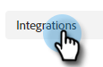

# Dynamischen Chat mit Marketo verbinden {#connect-dynamic-chat-to-marketo}

Nachdem Sie die [Ersteinrichtung](/help/marketo/product-docs/demand-generation/dynamic-chat/initial-setup.md)müssen Sie die einmalige Synchronisierung durchführen, um den dynamischen Chat mit Ihrem Marketo-Abonnement zu verbinden.

1. Klicken Sie in My Marketo auf die **Dynamischer Chat** Kachel.

   

   >[!NOTE]
   >
   >Wenn die Kachel nicht angezeigt wird, wenden Sie sich an Ihren Marketo-Administrator.

1. Wenn Sie zuvor auf eine Anwendung mit einer Adobe ID zugegriffen haben, gelangen Sie direkt zum dynamischen Chat. Wenn nicht, [Adobe ID einrichten](https://helpx.adobe.com/manage-account/using/create-update-adobe-id.html).

1. Um Ihre Marketo-Instanz zu verbinden, wählen Sie **Integrationen**.

   

1. Klicken Sie auf der Marketo-Karte auf **Initiieren der Synchronisierung**.

   

>[!NOTE]
>
>Je nach Größe Ihrer Datenbank kann es zwischen 2 und 24 Stunden dauern, bis die Synchronisation abgeschlossen ist.

## Adobe-Organisation und Marketo verknüpfen {#link-your-adobe-org-and-marketo}

Als Nächstes ist es an der Zeit, Adobe und Marketo zu verknüpfen.

1. Anmelden bei [experience.adobe.com](https://experience.adobe.com).

1. Kopieren Sie die Organisations-ID aus der rechten unteren Ecke der Homepage. _minus_ &quot;@AdobeOrg.&quot;

   

1. Navigieren Sie in Marketo zum **Admin** und wählen Sie **Adobe-Organisationszuordnung**.

   

1. Klicken **Bearbeiten**.

   

1. Fügen Sie die Organisations-ID ein, die Sie in Schritt 2 kopiert haben, und klicken Sie auf **OK**.

   

>[!MORELIKETHIS]
>
>[Ersteinrichtung](/help/marketo/product-docs/demand-generation/dynamic-chat/initial-setup.md)
