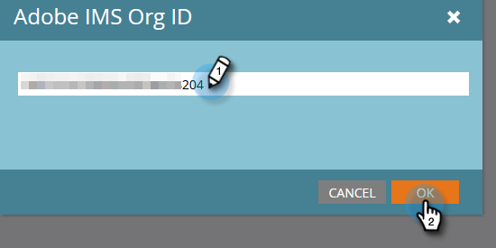

# Dynamischen Chat mit Marketo verbinden {#connect-dynamic-chat-to-marketo}

Nachdem Sie die [Ersteinrichtung](/help/marketo/product-docs/demand-generation/dynamic-chat/initial-setup.md)müssen Sie die einmalige Synchronisierung durchführen, um den dynamischen Chat mit Ihrem Marketo-Abonnement zu verbinden.

1. Klicken Sie in My Marketo auf die **Dynamischer Chat** Kachel.

   

   >[!NOTE]
   >
   >Wenn die Kachel nicht angezeigt wird, wenden Sie sich an Ihren Marketo-Administrator.

1. Wenn Sie zuvor auf eine Anwendung mit einer Adobe ID zugegriffen haben, gelangen Sie direkt zum dynamischen Chat. Wenn nicht, [Adobe ID einrichten](https://helpx.adobe.com/manage-account/using/create-update-adobe-id.html).

1. Um Ihre Marketo-Instanz zu verbinden, wählen Sie **Integrationen**.

   

1. Klicken Sie auf der Marketo-Karte auf **Initiieren der Synchronisierung**.

   

1. Wählen Sie bis zu 50 standardmäßige oder benutzerdefinierte Felder aus Ihrer Marketo-Instanz aus, um sie mit dem dynamischen Chat zu synchronisieren und sie für das Zielgruppen-Targeting, die Datenzuordnung und die Personalisierung zu verwenden. Klicken **Nächste** wann geschehen.

   

   >[!CAUTION]
   >
   >Zu diesem Zeitpunkt erfolgt die Attributauswahl **cannot** nach der ersten Synchronisierung geändert werden. Wenn die Synchronisierung abgeschlossen ist, können Sie nur zurückkehren und mehr hinzufügen (wenn Sie weniger als 50 ausgewählt haben).

1. Überprüfen Sie Ihre Auswahl (erinnern Sie sich: Sie können Attribute nicht nach der Synchronisierung entfernen. Klicken Sie daher auf **Auswahlen bearbeiten** , wenn Sie in diesem Schritt eine ändern müssen). Klicken **Bestätigen** wann sie zum Initiieren der Synchronisierung abgeschlossen ist.

   

>[!NOTE]
>
>Je nach Größe Ihrer Datenbank kann es zwischen 2 und 24 Stunden dauern, bis die Synchronisation abgeschlossen ist.

## Adobe-Organisation und Marketo verknüpfen {#link-your-adobe-org-and-marketo}

Als Nächstes ist es an der Zeit, Adobe und Marketo zu verknüpfen.

>[!IMPORTANT]
>
>Die E-Mail-Adresse des Marketo Engage-Benutzers, der dieses Mapping erstellt, muss auch Zugriff auf die Adobe-Organisation haben, die verbunden wird.

1. Anmelden bei [experience.adobe.com](https://experience.adobe.com).

1. Klicken Sie auf den Bildschirm an einer beliebigen Stelle im Experience Cloud und drücken Sie Strg+i. Im **Zugewiesene Organisationen** die Organisations-ID (_minus_ &quot;@AdobeOrg&quot;). Presse **Schließen** wann geschehen.

   

1. Navigieren Sie in Marketo zum **Admin** und wählen Sie **Adobe-Organisationszuordnung**.

   

1. Klicken **Bearbeiten**.

   

1. Fügen Sie die Organisations-ID ein, die Sie in Schritt 2 kopiert haben, und klicken Sie auf **OK**.

   

>[!MORELIKETHIS]
>
>[Ersteinrichtung](/help/marketo/product-docs/demand-generation/dynamic-chat/initial-setup.md)
