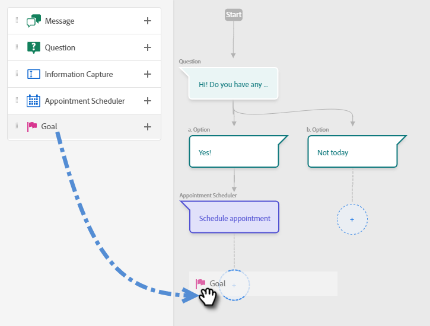
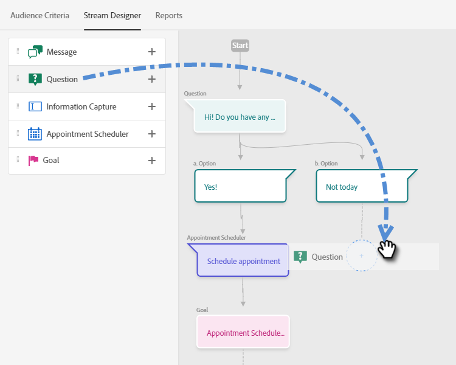
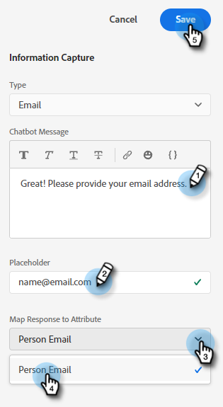
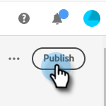

# Erstellen eines Streams {#create-a-stream}

Es gibt _many_ Stream-Kombinationen, die Sie erstellen können. Dieser Artikel enthält ein Beispiel, in dem der Marketing-Experte den Site-Besucher fragt, ob er Produktfragen hat. Falls ja, kann der Besucher einen Termin planen. Ist dies nicht der Fall, erhält der Besucher die Möglichkeit, sich einer Mailingliste für die künftige Korrespondenz anzuschließen. Das Ziel besteht darin, entweder einen Termin zu planen oder die E-Mail-Adresse des Besuchers zu erfassen.

1. Nach [Dialogfeld erstellen](/help/marketo/product-docs/demand-generation/dynamic-chat/dialogues.md#create-a-new-dialogue), klicken Sie auf die **Stream-Designer** Registerkarte.

   

1. Ziehen Sie die Fragenkarte per Drag-and-Drop in den Arbeitsbereich.

   

1. Geben Sie unter Chatbot-Antwort Ihre Frage an, wie Sie möchten.

   

   >[!NOTE]
   >
   >Poke ist standardmäßig auf ein gesetzt, wodurch die öffnende Frage neben dem Chat-Symbol angezeigt wird, ohne dass der Besucher darauf klicken muss, um sie zu sehen.

1. Geben Sie Ihre Benutzerantworten ein und klicken Sie auf **Speichern**.

   

1. Für &quot;Ja&quot; möchten wir einen Termin planen. Ziehen Sie daher unterhalb dieser Option über die Karte Terminplaner .

   

1. Klicken Sie in der Spalte rechts auf **Speichern**.

   

1. Da dies ein Ziel ist, ziehen Sie die Zielkarte unter die Terminplaner.

   

1. Benennen Sie Ihr Ziel (oder wählen Sie ein vorhandenes aus) und klicken Sie auf **Speichern**.

   

1. Für &quot;Nein&quot; möchten wir sehen, ob sie der Mailingliste beitreten, also unterhalb dieser Option ziehen Sie über eine andere Fragekarte.

   

1. Geben Sie Ihre Antwort ein und fügen Sie Antwortoptionen für den Besucher hinzu. Klicken **Speichern** wann geschehen.

   

   >[!NOTE]
   >
   >Sie können weitere Antworten hinzufügen, indem Sie auf **Antwort hinzufügen**.

1. Ziehen Sie unter der Antwort &quot;Ja&quot;über die Karte &quot;Informationserfassung&quot;, damit Sie die E-Mail des Besuchers erfassen können.

   

1. Klicken Sie auf **Typ** und wählen Sie **Email**.

   

1. Geben Sie eine Chat-Bot-Nachricht und einen Platzhalter ein. Stellen Sie sicher, dass das Attribut dem entsprechenden Feld in Marketo zugeordnet ist, und klicken Sie auf **Speichern**.

   

   <table>
    <tr>
     <td><strong>Typ</strong></td>
     <td>Der Informationstyp, den Sie erfassen möchten: Telefon, Text, E-Mail.</td>
    </tr>
    <tr>
     <td><strong>Chatbot-Nachricht</strong></td>
     <td>Die Meldung, die der Besucher sieht und ihn auffordert, die Informationen anzugeben.</td>
    </tr>
    <tr>
     <td><strong>Platzhalter</strong></td>
     <td>Beispieltext, der dem Besucher dabei hilft, zu sehen, was er eingeben soll.</td>
    </tr>
    <tr>
     <td><strong>Antwort auf Attribut zuordnen</strong></td>
     <td>Hiermit können Sie die Antwort des Besuchers mit dem entsprechenden Feld in seinem Personendatensatz in Ihrem Marketo-Abonnement synchronisieren.</td>
    </tr>
   </table>

1. Da das Sammeln ihrer E-Mail ein Ziel ist, ziehen Sie die Zielkarte unter &quot;Informationserfassung&quot;.

   

1. Benennen Sie Ihr Ziel (oder wählen Sie ein vorhandenes aus) und klicken Sie auf **Speichern**.

   

1. Denken Sie daran, eine Antwort hinzuzufügen, wenn Sie &quot;Nein&quot;sagen. Ziehen Sie eine Karte Nachricht unter diese Option.

   

1. Geben Sie Ihre Nachricht ein und klicken Sie auf **Speichern**.

   

1. Wählen Sie die **Vorschau** Umschalten auf Vorschau des Dialogfelds.

   

1. Wenn Sie bereit sind, Ihr Dialogfeld zu aktivieren, klicken Sie auf **Veröffentlichen**.

   

>[!NOTE]
>
>Stellen Sie vor dem Klicken auf Veröffentlichen sicher, dass Sie [Ihre Ziel-URL(s) eingegeben haben](/help/marketo/product-docs/demand-generation/dynamic-chat/dialogues.md#target).

>[!MORELIKETHIS]
>
>[Dialogfelder](/help/marketo/product-docs/demand-generation/dynamic-chat/dialogues.md)
