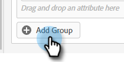

# Zielgruppenkriterien {#audience-criteria}

Ähnlich wie bei Smart-Lists in Marketo ermöglichen Ihnen Zielgruppenkriterien-Attribute die Definition Ihrer Zielgruppe. Sie können bekannte oder unbekannte Personen mithilfe von Inferred, Person oder Unternehmensattributen (oder einer Kombination daraus) ansprechen.

**Bekannte Personen**

Es gibt _many_ Attributkombinationen zur Auswahl. In diesem Beispiel zielen wir auf alle **bekannte Personen** in Kalifornien, die in einem Unternehmen mit mehr als 50 Beschäftigten arbeiten.

1. Grab die **Bundesland** -Attribut fest und ziehen Sie es nach rechts.

   

1. _Is_ ist standardmäßig festgelegt. Geben Sie im Feld Werte auswählen eine Zertifizierungsstelle ein (Sie können auch auf die Dropdown-Liste klicken und aus der Liste auswählen).

   

1. Grab die **Firmengröße** Attribut hinzufügen und an die gewünschte Position ziehen _Attribut hier ziehen und ablegen_.

   

   >[!NOTE]
   >
   >Sie können auch ein Attribut auswählen, indem Sie auf dessen **+** Symbol.

1. Klicken Sie auf die Dropdown-Liste Operator und wählen Sie **Größer als**.

   

1. Geben Sie 50 ein und klicken Sie auf eine andere Stelle auf dem Bildschirm, um zu speichern.

   

Und das ist es!

**Anonyme Personen**

Es gibt eine einfache Möglichkeit, Personen gezielt anzusprechen, die noch nicht in Ihrer Datenbank sind. In diesem Beispiel zielen wir auf alle **Anonyme Personen** befindet sich im Gebiet von New York.

1. Grab die **Personen-E-Mail** -Attribut fest und ziehen Sie es nach rechts.

   

1. Klicken Sie auf die Dropdown-Liste Operator und wählen Sie **Ist leer**.

   

1. Grab die **Inferated State** Attribut hinzufügen und an die gewünschte Position ziehen _Attribut hier ziehen und ablegen_.

   

   >[!NOTE]
   >
   >Wenn jemand Ihre Website besucht, [Munchkin](/help/marketo/product-docs/administration/additional-integrations/add-munchkin-tracking-code-to-your-website.md) Cookies und setzt sie in das System. Wir suchen ihre IP-Adresse in einer speziellen Datenbank und schließen alle möglichen guten Informationen.

1. _Is_ ist standardmäßig festgelegt. Geben Sie im Feld Werte auswählen NY ein (Sie können auch auf die Dropdown-Liste klicken und aus der Liste auswählen).

   

## Gruppen hinzufügen {#add-groups}

Sie haben auch die Möglichkeit, Attribute zu gruppieren, falls Sie alle Attribute zusammen mit &quot;all&quot;oder &quot;any&quot;eines anderen Attributs haben möchten. Sie können mehrere Gruppen hinzufügen.

## Ziel {#target}

Hier geben Sie die URL(s) ein, für die ein bestimmtes Dialogfeld angezeigt werden soll.

Zulässige Formate:

* `http://website.com`
* `https://*.website.com`
* `http://website.com/folder/*`
* `https://*.website.com/folder/*`

>[!NOTE]
>
>Die Verwendung eines Sternchens dient als Platzhalter. Also `https://*.website.com` würde das Dialogfeld auf jeder Seite der Site platzieren, einschließlich Subdomains (z. B.: `support.website.com`). und `https://website.com/folder/*` würde das Dialogfeld auf jeder HTML-Seite im folgenden Ordner platzieren (z. B.: Nehmen wir in diesem Fall an, der Ordner ist &quot;Sport&quot;, also: website.com/sports/baseball.html, website.com/sports/football.html usw.).

>[!MORELIKETHIS]
>
>* [Erstellen eines Dialogfelds](/help/marketo/product-docs/demand-generation/dynamic-chat/dialogues/create-a-dialogue.md){target=&quot;_blank&quot;}
>* [Stream-Designer](/help/marketo/product-docs/demand-generation/dynamic-chat/dialogues/stream-designer.md){target=&quot;_blank&quot;}
>* [Berichte](/help/marketo/product-docs/demand-generation/dynamic-chat/dialogues/reports.md){target=&quot;_blank&quot;}

