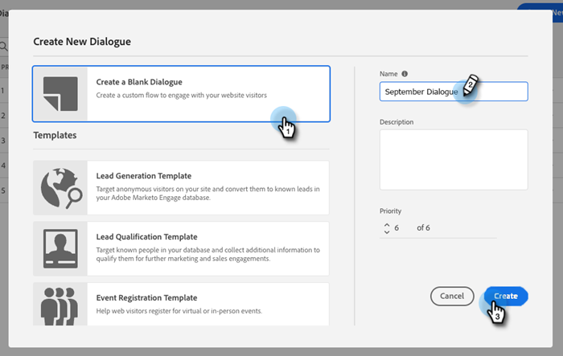

# Erstellen eines Dialogfelds {#create-a-dialogue}

So erstellen Sie ein neues Dialogfeld.

1. Klicken **Dialogfelder**.

   

1. Klicken Sie auf **Neu erstellen** Schaltfläche.

   

1. Wählen Sie ein leeres Dialogfeld oder eine der vorausgefüllten Vorlagen aus. Geben Sie einen Namen ein (Beschreibung ist optional), ändern Sie die Prioritätsstufe (optional) und klicken Sie auf **Erstellen**.

   

>[!NOTE]
>
>Die Priorität bestimmt, welches Dialogfeld einem Besucher angezeigt wird, wenn er sich für mehrere Dialogfelder gleichzeitig qualifiziert.

>[!MORELIKETHIS]
>
>* [Zielgruppenkriterien](/help/marketo/product-docs/demand-generation/dynamic-chat/dialogues/audience-criteria.md){target=&quot;_blank&quot;}
>* [Stream-Designer](/help/marketo/product-docs/demand-generation/dynamic-chat/dialogues/stream-designer.md){target=&quot;_blank&quot;}
>* [Berichte](/help/marketo/product-docs/demand-generation/dynamic-chat/dialogues/reports.md){target=&quot;_blank&quot;}

