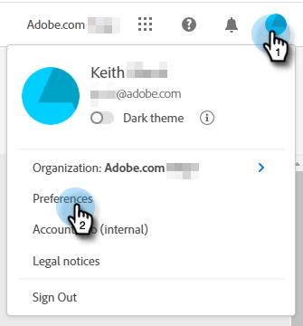

# [!DNL Dynamic Chat] Übersicht {#dynamic-chat-overview}

Mit Dynamic Chat können Sie eine benutzerfreundliche Oberfläche nutzen, um sowohl Personen als auch Konten anzusprechen, die Ihre Website besuchen. Sammeln Sie relevante Inhalte wie Namen, Kontaktinformationen und freien Text. Besuchende der Site können auch mit einem Live-Agenten chatten und sogar Meetings mit Ihrem Verkaufsteam buchen. Dynamic Chat-Aktivitäts- und Interaktionsdaten können verwendet werden, um Mitglieder zu Marketo-Programmen und kanalübergreifende Aktivitäten für Trigger hinzuzufügen.

>[!TIP]
>
>Besuchen Sie [diese Seite](https://experienceleague.adobe.com/docs/marketo-learn/tutorials/dynamic-chat/dynamic-chat-overview.html?lang=de){target="_blank"}, um Anleitungsvideos zu Dynamic Chat anzuzeigen.

## Integrationen {#integrations}

Eine Schlüsselkomponente von Dynamic Chat ist die Möglichkeit, nativ mit Ihrem Marketo-Abonnement zu interagieren. Um die volle Funktionalität dieser Integration nutzen zu können, müssen Sie zunächst die Datensynchronisation starten. Je nach Größe Ihrer Marketo-Datenbank kann es bis zu 24 Stunden dauern, bis die erste (einmalige [) ](/help/marketo/product-docs/demand-generation/dynamic-chat/integrations/adobe-marketo-engage.md){target="_blank"} abgeschlossen ist.

Folgendes wird synchronisiert:

* Personenfelddaten
* Unternehmensfelddaten
* Aktivitätsdaten

## Dialoge {#dialogues}

Dialoge stellen eine einzige Chat-Interaktion dar. Stellen Sie es sich als einen Container mit all den Dingen vor, die Sie für einen ansprechenden Chat-Dialog mit Ihren Website-Besuchern benötigen. In jedem Dialogfeld können Sie angeben, auf welchen Seiten das Dialogfeld angezeigt werden soll, wem es angezeigt werden soll sowie Inhalt und Fluss des Dialogfelds selbst. Darüber hinaus können Sie Metriken finden, um zu sehen, wie gut Ihr Dialogfeld funktioniert. [Weitere Informationen zu Dialogfeldern](/help/marketo/product-docs/demand-generation/dynamic-chat/automated-chat/dialogue-overview.md){target="_blank"}.

## Konfiguration {#configuration}

Passen Sie auf der Registerkarte Konfiguration das Erscheinungsbild Ihrer verschiedenen Dialogfelder an. Ändern Sie Schriftart, Farben, Antwortzeit und mehr! [Weitere Informationen zur Konfiguration](/help/marketo/product-docs/demand-generation/dynamic-chat/setup-and-configuration/configuration.md){target="_blank"}.

## Kalender {#calendar}

Verbinden Sie Ihren Outlook- oder Gmail-Kalender zur Verwendung bei der Terminplanung im Chatbot. [Weitere Informationen zum Kalender](/help/marketo/product-docs/demand-generation/dynamic-chat/setup-and-configuration/agent-settings.md#connect-calendar){target="_blank"}

## Meetings {#meetings}

Hier sehen Sie alle Termine, die von Besuchenden der Website über Ihre verschiedenen Dialogfelder geplant wurden. [Erfahren Sie mehr über Meetings](/help/marketo/product-docs/demand-generation/dynamic-chat/meeting-list.md){target="_blank"}

## Routing {#routing}

Hier sehen Sie eine Liste aller Agenten, die ihre Kalender verbunden haben, in welcher Reihenfolge sie den Besuchern der Website präsentiert werden, und können benutzerdefinierte Routing-Regeln erstellen. [Weitere Informationen zum Routing](/help/marketo/product-docs/demand-generation/dynamic-chat/setup-and-configuration/routing.md){target="_blank"}

## Live-Chat {#live-chat}

Bieten Sie Ihren qualifizierten Web-Besuchern an, sich über den [-Chat mit Ihren Vertriebsmitarbeitern ](/help/marketo/product-docs/demand-generation/dynamic-chat/live-chat/live-chat-overview.md){target="_blank"}.

## Konversationsfluss {#conversational-flow}

[Konversation entwerfen](/help/marketo/product-docs/demand-generation/dynamic-chat/automated-chat/conversational-flow-overview.md){target="_blank"} die von einem Besucher basierend auf einer von Ihnen festgelegten Aktion ausgelöst werden kann (z. B. Ausfüllen eines Formulars, Klicken auf einen Link usw.).

## Generative KI {#generative-ai}

[Generative KI](/help/marketo/product-docs/demand-generation/dynamic-chat/generative-ai/overview.md){target="_blank"} in Adobe Dynamic Chat verarbeitet Absichtssignale, Benutzervoreinstellungen und vergangenes Verhalten in Echtzeit, um relevante, personalisierte Nachrichten für Chat-Besucher zu generieren.

## Ändern der Sprache {#changing-the-language}

Gehen Sie wie folgt vor, um Ihre Dynamic Chat-Sprache zu ändern.

>[!IMPORTANT]
>
>Wenn Sie Ihre Sprache auf Profilebene ändern, wird die Sprache für _alle_ Experience Cloud-Programme geändert, nicht nur für [!DNL Dynamic Chat].

1. Klicken Sie in Ihrem Experience Cloud-Konto auf das Einstellungssymbol und wählen Sie **[!UICONTROL Voreinstellungen]** aus.

   

1. Klicken Sie unter Ihrer E-Mail-Adresse auf die aktuelle Sprache.

   

1. Wählen Sie Ihre neue Sprache (Zweite Sprache ist optional) und klicken Sie auf **[!UICONTROL Speichern]**.

   

   >[!NOTE]
   >
   >Es stehen einige Dutzend Sprachen zur Auswahl, [!DNL Dynamic Chat] jedoch nur Folgendes unterstützt: Englisch, Französisch, Deutsch, Japanisch, Spanisch, Italienisch, Portugiesisch (Brasilien), Koreanisch, Chinesisch (vereinfacht und traditionell).

Wenn Sie die Sprache aktualisieren, ändert sich alles in der App selbst, mit Ausnahme der Wörter, die Sie persönlich ausgefüllt haben (z. B. Stream-Antworten).

## Grenzwerte für die Datenaufbewahrung in Dynamic Chat {#dynamic-chat-data-retention-limits}

Im Folgenden finden Sie einige der Einschränkungen/Parameter in Dynamic Chat. Eine vollständige Liste finden Sie auf der Marketo Engage-[ (Produktbeschreibungsseite](https://helpx.adobe.com/de/legal/product-descriptions/adobe-marketo-engage---product-description.html){target="_blank"}.

<table>
  <th>Datentyp</th>
  <th>Aufbewahrungsfrist</th>
 <tr>
  <td>Anonymer Lead ohne Interaktion</td>
  <td>90 Tage</td>
 </tr>
 <tr>
  <td>Zielaktivität</td>
  <td>24 Monate</td>
 </tr>
 <tr>
  <td>Dokumentaktivität</td>
  <td>24 Monate</td>
 </tr>
 <tr>
  <td>Interagiert mit Dialogfeldaktivität</td>
  <td>90 Tage</td>
 </tr>
 <tr>
  <td>Aktivität „Besprechungsbuchung“</td>
  <td>24 Monate</td>
 </tr>
</table>

## FAQs {#faq}

Siehe die häufig gestellten Fragen zu [Dynamic Chat](/help/marketo/product-docs/demand-generation/dynamic-chat/faq.md){target="_blank"}.
