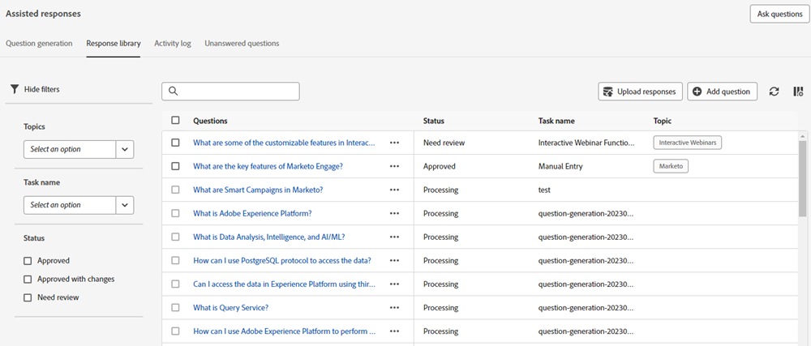

# Übersicht über generative KI {#generative-ai-overview}

Generative KI in Adobe Dynamic Chat verarbeitet Intent-Signale, Benutzereinstellungen und vergangenes Verhalten in Echtzeit, um relevante, personalisierte Nachrichten für Chat-Besucher zu generieren.

## Generierungsreaktionskarte {#generation-response-card}

Erstellen Sie eine Nachricht für den Besucher, wenn er einen bestimmten Punkt in der Konversation erreicht. Stellen Sie eine Reihe von Fragen, die sie auf einmal stellen können, um Ihren gewünschten wichtigen Leistungsindikator zu erreichen. Fügen Sie bis zu 5 Folgenachfragen hinzu und fügen Sie eine Fallback-Nachricht hinzu, wenn für die Frage eines Besuchers keine Antwort verfügbar ist.

(assets/generative-ai-overview-1.png

## Zusammenfassung des Gesprächs {#conversation-summary}

Um den vollständigen Kontext einer Besucherkonversation zu erhalten, müssen Sie in der Regel durch das gesamte Chat-Transkript blättern. Die Zusammenfassung der Unterhaltungen generiert eine Zusammenfassung für Sie in Echtzeit und enthält sogar Themen, an denen der Besucher Interesse gezeigt hat. Dies ist besonders nützlich für Chat-Agenten, die einen schnellen Kontext für eine Konversation benötigen, wenn sie zwischen Chats mit mehreren Besuchern wechseln.

(assets/generative-ai-overview-2.png

## Generierung von Fragen {#question-generation}

[Erhöhen eingehender Erlebnisse](/help/marketo/product-docs/demand-generation/dynamic-chat/generative-ai/question-generation.md) mit KI-gestützten Konversationen für Besucher, die eine mit Vertrieb, Marketing und Produktwissen trainierte Benutzeroberfläche verwenden.

## Antwortbibliothek {#response-library}

[Erstellen einer benutzerdefinierten Sammlung](/help/marketo/product-docs/demand-generation/dynamic-chat/generative-ai/response-library.md) Fragen und Antworten, die alle von Ihnen vorab genehmigt wurden, zur Verwendung in generativen KI-Chat-Kampagnen.

## Aktivitätsprotokoll {#activity-log}

[Liste aller Aufgaben anzeigen](/help/marketo/product-docs/demand-generation/dynamic-chat/generative-ai/activity-log.md) und die zugehörigen Details, einschließlich Name, Eigentümer, Typ und wer sie bearbeitet hat und wann.

## Unbeantwortete Fragen {#unanswered-questions}

[Zusätzliche vorab genehmigte Antworten erstellen](/help/marketo/product-docs/demand-generation/dynamic-chat/generative-ai/unanswered-questions.md) für Ihre Antwortbibliothek mit KI, die auf einem Repository basiert, VERWENDEN SIE UNTERSCHIEDLICHE WORD unbeantworteter Fragen aus früheren Konversationen.

>[!IMPORTANT]
>
>Bei Verwendung der generativen KI müssen Sie sich an die [Adobe Experience Cloud Generative AI-Benutzerrichtlinien](https://www.adobe.com/legal/licenses-terms/adobe-dx-gen-ai-user-guidelines.html) damit wir sicherstellen können, dass Adobe Experience Cloud-Funktionen, die generative KI enthalten, auf sichere und verantwortungsvolle Weise verwendet werden.

## FAQs {#faq}

**Ist generative KI für alle Dynamic Chat-Benutzer verfügbar?**

Generative KI steht nur Dynamic Chat Prime-Abonnenten zur Verfügung.

**Gibt es eine Begrenzung für die Anzahl der Fragen und Antworten, die ich hätte generieren können?**

Ja. Derzeit ist die Lebensdauer auf 1000 begrenzt.

**Welche Sprachen gibt es in der generativen KI?**

Derzeit wird in generativen KI nur Englisch unterstützt.

FÜR KG UNTEN...

VIDEO - 13:09 - SHORTCUTS

