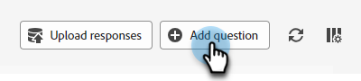

# Reaktionsbibliothek {#response-library}

Zeigen Sie an einer zentralen Stelle alle Ihre Fragen, ihren Genehmigungsstatus und den ihnen zugewiesenen Aufgabennamen/Themen an.

## Manuelles Hinzufügen einer Frage {#manually-add-a-question}

1. Klicken Sie unter Generative KI auf **Unterstützte Antworten**.

   

1. Klicken Sie auf **Reaktionsbibliothek** Registerkarte.

   

1. Klicks **Frage hinzufügen**.

   

1. Geben Sie Ihre Frage und Antwort ein. Weisen Sie ein Thema zu und fügen Sie eine optionale URL hinzu, die Benutzer für Besucher freigeben können. Klicken Sie auf **Speichern**, wenn Sie fertig sind.

   

1. Klicken Sie auf &quot;Aktualisieren&quot;. Ihre neue Frage wird oben mit dem Status &quot;Verarbeitung&quot;angezeigt.

   

1. Klicken Sie nach einigen Minuten erneut auf und der Status ändert sich in &quot;Genehmigt&quot;.

   

## Bearbeiten einer einzelnen Frage/Antwort {#generate-a-new-question}

>[!NOTE]
>
>Allen generierten Fragen und Antworten wird standardmäßig der Status &quot;Überprüfung erforderlich&quot;zugewiesen. Chat-Besuchern stehen nur &quot;genehmigte&quot;Fragen und Antworten zur Verfügung.

1. Im **Reaktionsbibliothek** klicken Sie auf die gewünschte Frage.

   

1. Nehmen Sie die gewünschten Änderungen vor und klicken Sie auf **Speichern**.

   

## Massenbearbeitung und Hochladen von Fragen/Antworten {#bulk-edit-and-upload-questions-responses}

1. Text

SCREENSHOT

1. Text

SCREENSHOT

1. Text

SCREENSHOT

1. Text

SCREENSHOT

## Fragen filtern {#filter-your-questions}

Standardmäßig werden Fragen in der Reihenfolge nach Erstellungszeitpunkt/Erstellungsdatum aufgelistet, wobei die neuesten zuerst angezeigt werden. Wenn Sie nach einer bestimmten Frage suchen, wenden Sie Filter an, um Ihre Suche einzuschränken. Filtern Sie nach Themen, Aufgabennamen und/oder Genehmigungsstatus.

SCREENSHOT
