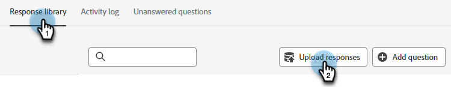

# Antwortbibliothek {#response-library}

Zeigen Sie alle Ihre Fragen, deren Genehmigungsstatus und den/die ihnen zugewiesenen Aufgabennamen/-themen an einem Ort an.

## Manuelles Hinzufügen einer Frage {#manually-add-a-question}

1. Klicken Sie unter Generative KI auf **[!UICONTROL Unterstützte Antworten]**.

   

1. Klicken Sie auf die **[!UICONTROL Antwortbibliothek]**.

   

1. Klicken Sie **[!UICONTROL Frage hinzufügen]**.

   

1. Geben Sie Ihre Frage und Antwort ein. Weisen Sie ein Thema zu und fügen Sie eine optionale URL hinzu, die Benutzer für Besucher freigeben können. Klicken Sie auf **[!UICONTROL Speichern]**, wenn Sie fertig sind.

   

1. Klicken Sie auf „Aktualisieren“. Ihre neue Frage wird oben mit dem Status &quot;[!UICONTROL &quot; ].

   

1. Nach einigen Minuten müssen Sie die Seite erneut aktualisieren, und der Status ändert sich in „Genehmigt“.

   

## Einzelne Frage/Antwort bearbeiten {#generate-a-new-question}

>[!NOTE]
>
>Allen generierten Fragen und Antworten wird standardmäßig der Status [!UICONTROL Überprüfung erforderlich] zugewiesen. Chatbesuchern werden nur [!UICONTROL genehmigte] Fragen und Antworten zur Verfügung gestellt.

1. Klicken Sie in **[!UICONTROL Antwortbibliothek]** auf die gewünschte Frage.

   

1. Nehmen Sie die gewünschten Änderungen vor und klicken Sie auf **[!UICONTROL Speichern]**.

   

## Fragen/Antworten zur Massenbearbeitung und zum Hochladen {#bulk-edit-and-upload-questions-responses}

Anweisungen zum Vornehmen von Massenbearbeitungen in der [heruntergeladenen Excel-Datei](/help/marketo/product-docs/demand-generation/dynamic-chat/generative-ai/question-generation.md#download-questions-and-responses){target="_blank"} finden Sie unten. Sie werden auch auf der Registerkarte Aufgabendetails der Datei angezeigt.

<table>
<thead>
  <tr>
    <th>Aktion</th>
    <th>Anleitung</th>
  </tr>
</thead>
<tbody>
  <tr>
    <td>Frage bearbeiten</td>
    <td>Neue Frage in Spalte „editierte Frage“ (Spalte H) eingeben</td>
  </tr>
  <tr>
    <td>Bearbeiten einer Antwort</td>
    <td>Neue Antwort in Spalte „editedResponse“ (Spalte I) eingeben</td>
  </tr>
  <tr>
    <td>Neue Frage hinzufügen</td>
    <td>Geben Sie die neue Frage in der Spalte „editedQuestion“ (Spalte H) ein und lassen Sie questionResponsed leer. Sie müssen auch ein entsprechendes Thema in der Spalte „Themen“ (Spalte C) und eine Quell-URL in der Spalte „sourceUr!“ eingeben.</td>
  </tr>
  <tr>
    <td>Frage und Antwort hinzufügen</td>
    <td>Geben Sie die neue Frage in der Spalte „editedQuestion“ (Spalte H), die neue Antwort in der Spalte „editedResponse“ (Spalte I) ein und lassen Sie „questionResponsed“ leer. Sie müssen auch ein entsprechendes Thema in der Spalte „Themen“ (Spalte C) eingeben</td>
  </tr>
</tbody>
</table>

1. Nachdem Sie die Änderungen in Ihrer Datei vorgenommen haben, wechseln Sie zurück zur Registerkarte **[!UICONTROL Antwortbibliothek]** und klicken Sie auf **[!UICONTROL Antworten hochladen]**.

   

1. Geben Sie den entsprechenden Aufgabennamen ein. Datei per Drag-and-Drop ziehen oder auf dem Gerät suchen und auswählen. Klicken Sie auf **[!UICONTROL Speichern]**, wenn Sie fertig sind.

   

1. Die Bestätigung wird angezeigt und Sie sind fertig.

   

## Filtern Sie Ihre Fragen {#filter-your-questions}

Standardmäßig werden die Fragen nach Zeit/Erstellungsdatum geordnet aufgelistet, wobei die neuesten zuerst angezeigt werden. Wenn Sie nach einer bestimmten Frage suchen, wenden Sie Filter an, um Ihre Suche einzugrenzen. Filtern Sie nach Themen, Aufgabenname und/oder Genehmigungsstatus.

