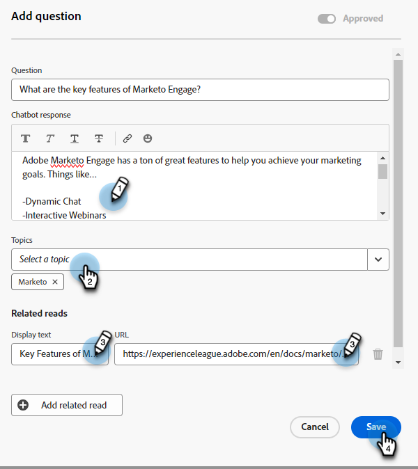

# Nicht beantwortete Fragen {#unanswered-questions}

Sehen Sie sich alle Fragen an, die der Chatbot nicht beantworten konnte und/oder die Besucher, die als &quot;nicht hilfreich&quot;gekennzeichnet waren, und verwenden Sie diese wertvollen Informationen, um zusätzliche vorab genehmigte Antworten zu erstellen.

>[!NOTE]
>
>Die Liste der unbeantworteten Fragen wird automatisch alle 24 Stunden um Mitternacht (PST) aktualisiert.

1. Klicken Sie unter Generative KI auf **[!UICONTROL Unterstützte Antworten]**.

   

1. Klicken Sie auf **[!UICONTROL Unbeantwortete Fragen]** Registerkarte.

   

1. Wählen Sie die unbeantwortete Frage aus, für die Sie eine Antwort erstellen möchten.

   

1. Geben Sie Ihre Antwort ein. Weisen Sie ein Thema zu und fügen Sie eine optionale URL hinzu, die Benutzer für Besucher freigeben können. Klicken Sie auf **[!UICONTROL Speichern]**, wenn Sie fertig sind.

   

1. Die unbeantwortete Frage wird jetzt beantwortet und automatisch Ihrer Antwortbibliothek hinzugefügt.

   
