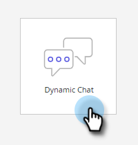

# Adobe Marketo Engage {#adobe-marketo-engage}

## Anbinden von Dynamic Chat {#connecting-dynamic-chat}

Nachdem Sie die [Ersteinrichtung](/help/marketo/product-docs/demand-generation/dynamic-chat/setup-and-configuration/initial-setup.md){target="_blank"} abgeschlossen haben, ist es an der Zeit, die einmalige Synchronisation zum Verbinden des Dynamic Chat mit Ihrem Adobe Marketo Engage-Abonnement durchzuführen.

>[!NOTE]
>
>Dynamic Chat unterstützt die Synchronisierung von [nativen Marketo](https://experienceleague.adobe.com/en/docs/marketo-developer/marketo/rest/lead-database/field-types){target="_blank"}- und benutzerdefinierten Personenfeldern und Unternehmensfeldern.

1. Klicken Sie in My Marketo auf die Kachel **[!UICONTROL Dynamic Chat]** .

   

   >[!NOTE]
   >
   >Wenn die Kachel nicht angezeigt wird, wenden Sie sich an Ihren Marketo-Administrator.

1. Wenn Sie bereits auf eine Anwendung mit einem Adobe ID zugegriffen haben, gelangen Sie direkt zum Dynamic Chat. Falls nicht, richten Sie [Ihren Adobe ID](https://helpx.adobe.com/manage-account/using/create-update-adobe-id.html){target="_blank"} ein.

1. Um Ihre Marketo-Instanz zu verbinden, wählen Sie **[!UICONTROL Integrationen]** aus.

   

1. Klicken Sie auf der Marketo-Karte auf **[!UICONTROL Synchronisation starten]**.

   

1. Wählen Sie bis zu 50 Attribute (Standard- oder benutzerdefinierte Felder) aus Ihrer Marketo-Instanz aus, um sie mit Dynamic Chat zu synchronisieren und sie für Zielgruppen-Targeting, Daten-Mapping und Personalisierung zu verwenden. Klicken Sie abschließend auf **[!UICONTROL Weiter]** .

   

1. Überprüfen Sie Ihre Auswahl. Klicken Sie auf **[!UICONTROL Bestätigen]** , um die Synchronisierung zu starten.

   

>[!NOTE]
>
>Je nach Größe Ihrer Datenbank kann es zwischen 2 und 24 Stunden dauern, bis die Synchronisation abgeschlossen ist.

## Hinzufügen eines Attributs {#add-an-attribute}

Nach der ersten Synchronisierung finden Sie hier, wie Sie zusätzliche Attribute hinzufügen können.

1. Stellen Sie in **[!UICONTROL Integrationen]** sicher, dass die Registerkarte **[!UICONTROL Adobe Marketo Engage]** ausgewählt ist, und klicken Sie auf **[!UICONTROL Attribut hinzufügen]**.

   

1. Wählen Sie die Attribute aus, die Sie hinzufügen möchten, und klicken Sie auf **[!UICONTROL Weiter]**.

   

1. Überprüfen Sie Ihre Auswahl und klicken Sie auf **[!UICONTROL Bestätigen]**.

   

## Attribut entfernen {#remove-an-attribute}

Nach der ersten Synchronisierung finden Sie hier, wie Sie ein Attribut entfernen können.

>[!NOTE]
>
>Sie sehen nur dann die Option zum Entfernen eines Attributs, wenn es aktuell noch nicht von Dialogfeldern verwendet wird.

1. Stellen Sie in **[!UICONTROL Integrationen]** sicher, dass die Registerkarte **[!UICONTROL Adobe Marketo Engage]** ausgewählt ist, und klicken Sie auf das Attribut, das Sie entfernen möchten.

   

1. Klicken Sie auf **[!UICONTROL Attribut entfernen]**.

   

>[!MORELIKETHIS]
>
>[Ersteinrichtung](/help/marketo/product-docs/demand-generation/dynamic-chat/setup-and-configuration/initial-setup.md){target="_blank"}
