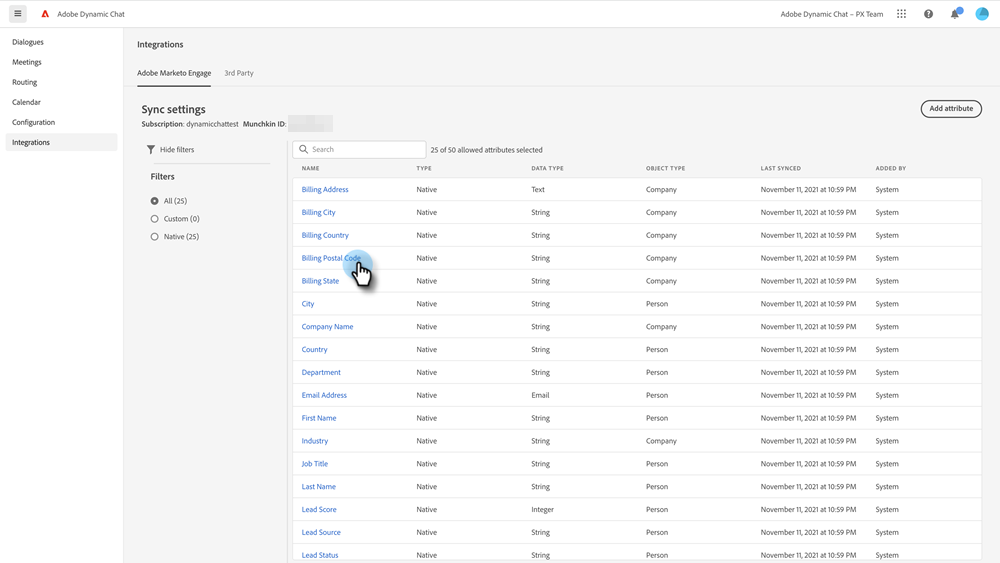

# Adobe Marketo Engage {#adobe-marketo-engage}

## Verbinden von Dynamic Chat {#connecting-dynamic-chat}

Nachdem Sie die [Ersteinrichtung“ abgeschlossen haben](/help/marketo/product-docs/demand-generation/dynamic-chat/setup-and-configuration/initial-setup.md){target="_blank"} ist es an der Zeit, die einmalige Synchronisierung durchzuführen, um Dynamic Chat mit Ihrem Adobe Marketo Engage-Abonnement zu verbinden.

>[!NOTE]
>
>Dynamic Chat unterstützt die Synchronisierung von [nativen ](https://experienceleague.adobe.com/de/docs/marketo-developer/marketo/rest/lead-database/field-types){target="_blank"} benutzerdefinierten Personenfeldern und Unternehmensfeldern in Marketo.

1. Klicken Sie in „Mein Marketo&quot; auf die Kachel **[!UICONTROL Dynamic Chat]** .

   

   >[!NOTE]
   >
   >Wenn die Kachel nicht angezeigt wird, wenden Sie sich an Ihren Marketo-Administrator.

1. Wenn Sie zuvor bereits auf eine Anwendung mit einer Adobe ID zugegriffen haben, gelangen Sie direkt zu Dynamic Chat. Wenn nicht, [richten Sie Ihre Adobe ID ein](https://helpx.adobe.com/de/manage-account/using/create-update-adobe-id.html){target="_blank"}.

1. Um Ihre Marketo-Instanz zu verbinden, wählen Sie **[!UICONTROL Integrationen]** aus.

   

1. Klicken Sie auf der Marketo-Karte auf **[!UICONTROL Synchronisierung starten]**.

   

1. Wählen Sie bis zu 50 Attribute (Standard- oder benutzerdefinierte Felder) aus Ihrer Marketo-Instanz aus, um sie zur Verwendung bei Zielgruppen-Targeting, Datenzuordnung und Personalisierung mit Dynamic Chat zu synchronisieren. Klicken Sie abschließend **[!UICONTROL Weiter]**.

   

1. Überprüfen Sie Ihre Auswahl. Klicken Sie **[!UICONTROL Bestätigen]**, um die Synchronisierung zu starten.

   

>[!NOTE]
>
>Je nach Größe der Datenbank kann es 2 bis 24 Stunden dauern, bis die Synchronisierung abgeschlossen ist.

## Attribut hinzufügen {#add-an-attribute}

Nach der ersten Synchronisierung sehen Sie hier, wie Sie zusätzliche Attribute hinzufügen.

1. Stellen **[!UICONTROL in &quot;]**&quot; sicher, dass die Registerkarte **[!UICONTROL Adobe Marketo Engage]** ausgewählt ist, und klicken Sie auf **[!UICONTROL Attribut hinzufügen]**.

   

1. Wählen Sie die Attribute aus, die Sie hinzufügen möchten, und klicken Sie auf **[!UICONTROL Weiter]**.

   

1. Überprüfen Sie Ihre Auswahl und klicken Sie auf **[!UICONTROL Bestätigen]**.

   

## Attribut entfernen {#remove-an-attribute}

Im Folgenden finden Sie eine Anleitung zum Entfernen eines Attributs nach der ersten Synchronisierung.

>[!NOTE]
>
>Die Option zum Entfernen eines Attributs wird nur angezeigt, wenn es derzeit von keinem Dialogfeld verwendet wird.

1. Stellen **[!UICONTROL in &quot;]**&quot; sicher, dass die Registerkarte **[!UICONTROL Adobe Marketo Engage]** ausgewählt ist, und klicken Sie auf das Attribut, das Sie entfernen möchten.

   

1. Klicken Sie **[!UICONTROL Attribut entfernen]**.

   

>[!MORELIKETHIS]
>
>[Ersteinrichtung](/help/marketo/product-docs/demand-generation/dynamic-chat/setup-and-configuration/initial-setup.md){target="_blank"}
