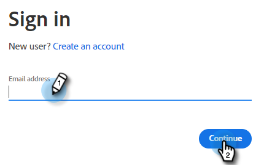
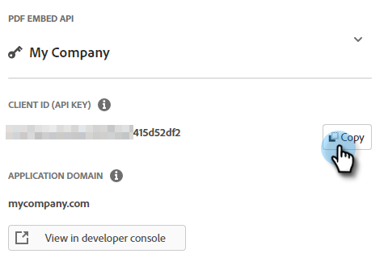

# Adobe PDF Embed-API {#adobe-pdf-embed-api}

Mit der Dokumentkarte können Sie PDF-Dokumente in Dialogfelder einbetten und die Aktivität von Besuchern zur Dokumenteninteraktion verfolgen. So richten Sie es ein.

1. Navigieren Sie zu [Adobe PDF Embed API](https://udp.adobe.io/document-services/apis/pdf-embed/){target="_blank"}.

1. Klicks **Anmeldeinformationen abrufen**.

   

1. Melden Sie sich bei Ihrem Adobe-Konto an.

   

1. Geben Sie Ihre Anmeldedaten ein, akzeptieren Sie die Bedingungen und klicken Sie auf **Erstellen von Anmeldeinformationen**.

   

   >[!IMPORTANT]
   >
   >Sie müssen die Domäne verwenden, in der Sie den Chat-Bot hosten (z. B. wenn Sie den Chat auf mycompany.com hosten, stellen Sie sicher, dass Sie dies in Schritt 4 eingeben).

1. Klicks **Kopieren** zum Kopieren Ihrer Client-ID.

   

1. Zurück unter Dynamic Chat klicken Sie auf **Integrationen**. Klicken Sie auf der Adobe PDF Embed API-Karte auf **Aktivieren**.

   

1. Fügen Sie Ihre Client-ID ein und klicken Sie auf **Speichern**.

   

Sie können jetzt die Dokumentkarte in Ihren Dialogfeldern verwenden.&quot; [Stream-Designer](/help/marketo/product-docs/demand-generation/dynamic-chat/automated-chat/stream-designer.md){target="_blank"}!

