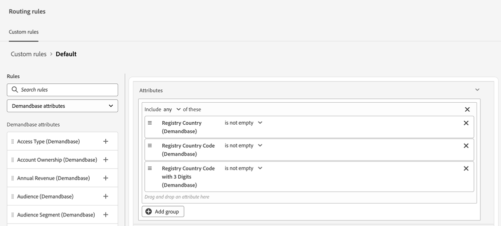

# Demandbase {#demandbase}

Demandbase-Benutzende können Demandbase-Personenattribute für Dialog-Targeting, bedingtes Branding und benutzerdefiniertes Routing in Dynamic Chat verwenden.

## Zugriff auf den API-Schlüssel für Dynamic Chat {#access-the-api-key-for-dynamic-chat}

Die folgenden Schritte sind (in _Demandbase-Konto)_.

1. Klicken Sie in Demandbase auf das Symbol _Einstellungen_ .

   

1. Wählen _unter_ die Option **Konto-Connector** aus.

1. Klicken Sie auf die Schaltfläche **+ Neu erstellen**.

1. Wählen Sie in der _Integrationsname_ die Option **Adobe Dynamic Chat** aus.

1. Wählen Sie das Optionsfeld **Serverseite** aus.

1. Klicken Sie auf **Erstellen**.

1. Kopieren Sie mithilfe _Symbols_ Kopieren“ die API-Token-Zeichenfolge unten auf der Seite.

1. Senden Sie ein Ticket mit [Marketo-Support](https://nation.marketo.com/t5/support/ct-p/Support) und geben Sie die API-Token-Zeichenfolge an, um die Demandbase-Integration zu aktivieren.

>[!NOTE]
>
>Weitere Informationen finden Sie unter [Einrichten von Demandbase zum Senden von Daten an eine Integration (Konto-Connector)](https://support.demandbase.com/hc/en-us/articles/360057169531-Set-Up-Demandbase-to-Send-Data-to-an-Integration-Account-Connector){target="_blank"} auf der Demandbase-Hilfeseite.

## Integrationsfunktionen {#integration-features}

Targeting Ihrer Zielgruppe basierend auf Demandbase-Attributen zusätzlich zu nativen und benutzerdefinierten Attributen beim Erstellen eines Dialogfelds oder eines Gesprächsflusses.

Verwenden Sie Demandbase-Attribute als Bedingung in Ihrer bedingten Verzweigung, einem Dialogfeld oder einem Gesprächsfluss.

Verwenden Sie Demandbase-Attribute beim Definieren einer benutzerdefinierten Routing-Logik.

