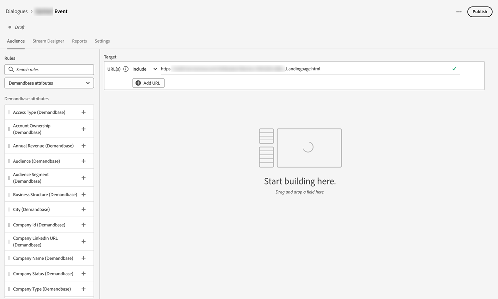

# Demandbase {#demandbase}

Demandbase-Benutzer können Demandbase-Personenattribute für Dialog-Targeting, bedingtes Branding und benutzerdefiniertes Routing im Dynamic Chat verwenden.

**Integrationsfunktionen**

Targeting Ihrer Zielgruppe basierend auf Demandbase-Attributen zusätzlich zu nativen und benutzerdefinierten Attributen beim Erstellen eines Dialogfelds oder eines Gesprächsflusses.

Verwenden Sie Demandbase-Attribute als Bedingung in Ihrer bedingten Verzweigung, einem Dialogfeld oder einem Gesprächsfluss.

Verwenden Sie Demandbase-Attribute beim Definieren einer benutzerdefinierten Routing-Logik.

