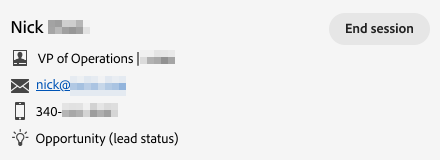

# Agenten-Posteingang {#agent-inbox}

Agenten können Live-Chats im Agenten-Posteingang abfragen. Zusätzlich zu den aktiven Unterhaltungen können sie vergangene Unterhaltungen, Besucherinformationen und mehr sehen.

## Verfügbarkeits-Umschalter {#availability-toggle}

In der rechten oberen Ecke des Bildschirms Agentenposteingang haben Sie die Möglichkeit, Ihren Status als „Verfügbar“ oder „Nicht verfügbar“ festzulegen.

>[!IMPORTANT]
>
>**Dadurch wird die** Live[Chat-Verfügbarkeit](/help/marketo/product-docs/demand-generation/dynamic-chat/setup-and-configuration/agent-settings.md#live-chat-availability){target="_blank"} überschrieben, die Sie in den Agenteneinstellungen festgelegt haben. Der Status bleibt erhalten, bis Sie ihn entweder zurückwechseln oder auf den nächsten Block Ihrer Verfügbarkeit wechseln.

>[!NOTE]
>
>Wenn Sie Ihren Status auf Nicht verfügbar setzen, wirkt sich dies nicht auf aktive Chats aus.

## Live-Chat-Benachrichtigungen {#live-chat-notifications}

Weitere Informationen zu Benachrichtigungen finden Sie in der [Live-Chat - Übersicht](/help/marketo/product-docs/demand-generation/dynamic-chat/live-chat/live-chat-overview.md#live-chat-notifications){target="_blank"}.

## Konversationen {#conversations}

Auf der linken Seite des Bildschirms des Agenten-Posteingangs können Sie festlegen, ob nur die aktiven Unterhaltungen oder alle angezeigt werden sollen.

>[!NOTE]
>
>Während Sie vergangene (inaktive) Unterhaltungen von sich selbst und anderen Agenten sehen können, können Sie nur Ihre eigenen aktiven Unterhaltungen sehen.

## Besucherinformationen {#visitor-information}

Auf der rechten Seite des Bildschirms des Agenten-Posteingangs sehen Sie (von oben nach unten) ihren Namen, ihre Stellenbezeichnung, ihre E-Mail-Adresse, ihre Telefonnummer und ihren CRM-Status. Alle nicht weitergegebenen Informationen werden als Bindestrich (-) angezeigt.

## Beenden einer Sitzung {#end-a-session}

Agenten können eine Sitzung manuell beenden, indem sie einfach auf die Schaltfläche **Sitzung beenden** neben den Besucherinformationen klicken.

## Aktivitätsverlauf {#activity-history}

Unter den Besucherinformationen finden Sie den Aktivitätsverlauf. Zeigen Sie Aktivitätstypen und -daten an und zeigen Sie sogar Chattranskripte an.

>[!NOTE]
>
>Die Informationen werden nur für die letzten 90 Tage angezeigt.

## Kalenderfreigabe {#calendar-sharing}

Am unteren Rand des Live-Chat-Fensters befindet sich ein Symbol, mit dem Sie den Kalender Ihres oder eines anderen Agenten für den Chat-Besucher freigeben können.

1. Klicken Sie auf das Kalendersymbol.

   

1. Wählen Sie den gewünschten Agentenkalender aus und klicken Sie auf **Senden**.

   

1. Der Chat-Besucher kann ein Meeting buchen.

   
