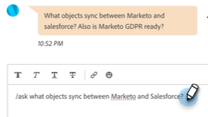

# Agenten-Posteingang {#agent-inbox}

Agenten stellen Live-Chats im Agenten-Posteingang ein. Neben den aktiven Unterhaltungen können sie auch frühere Unterhaltungen, Besucherinformationen und mehr sehen.

## Umschalten auf Verfügbarkeit {#availability-toggle}

Oben rechts im Bildschirm &quot;Agent-Posteingang&quot;haben Sie die Möglichkeit, Ihren Status als verfügbar oder nicht verfügbar festzulegen.

>[!IMPORTANT]
>
>**Dadurch wird** die [Live-Chat-Verfügbarkeit](/help/marketo/product-docs/demand-generation/dynamic-chat/setup-and-configuration/agent-settings.md#live-chat-availability){target="_blank"} die Sie in den Agenteneinstellungen festgelegt haben. Der Status bleibt erhalten, bis Sie ihn entweder zurückwechseln oder zum nächsten Zeitblock in Ihrer Verfügbarkeit wechseln.

>[!NOTE]
>
>Wenn Sie Ihren Status auf &quot;Nicht verfügbar&quot;setzen, wirkt sich dies nicht auf aktive Chats aus.

## Live-Chat-Benachrichtigungen {#live-chat-notifications}

Weitere Informationen zu Benachrichtigungen finden Sie im Abschnitt [Live-Chat-Übersicht](/help/marketo/product-docs/demand-generation/dynamic-chat/live-chat/live-chat-overview.md#live-chat-notifications){target="_blank"}.

## Konversationen {#conversations}

Auf der linken Seite des Bildschirms &quot;Agent Inbox&quot;können Sie festlegen, dass nur die aktiven Konversationen oder alle davon angezeigt werden sollen.

>[!NOTE]
>
>Während Sie vergangene (inaktive) Gespräche von sich selbst und anderen Agenten sehen können, können Sie nur Ihre eigenen aktiven Unterhaltungen sehen.

## Besucherinformationen {#visitor-information}

Auf der rechten Seite des Bildschirms &quot;Agent Inbox&quot;können Sie (von oben nach unten) deren Namen, Titel, E-Mail-Adresse, Telefonnummer und CRM-Status sehen. Alle Informationen, die nicht weitergegeben werden, werden als Bindestrich (-) angezeigt.

## Sitzung beenden {#end-a-session}

Support-Mitarbeiter können eine Sitzung manuell beenden, indem sie einfach auf **Sitzung beenden** neben den Besucherinformationen.

## Aktivitätsverlauf {#activity-history}

Unter den Besucherinformationen befindet sich der Aktivitätsverlauf. Zeigen Sie Aktivitätstypen und -daten an und sehen Sie sich sogar Chat-Transkripte an.

>[!NOTE]
>
>Informationen werden nur für die letzten 90 Tage angezeigt.

## Kalenderfreigabe {#calendar-sharing}

Am unteren Rand des Live-Chat-Fensters befindet sich ein Symbol, mit dem Sie den Kalender Ihres oder eines anderen Agenten für den Chat-Besucher freigeben können.

1. Klicken Sie auf das Kalendersymbol.

   

1. Wählen Sie den gewünschten Agentenkalender aus und klicken Sie auf **Senden**.

   

1. Der Chatbesucher kann ein Meeting buchen.

   

## Zusammenfassung des Gesprächs {#conversation-summary}

Die Zusammenfassung der Unterhaltungen generiert eine schnelle Zusammenfassung für Sie in Echtzeit, einschließlich Themen, an denen der Besucher Interesse gezeigt hat. Er ist unten rechts auf jedem Chat-Bildschirm verfügbar.

