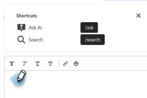

# Agenten-Posteingang {#agent-inbox}

Agenten können Live-Chats im Agenten-Posteingang abfragen. Zusätzlich zu den aktiven Unterhaltungen können sie vergangene Unterhaltungen, Besucherinformationen und mehr sehen.

## Verfügbarkeits-Umschalter {#availability-toggle}

In der rechten oberen Ecke des Bildschirms Agentenposteingang haben Sie die Möglichkeit, Ihren Status als „Verfügbar“ oder „Nicht verfügbar“ festzulegen.

>[!IMPORTANT]
>
>**Dadurch wird die** Live[Chat-Verfügbarkeit](/help/marketo/product-docs/demand-generation/dynamic-chat/setup-and-configuration/agent-settings.md#live-chat-availability){target="_blank"} überschrieben, die Sie in den Agenteneinstellungen festgelegt haben. Der Status bleibt erhalten, bis Sie ihn entweder zurückwechseln oder auf den nächsten Block Ihrer Verfügbarkeit wechseln.

>[!NOTE]
>
>Wenn Sie Ihren Status auf Nicht verfügbar setzen, wirkt sich dies nicht auf aktive Chats aus.

## Live-Chat-Benachrichtigungen {#live-chat-notifications}

Weitere Informationen zu Benachrichtigungen finden Sie in der [Live-Chat - Übersicht](/help/marketo/product-docs/demand-generation/dynamic-chat/live-chat/live-chat-overview.md#live-chat-notifications){target="_blank"}.

## Konversationen {#conversations}

Auf der linken Seite des Bildschirms des Agenten-Posteingangs können Sie festlegen, ob nur die aktiven Unterhaltungen oder alle angezeigt werden sollen.

>[!NOTE]
>
>Während Sie vergangene (inaktive) Unterhaltungen von sich selbst und anderen Agenten sehen können, können Sie nur Ihre eigenen aktiven Unterhaltungen sehen.

## Besucherinformationen {#visitor-information}

Auf der rechten Seite des Bildschirms des Agenten-Posteingangs sehen Sie (von oben nach unten) ihren Namen, ihre Stellenbezeichnung, ihre E-Mail-Adresse, ihre Telefonnummer und ihren CRM-Status. Alle nicht weitergegebenen Informationen werden als Bindestrich (-) angezeigt.

## Beenden einer Sitzung {#end-a-session}

Agenten können eine Sitzung manuell beenden, indem sie einfach auf die Schaltfläche **Sitzung beenden** neben den Besucherinformationen klicken.

## Tastaturbefehle {#shortcuts}

>[!NOTE]
>
>Diese Funktion ist Teil der generativen KI, die über das Dynamic Chat Prime-Abonnement verfügbar ist. Weitere Informationen erhalten Sie beim Adobe Account Team (Ihrem Account Manager).

Shortcuts, unterstützt durch die generative AI [Response Library](/help/marketo/product-docs/demand-generation/dynamic-chat/generative-ai/response-library.md), sind eine hervorragende Möglichkeit, während des Chats mit einem Besucher schnell Hilfe zu erhalten. Geben Sie einfach einen Schrägstrich (`/`) in das Textfeld ein und wählen Sie `ask` oder `search`.

**Fragen** ist Hilfe bei Antworten auf eine Frage.

1. Geben Sie `/ask` in das Textfeld ein oder wählen Sie es aus. Geben Sie Ihre Frage ein und drücken Sie die Eingabetaste auf der Tastatur.

   

1. Eine Antwort wird angezeigt. Klicken Sie auf das Kopiersymbol, um es in das Textfeld einfügen zu lassen. Sie können den Text bearbeiten, bevor Sie ihn an den Besucher senden.

   

**Suche** dient der Hilfe bei der Suche nach Seiten, die sich auf einen bestimmten Text beziehen.

1. Geben Sie `/search` in das Textfeld ein oder wählen Sie es aus.

   

1. Geben Sie ein, wonach Sie suchen möchten, und drücken Sie die Eingabetaste auf der Tastatur.

   

1. Die entsprechenden Links werden angezeigt. Klicken Sie auf das Kopiersymbol, um sie in das Textfeld einfügen zu lassen. Sie können Änderungen vornehmen, bevor Sie die Informationen an den Besucher senden.

   

## Aktivitätsverlauf {#activity-history}

Unter den Besucherinformationen finden Sie den Aktivitätsverlauf. Zeigen Sie Aktivitätstypen und -daten an und zeigen Sie sogar Chattranskripte an.

>[!NOTE]
>
>Die Informationen werden nur für die letzten 90 Tage angezeigt.

## Kalenderfreigabe {#calendar-sharing}

Am unteren Rand des Live-Chat-Fensters befindet sich ein Symbol, mit dem Sie den Kalender Ihres oder eines anderen Agenten für den Chat-Besucher freigeben können.

1. Klicken Sie auf das Kalendersymbol.

   

1. Wählen Sie den gewünschten Agentenkalender aus und klicken Sie auf **Senden**.

   

1. Der Chat-Besucher kann ein Meeting buchen.

   

## Zusammenfassung des Gesprächs {#conversation-summary}

>[!NOTE]
>
>Diese Funktion ist Teil der generativen KI, die über das Dynamic Chat Prime-Abonnement verfügbar ist. Weitere Informationen erhalten Sie beim Adobe Account Team (Ihrem Account Manager).

Konversationszusammenfassung generiert eine schnelle Zusammenfassung für Sie in Echtzeit, einschließlich Themen, an denen der Besucher Interesse gezeigt hat. Er ist in der rechten unteren Ecke jedes Chatbildschirms verfügbar.

>[!NOTE]
>
>Eine abgeschlossene Zusammenfassung einer Konversation finden Sie auch im Aktivitätsprotokoll des Personendatensatzes des Besuchers in Ihrer Marketo Engage-Datenbank.
