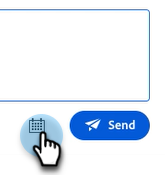

# Agenten-Posteingang {#agent-inbox}

Agenten stellen Live-Chats im Agenten-Posteingang ein. Neben den aktiven Unterhaltungen können sie auch frühere Unterhaltungen, Besucherinformationen und mehr sehen.

## Umschalten auf Verfügbarkeit {#availability-toggle}

Oben rechts im Bildschirm &quot;Agent-Posteingang&quot;haben Sie die Möglichkeit, Ihren Status als verfügbar oder nicht verfügbar festzulegen.

>[!IMPORTANT]
>
>**Dadurch wird** die in den Agenteneinstellungen festgelegte [Live-Chat-Verfügbarkeit](/help/marketo/product-docs/demand-generation/dynamic-chat/setup-and-configuration/agent-settings.md#live-chat-availability){target="_blank"} außer Kraft gesetzt. Der Status bleibt erhalten, bis Sie ihn entweder zurückwechseln oder zum nächsten Zeitblock in Ihrer Verfügbarkeit wechseln.

>[!NOTE]
>
>Wenn Sie Ihren Status auf &quot;Nicht verfügbar&quot;setzen, wirkt sich dies nicht auf aktive Chats aus.

## Live-Chat-Benachrichtigungen {#live-chat-notifications}

Erfahren Sie mehr über Benachrichtigungen in der [Live-Chat-Übersicht](/help/marketo/product-docs/demand-generation/dynamic-chat/live-chat/live-chat-overview.md#live-chat-notifications){target="_blank"}.

## Konversationen {#conversations}

Auf der linken Seite des Bildschirms &quot;Agent Inbox&quot;können Sie festlegen, dass nur die aktiven Konversationen oder alle davon angezeigt werden sollen.

>[!NOTE]
>
>Während Sie vergangene (inaktive) Gespräche von sich selbst und anderen Agenten sehen können, können Sie nur Ihre eigenen aktiven Unterhaltungen sehen.

## Besucherinformationen {#visitor-information}

Auf der rechten Seite des Bildschirms &quot;Agent Inbox&quot;können Sie (von oben nach unten) deren Namen, Titel, E-Mail-Adresse, Telefonnummer und CRM-Status sehen. Alle Informationen, die nicht weitergegeben werden, werden als Bindestrich (-) angezeigt.

## Sitzung beenden {#end-a-session}

Agenten können eine Sitzung manuell beenden, indem sie einfach auf die Schaltfläche **Sitzung beenden** neben den Besucherinformationen klicken.

## Tastaturbefehle {#shortcuts}

>[!NOTE]
>
>Diese Funktion ist Teil der generativen KI, die über das Dynamic Chat Prime-Abonnement verfügbar ist. Weitere Informationen erhalten Sie vom Adobe Account Team (Ihrem Kundenbetreuer).

Tastaturbefehle, die von der generativen AI [Response Library](/help/marketo/product-docs/demand-generation/dynamic-chat/generative-ai/response-library.md) unterstützt werden, sind eine großartige Möglichkeit, beim Chatten mit einem Besucher Hilfe zu erhalten. Geben Sie einfach einen Schrägstrich (`/`) in das Textfeld ein und wählen Sie `ask` oder `search`.

**Fragen** ist Hilfe bei Antworten auf eine Frage.

1. Geben Sie in das Textfeld den Wert `/ask` ein oder wählen Sie ihn aus. Geben Sie Ihre Frage ein und drücken Sie die Eingabetaste auf der Tastatur.

   

1. Eine Antwort wird angezeigt. Klicken Sie auf das Kopiersymbol, damit es in das Textfeld eingefügt wird. Sie können den Text bearbeiten, bevor Sie ihn an den Besucher senden.

   

**Suche** ist Hilfe bei der Suche nach Seiten, die sich auf bestimmten Text beziehen.

1. Geben Sie in das Textfeld den Wert `/search` ein oder wählen Sie ihn aus.

   

1. Geben Sie ein, wonach Sie suchen möchten, und drücken Sie die Eingabetaste auf der Tastatur.

   

1. Anwendbare Links werden angezeigt. Klicken Sie auf das Kopiersymbol, damit sie in das Textfeld eingefügt werden. Sie können Änderungen vornehmen, bevor Sie die Informationen an den Besucher senden.

   

## Aktivitätsverlauf {#activity-history}

Unter den Besucherinformationen befindet sich der Aktivitätsverlauf. Zeigen Sie Aktivitätstypen und -daten an und sehen Sie sich sogar Chat-Transkripte an.

>[!NOTE]
>
>Informationen werden nur für die letzten 90 Tage angezeigt.

## Kalenderfreigabe {#calendar-sharing}

Am unteren Rand des Live-Chat-Fensters befindet sich ein Symbol, mit dem Sie den Kalender Ihres oder eines anderen Agenten für den Chat-Besucher freigeben können.

1. Klicken Sie auf das Kalendersymbol.

   

1. Wählen Sie den gewünschten Agentenkalender aus und klicken Sie auf **Senden**.

   

1. Der Chatbesucher kann ein Meeting buchen.

   

## Zusammenfassung des Gesprächs {#conversation-summary}

>[!NOTE]
>
>Diese Funktion ist Teil der generativen KI, die über das Dynamic Chat Prime-Abonnement verfügbar ist. Weitere Informationen erhalten Sie vom Adobe Account Team (Ihrem Kundenbetreuer).

Die Zusammenfassung der Unterhaltungen generiert eine schnelle Zusammenfassung für Sie in Echtzeit, einschließlich Themen, an denen der Besucher Interesse gezeigt hat. Er ist unten rechts auf jedem Chat-Bildschirm verfügbar.

>[!NOTE]
>
>Eine abgeschlossene Konversationszusammenfassung finden Sie auch im Aktivitätsprotokoll des Benutzerdatensatzes in Ihrer Marketo Engage-Datenbank.
